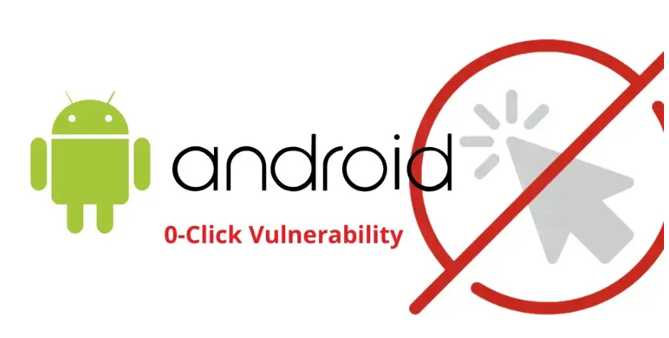

# Android Security Bulletin - November 2025

**CVE-2025-48593**{.cve-chip}
**Remote Code Execution**{.cve-chip}
**Zero-Click Exploit**{.cve-chip}

## Overview
Google released the November 2025 Android Security Bulletin addressing multiple critical vulnerabilities in the Android platform. The most severe flaw resides in the System component, allowing remote code execution (RCE) without user interaction or additional privileges. This zero-click vulnerability poses a significant risk to unpatched Android devices.

## Technical Specifications

| **Attribute** | **Details** |
|---------------|-------------|
| **CVE ID** | CVE-2025-48593 (Primary), CVE-2025-48581 |
| **Vulnerability Type** | Remote Code Execution (RCE), Elevation of Privilege (EoP) |
| **Attack Vector** | Network (remote) |
| **Authentication** | None required |
| **Complexity** | Low |
| **User Interaction** | Not required (Zero-Click) |

## Affected Products
- **Android Versions**: 13, 14, 15, and 16
- **Components**: System component, apexd.cpp
- **Patch Level Required**: 2025-11-01 or later
- **Status**: Patched in November 2025 Security Update

## Attack Scenario

### Primary Attack Vector
1. Attacker crafts malicious transmission (message/data packet)
2. Targets vulnerable Android device
3. Exploits System component vulnerability
4. Achieves code execution without user interaction
5. Gains control over device system process

### Secondary Concerns
- Elevation of Privilege via apexd.cpp
- Potential blocking of security updates
- Chain of exploitation possibilities

## Impact Assessment

=== "System Security"
    * Remote code execution in System process
    * Privilege escalation potential
    * Security update interference
    * System process compromise

=== "Data Security"
    * Unauthorized data access
    * Credential theft risk
    * Personal information exposure
    * Corporate data compromise

=== "Device Control"
    * Complete device takeover
    * System process manipulation
    * Security feature bypass
    * Persistent access potential

=== "Update Mechanism"
    * Security update blocking (CVE-2025-48581)
    * Patch deployment interference
    * Update verification bypass
    * System protection compromise

## Mitigation Strategies

### :material-shield-check: Immediate Actions
- Install 2025-11-01 Android security patch
- Enable Google Play Protect
- Avoid untrusted app sources
- Verify patch level compliance

### :material-account-supervisor: Enterprise Controls
- Deploy MDM update enforcement
- Monitor device compliance
- Implement security policies
- Track patch deployment

### :material-cellphone-lock: Device Security
- Regular security updates
- App installation restrictions
- Network security monitoring
- Security feature enforcement

### :material-update: Update Management
- Automated patch deployment
- Compliance monitoring
- Update verification
- Rollout tracking

## Technical Recommendations

### For Users
1. **Check Current Patch Level**: Settings > About phone > Android version
2. **Update System**: Settings > System > System update
3. **Enable Protection**: Verify Google Play Protect is active
4. **App Sources**: Use only trusted app stores

### For Enterprise
1. **MDM Configuration**: Enforce security patch compliance
2. **Policy Updates**: Require minimum patch levels
3. **Monitoring**: Track device update status
4. **Documentation**: Record affected devices

### For Developers
1. **App Testing**: Verify compatibility with security patches
2. **Security Features**: Implement additional protections
3. **Update Checks**: Verify device security status
4. **API Usage**: Follow secure coding practices

## Resources and References

!!! info "Official Documentation"
    - [Android Security Bulletin—November 2025 | Android Open Source Project](https://source.android.com/)
    - [GovCERT.HK - Security Alert (A25-11-03)](https://www.govcert.hk/)
    - [SecurityWeek - Android Update Patches Critical RCE Flaw](https://www.securityweek.com/)

!!! danger "Critical Warning"
    Zero-click exploitation is possible if mitigations are bypassed. Immediate patching is essential for all affected devices.

!!! tip "Best Practices"
    1. Keep automatic updates enabled
    2. Monitor patch level regularly
    3. Implement defense-in-depth strategies
    4. Follow Android security guidelines
    5. Report suspicious behavior to Google