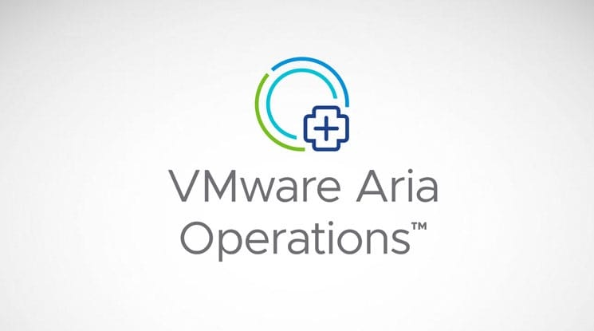

# VMware Aria Operations and VMware Tools Vulnerability

**CVE-2025-41244**{.cve-chip}
**Privilege escalation**{.cve-chip}
**Root access on guest VMs**{.cve-chip}

## Overview
CVE-2025-41244 is a local privilege escalation vulnerability affecting VMware Aria Operations (including SDMP—Service Discovery Management Pack) and VMware Tools, notably on guest VMs managed by Aria Operations. Exploitation allows a local, authenticated attacker (even with non-administrative privileges) to escalate privileges and execute arbitrary code as root on the VM.

## Technical Details

| **Attribute** | **Details** |
|---------------|-------------|
| **CVE ID** | CVE-2025-41244 |
| **Vulnerability Type** | Privilege Assignment Logic Error (CWE-267) |
| **Attack Vector** | Local (guest VM) |
| **Authentication** | Local user (non-admin) |
| **Complexity** | Low |
| **User Interaction** | Required |

### Root Cause
- Privilege assignment logic error (CWE-267, Privilege Defined With Unsafe Actions) in VMware Aria Operations managing a VM with VMware Tools and SDMP enabled
- Impacts both credential-based and credential-less service discovery methods
- Vulnerable `get-versions.sh` script can be tricked to execute attacker-provided binaries with elevated privileges

### Affected Software
- VMware Aria Operations (formerly vRealize Operations)
- VMware Tools (all 11.x.x, 12.x.x, and 13.x.x releases)
- Open VM Tools on major Linux distros
- VMware Cloud Foundation, NSX, vCenter, vSphere Foundation

### Detection
- Exploitation involves observing abnormal child processes started by VMware Tools services (`vmtoolsd`) or SDMP scripts, often from the `/tmp` directory where an attacker can plant a malicious binary

## Attack Scenario
1. **Initial Access**: A legitimate user or malware with local access to a guest VM finds a writable directory (e.g., `/tmp/`)
2. **Preparation**: Attacker places a malicious binary (e.g., a root-privilege escalation payload) in the targeted directory
3. **Trigger**: VMware Aria Operations or VMware Tools, through SDMP, runs metrics/discovery scripts, and—due to weak path and privilege validation—executes the attacker's binary as root
4. **Outcome**: Attacker gains root privilege, bypassing intended access controls, enabling full control over the VM and further lateral movement

## Impact Assessment

=== "Integrity"
  * Full root access to targeted VM
  * Arbitrary code and configuration changes

=== "Confidentiality"
  * Access, modification, or theft of sensitive data within the VM

=== "Availability"
  * Persistence and lateral movement within the environment

=== "Threat Landscape"
  * Real-world exploitation by APT group UNC5174 and others since at least October 2024
  * Confirmed exploitation in enterprise environments before public disclosure
  * Affects enterprises using VMware for virtualization/cloud workload management (critical infrastructure, telco, finance, government)

## Mitigation Strategies

### :material-update: Patch and Remediation
- **Patch Immediately**: Update VMware Tools and VMware Aria Operations to the latest version as per Broadcom security advisories (VMSA-2025-0015, 0016)
- **Restrict Write Access**: Limit guest VM and container access to writable directories that could be abused for privilege escalation

### :material-monitor-dashboard: Monitoring & Detection
- **Monitor & Detect**: Use security analytics to detect abnormal executions by `vmtoolsd` or SDMP scripts, unexpected root-level processes, and newly placed binaries in `/tmp`

### :material-network: Network Security
- **Network Segmentation**: Restrict VM connectivity to minimize attack surface from other compromised endpoints

## Technical Recommendations

### Immediate Actions
1. **Patch all affected VMware Tools and Aria Operations installations**
2. **Audit guest VMs for unexpected binaries in `/tmp` and other writable directories**
3. **Monitor for abnormal root-level processes spawned by `vmtoolsd` or SDMP scripts**
4. **Restrict unnecessary write permissions on guest VMs**

### Short-term Measures
1. **Incident response**: Prepare for rapid remediation if compromise is detected
2. **Review and harden VM/container security policies**

### Long-term Strategy
1. **Ongoing patch management and vulnerability scanning**
2. **Security architecture review for cloud/hybrid environments**
3. **Staff training on VM/container security**

## Resources

1. [VMware security advisory (AV25-629) – Update 1 - Canadian Centre for Cyber Security](https://www.cyber.gc.ca)
2. [Support Content Notification - Support Portal - Broadcom support portal](https://support.broadcom.com)
3. [You name it, VMware elevates it (CVE-2025-41244)](https://www.securityweek.com/you-name-it-vmware-elevates-it-cve-2025-41244/)
4. [NVD - CVE-2025-41244](https://nvd.nist.gov/vuln/detail/CVE-2025-41244)