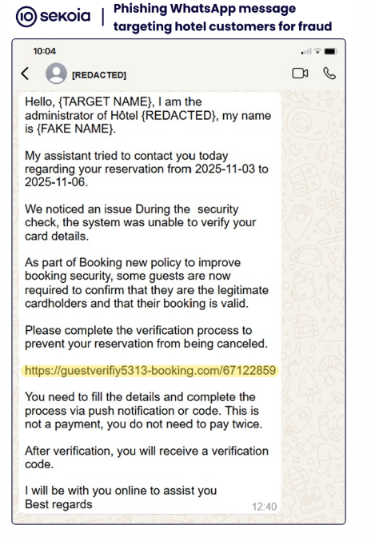

# ClickFix Hospitality Phishing Campaign (a.k.a. “I Paid Twice” campaign)

**Hospitality Phishing / Booking Impersonation**{.campaign-chip}
**Infostealer / RAT Delivery**{.campaign-chip}
**Credential & Booking Data Theft**{.campaign-chip}

## Overview

The ClickFix campaign targets hotels and accommodation providers via phishing emails impersonating booking platforms (notably Booking.com). Hotel staff who follow the lure run a clipboard/PowerShell payload that installs infostealers and PureRAT variants, enabling theft of booking and guest data and follow‑on phishing or financial fraud against customers.

## Technical Specifications

| **Attribute**             | **Details**                                                                                       |
| ------------------------- | ------------------------------------------------------------------------------------------------- |
| **Campaign Name**         | ClickFix / "I Paid Twice"                                                                         |
| **Target**                | Hotels, lodging providers, reservation staff                                                      |
| **Attack Vector**         | Spear‑phishing emails with links to fake Booking.com pages (CAPTCHA / "Click to fix" lures)       |
| **Initial Vector**        | Compromised/spoofed emails or targeted phishing                                                    |
| **Payloads**              | PowerShell downloader, infostealer (credentials, browser data), PureRAT (PureHVNC/ResolverRAT)    |
| **Infrastructure**        | Hundreds of lookalike domains (fast‑flux / bulletproof hosting)                                    |
| **User Interaction**      | Low — user must follow link and execute copied payload (Win+R, Ctrl+V, Enter)                     |
| **Impact**                | Account compromise, data theft, secondary phishing, financial fraud                               |
| **Regions Observed**      | Global (hotel ecosystems relying on third‑party booking platforms)                                 |

## Technical Details

- Initial vectors:
  - Compromised or spoofed sender addresses impersonating Booking.com or similar services.
  - Malicious landing pages that present a fake CAPTCHA or "ClickFix" verification flow.
- Delivery & execution:
  - Pages instruct victims to copy a command/payload to clipboard and run via Windows Run (Win+R → Ctrl+V → Enter).
  - PowerShell fetches and executes additional payloads from attacker infrastructure.
- Payload & capabilities:
  - Infostealer modules harvest email, booking system credentials, browser cookies, and local files.
  - Remote Access Trojans (PureRAT / PureHVNC / ResolverRAT) provide persistence and remote control.
- Infrastructure:
  - Domain clusters mimic legitimate booking and hotel domains (e.g., booking-com-secure[.]com).
  - Use of fast‑flux/bulletproof providers to rotate domains and evade takedown.

## Attack Scenario

1. Adversary identifies hotels using popular booking platforms and crafts spear‑phish messages (urgent payment/update, negative review).
2. Email directs staff to a spoofed Booking.com page with a verification/CAPTCHA prompt (ClickFix lure).
3. Page instructs victim to copy a command and run it, causing a PowerShell download/execution.
4. Malware installs infostealer and PureRAT, exfiltrating credentials and system data.
5. Compromised hotel accounts are used to alter bookings, send fraudulent emails to guests, or harvest payment data.
6. Stolen guest data fuels secondary phishing or payment fraud campaigns against customers.

## Impact

- Hotels / Lodging Providers:
  - Email and booking system account compromise
  - Operational disruption, financial loss, reputational damage
  - Potential regulatory exposures (GDPR, local data‑protection laws)
- Customers / Guests:
  - Exposure of PII and payment details
  - Increased risk of payment fraud and identity theft
  - Targeted follow‑on phishing using stolen booking data

## Mitigations

- For Organizations (Hotels, Booking Platforms):
  - Enforce MFA on email and booking accounts.
  - Deploy email authentication (SPF/DKIM/DMARC) and advanced phishing detection.
  - Implement EDR to detect PowerShell abuse and RAT behavior.
  - Train staff to never run clipboard commands or follow verification flows from unsolicited messages.
  - Maintain segmented networks, offline backups, and rapid incident response playbooks.
- For Customers:
  - Always access booking platforms directly (not via message links).
  - Verify suspicious "payment verification" notices through the official booking dashboard.
  - Use strong, unique passwords and enable MFA.

## Indicators & IOCs

- Example domain patterns: booking-com-secure[.]com, extrntbooking[.]xyz
- Lures: fake CAPTCHA / "Click to fix" verification pages instructing clipboard command execution
- Behavioral IOCs: unusual PowerShell downloads, new Remote Access service installs, outbound beaconing to unfamiliar domains

## Resources and References

!!! info "Official Documentation"
- [Dark Reading: ClickFix Scam Targets Hotels, Spurs Customer Attacks](https://www.darkreading.com/cyberattacks-data-breaches/clickfix-targets-hotels-secondary-customer-attacks)
- [Industry report: ClickFix phishing links increased nearly 400% in 12 months](https://www.scworld.com/news/clickfix-phishing-links-increased-nearly-400-in-12-months-report-says)
- [Sekoia: Booking.com Phishing Campaign Targeting Hotels](https://blog.sekoia.io/phishing-campaigns-i-paid-twice-targeting-booking-com-hotels-and-customers/)

!!! warning "Risk Level: High"
The campaign enables credential theft and persistent remote access to hotel systems; prioritise MFA, EDR, user training, and swift containment for suspected incidents.