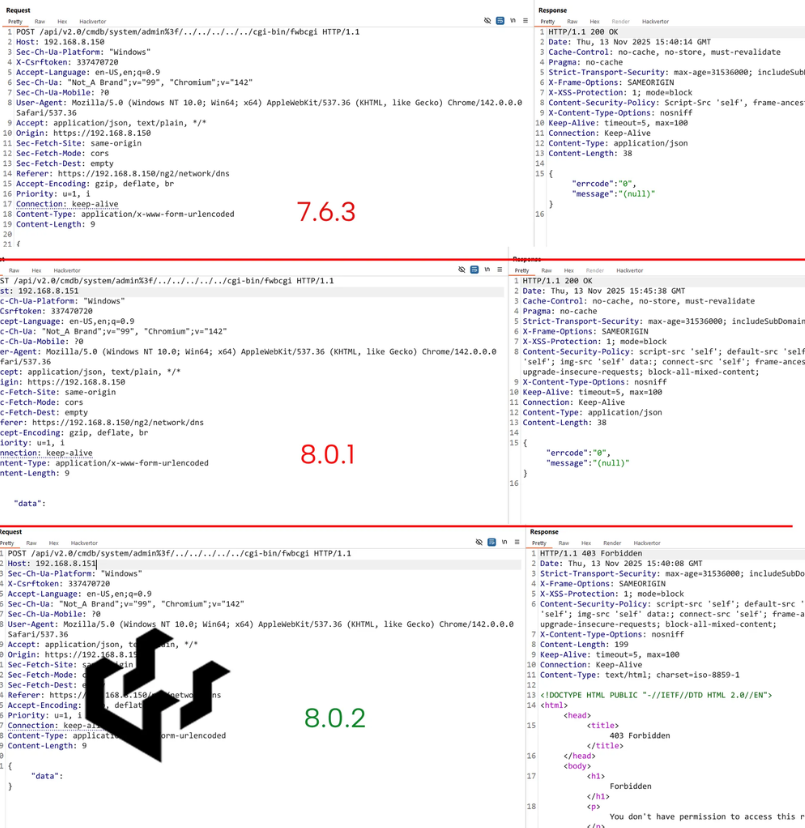

# Fortinet FortiWeb Authentication Bypass (CVE-2025-64446)


## Description

A critical vulnerability in Fortinet FortiWeb allows remote attackers to bypass authentication and impersonate the built-in admin user.
Attackers exploit a path traversal flaw combined with a crafted `CGIINFO` header containing Base64-encoded JSON.
This flaw is being **actively exploited** to create rogue admin accounts, giving attackers full control over the WAF device.

---


## Technical Details

| **Component / Area**         | **Details**                                            |
| ---------------------------- | ------------------------------------------------------ |
| **CVE**                      | **CVE-2025-64446**                                     |
| **Vulnerability Type**       | Path Traversal + Authentication Bypass                 |
| **Affected Feature**         | `fwbcgi` internal CGI handler                          |
| **Attack Vector**            | Crafted HTTP POST with Base64 JSON in `CGIINFO` header |
| **Privilege Level Achieved** | Full Administrative Control                            |

### Combined Vulnerabilities

1. **Path Traversal** to reach the internal CGI binary:

   ```
   /api/v2.0/cmdb/system/admin%3F/../../../../../cgi-bin/fwbcgi
   ```
2. **Authentication Bypass** via Base64-encoded JSON specifying:

   * `username`
   * `profname`
   * `vdom`
   * `loginname`

FortiWeb fails to verify authentication and accepts the supplied values, causing **admin impersonation**.

### Affected Versions

* 8.0.0–8.0.1
* 7.6.0–7.6.4
* 7.4.0–7.4.9
* 7.2.0–7.2.11
* 7.0.0–7.0.11

---

## Attack Scenario

1. Attacker sends a malicious POST request to the vulnerable endpoint.
2. JSON blob in `CGIINFO` header is Base64-encoded and mimics the internal admin identity.
3. FortiWeb treats the attacker as an authenticated **administrator**.
4. Attacker creates new privileged accounts, such as:

   * `Testpoint / AFodIUU3Sszp5`
   * `trader / 3eMIXX43`
   * `test1234point / AFT3$tH4ck`
5. With persistence established, the attacker can:

   * Modify WAF policies
   * Disable protections
   * Intercept or manipulate traffic
   * Install backdoors
   * Pivot internally

---

## Impact Assessment

=== "System Compromise"

* Full administrative compromise of FortiWeb
* Rogue administrator accounts created
* Ability to disable or tamper with WAF rules
* Long-term persistence via hidden accounts
* Potential internal network pivoting
* High risk of sensitive traffic interception or alteration

---

## Mitigation Strategies

### 🔄 Immediate Patching

Upgrade to fixed versions:

* **8.0.2**
* **7.6.5**
* **7.4.10**
* **7.2.12**
* **7.0.12**



### 🌐 Reduce Exposure

* Disable HTTP/HTTPS admin access on internet-facing interfaces.

### 🔍 Detection & Threat Hunting

* Check for **unauthorized admin accounts**.
* Inspect logs for POST requests to `fwbcgi`.
* Search for Base64 patterns in the `CGIINFO` header.

### 🔒 Network Hardening

* Restrict management access to internal networks only.

### 📘 CISA KEV Compliance

* Apply patches within required remediation windows.

---

## Resources & References

!!! info "Official & Media Reports"

      * [PSIRT | FortiGuard Labs](https://fortiguard.fortinet.com/psirt/FG-IR-25-910)
      * [Now-Patched Fortinet FortiWeb Flaw Exploited in Attacks to Create Admin Accounts](https://thehackernews.com/2025/11/fortinet-fortiweb-flaw-actively.html)
      * [CVE Record: **CVE-2025-64446**](https://www.cve.org/CVERecord?id=CVE-2025-64446)
      * [CISA Known Exploited Vulnerabilities Catalog](https://www.cisa.gov/known-exploited-vulnerabilities-catalog?search_api_fulltext=CVE-2025-64446)
      * [CVE-2025-64446 in Fortinet FortiWeb: Details, Next Steps](https://www.bitsight.com/blog/critical-vulnerability-alert-cve-2025-64446-fortinet-fortiweb-vulnerability)
      * [Unauthenticated Authentication Bypass in Fortinet FortiWeb Exploited in the Wild — Qualys](https://blog.qualys.com/vulnerabilities-threat-research/2025/11/14/unauthenticated-authentication-bypass-in-fortinet-fortiweb-cve-2025-64446-exploited-in-the-wild)
