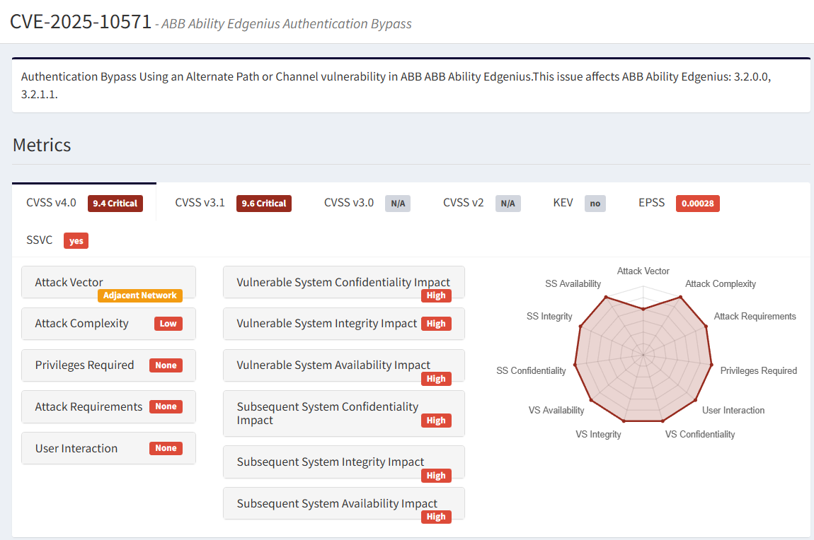

# ABB Ability Edgenius Authentication Bypass – CVE-2025-10571

**CVE-2025-10571**{.cve-chip}  
**Authentication Bypass**{.cve-chip}  
**Adjacent Network Access**{.cve-chip}

## Overview
CVE-2025-10571 is a critical authentication bypass vulnerability in ABB Ability Edgenius, an industrial edge computing and management platform. Due to improper access controls, an attacker on the adjacent network can directly interact with the Edgenius Management Portal and execute privileged operations without authentication.

This could allow attackers to install, modify, or uninstall software packages, reconfigure systems, or take control of edge nodes within an industrial environment.

## Technical Specifications

| **Attribute** | **Details** |
|---------------|-------------|
| **CVE ID** | CVE-2025-10571 |
| **Vulnerability Type** | Authentication Bypass / Alternate Path |
| **Attack Vector** | Adjacent Network (local segment, routed industrial network, VPN) |
| **Authentication** | None required |
| **Complexity** | Low |
| **User Interaction** | None required |
| **Affected Component** | ABB Ability Edgenius Management Portal |

### Affected Versions
- 3.2.0.0
- 3.2.1.1

### Root Cause
A backend API used by the Edgenius Management Portal does not properly enforce authentication checks, enabling unauthorized access from an attacker with network visibility into the node hosting Edgenius.

### Vulnerability Class
CWE-288 – Authentication Bypass / Alternate Path

**Scope**: Changed – exploitation can affect external systems via control plane compromise.

## Attack Scenario
1. An attacker gains access to the same network segment or route as an Edgenius node (e.g., via lateral movement, exposed VLAN, misconfigured firewall, or VPN access).
2. They send crafted requests to the Edgenius management API.
3. Due to missing authentication validation, the system accepts the request as legitimate.
4. The attacker can then:
   - Install or remove applications on edge systems
   - Modify configuration or operational parameters
   - Deploy malicious code
   - Disrupt industrial processes

Compromise of the edge manager can enable pivoting deeper into OT or industrial networks.

## Impact Assessment

=== "Confidentiality"
    * Unauthenticated access to edge device configuration and operational data

=== "Integrity"
    * Attackers can change system settings
    * Push unauthorized apps or inject malicious payloads

=== "Availability"
    * Industrial functions may be disabled
    * Applications removed or systems rendered inoperable

=== "Industrial / Business Impact"
    * Loss of visibility or control over production edge devices
    * Compromise of industrial automation processes
    * Potential for operational downtime, safety violations, or manipulation of production logic
    * Gateway takeover allowing further attacks on PLCs, SCADA, or industrial controllers

## Mitigations

### 🔄 Primary Mitigation (Recommended)
Upgrade to **ABB Ability Edgenius version 3.2.2.0 or later**, which contains the official fix.

### 🛡️ If Patching is Delayed
- Disable the Edgenius Management Portal if not required.
- Restrict network access to Edgenius nodes:
  - Firewall rules
  - VLAN segmentation
  - Zero-trust zone enforcement
- Do not expose Edgenius management services to the Internet or uncontrolled networks.

### 📊 Implement
- IDS/IPS monitoring for suspicious requests
- System logging of management operations
- Strong access controls on administration paths

### 🔍 Assess Edge Nodes For
- Unexpected installed applications
- Unauthorized configuration changes
- Signs of lateral movement on the OT network

## Resources & References

!!! info "Official & Advisory Resources"
    * [Canadian Centre for Cyber Security Advisory](https://www.cyber.gc.ca/en/alerts-advisories/control-systems-abb-security-advisory-av25-776)
    * [NVD - CVE-2025-10571](https://nvd.nist.gov/vuln/detail/CVE-2025-10571)
    * [ABB Security Advisory](https://library.e.abb.com/public/6fed91aad9034910b99298c58e407979/7PAA022088_B_en_Edgenius%20Management%20Portal%20Authentication%20Bypass.pdf?x-sign=kuMLUXu%2B5oamHWJfxVip%2BhHMBVcvnU%3D)
    * [OpenCVE - CVE-2025-10571](https://app.opencve.io/cve/CVE-2025-10571)