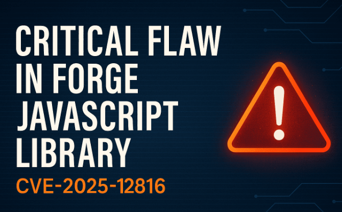

# node-forge ASN.1 Validation Bypass Vulnerability

**CVE-2025-12816**{.cve-chip}  
**node-forge ASN.1 Validator Desynchronization**{.cve-chip}  
**Cryptographic Verification Bypass**{.cve-chip}

## Overview

A vulnerability in the ASN.1 schema validator of the widely used JavaScript crypto library **node-forge** allows specially crafted ASN.1 structures to be treated as valid. Applications that rely on node-forge for certificate, PKCS#12, or signature verification may incorrectly accept attacker-crafted data, bypassing MACs, signature checks, or certificate validation.

## Technical Specifications

| **Attribute**         | **Details**                                                                 |
|-----------------------|-----------------------------------------------------------------------------|
| **CVE ID**            | CVE-2025-12816                                                              |
| **Library**           | node-forge                                                                  |
| **Component / Func**  | ASN.1 validator — asn1.validate(...)                                        |
| **Vulnerability Type**| ASN.1 validator desynchronization → validation bypass                       |
| **Affected Versions** | node-forge versions prior to 1.3.2                                          |
| **Attack Vector**     | Malformed ASN.1 structures (PKCS#12, certificates, signed messages)         |
| **Privileges**        | Depends on application context (no native privileges required for exploit)  |
| **Impact**            | Cryptographic verification bypass, signature/certificate acceptance issues  |

## Technical Details

- The flaw resides in node-forge's asn1.validate(...) traversal logic. When optional ASN.1 fields are manipulated, the validator can become desynchronized.
- Desynchronization can cause the parser to skip required fields or misinterpret subsequent elements, allowing malformed structures to be treated as valid.
- Demonstrated exploit: a tampered PKCS#12 archive where MAC verification fails but node-forge reports success.
- Root cause fixed by tightening validation logic and correcting ASN.1 traversal/length handling in the 1.3.2 patch.

## Attack Scenario

1. Attacker crafts a malicious ASN.1 payload (e.g., PKCS#12, certificate, or signed message) that abuses optional fields to desynchronize the validator.  
2. The malicious object is supplied to an application that uses node-forge for verification (upload, authentication, or package verification).  
3. node-forge's asn1.validate(...) accepts the malformed structure as valid.  
4. The application skips integrity/MAC/signature checks or treats the tampered object as authentic.  
5. Attacker gains ability to load forged credentials, impersonate identities, bypass integrity checks, or run modified encrypted packages undetected.

## Impact Assessment

=== "Integrity & Authentication"
    * High risk of signature or MAC verification bypass.
    * Applications may accept forged certificates, PKCS#12 archives, or signed payloads.

=== "Account & Credential Risk"
    * Potential account takeover where PKCS#12 or certificate-based auth is used.
    * Forged credentials could enable lateral access or impersonation.

=== "Supply Chain & Configuration Risk"
    * Tampered encrypted configuration files or install packages may be accepted.
    * Downstream JavaScript apps and bundled codebases are at risk if they include vulnerable node-forge.

## Mitigations

### 📦 Upgrade
- Upgrade node-forge to version **1.3.2** or later (patch tightens ASN.1 validation).

### 🛠️ Build & Dependency Hygiene
- Rebuild applications and audit bundled dependencies to ensure no residual vulnerable copies remain (npm ls node-forge).
- Use SCA tools and dependency monitoring to detect vulnerable transitive dependencies.

### 🔐 Defense-in-Depth
- Where possible, validate certificates and PKCS#12 using platform/native crypto libraries (OpenSSL, OS trust stores) in addition to node-forge.
- Reject inputs that fail parsing or produce unexpected ASN.1 structures rather than attempting lenient recovery.

### 🔎 Incident Response
- Regenerate PKCS#12 archives and certificates if tampering is suspected.
- Hunt for unexpected successful verifications, unexpected certificate chains, or systems that accepted malformed packages.

## Resources & References

!!! info "Advisories & Coverage"
    * [VU#521113 - Forge JavaScript library impacted by a vulnerability in signature verification](https://kb.cert.org/vuls/id/521113)
    * [GitHub Advisory: node-forge Interpretation Conflict / ASN.1 Validator Desynchronization (CVE-2025-12816)](https://github.com/advisories/GHSA-5gfm-wpxj-wjgq)
    * [TechRadar: Popular JavaScript library can be hacked to allow attackers into user accounts ](https://www.techradar.com/pro/security/popular-javascript-library-can-be-hacked-to-allow-attackers-into-user-accounts)
    * [CCB Safeonweb: Warning: Cryptographic verification vulnerability in Node-forge — patch immediately!](https://ccb.belgium.be/advisories/warning-cryptographic-verification-vulnerability-node-forge-can-compromise-any)
    * [NVD entry: CVE-2025-12816](https://nvd.nist.gov/vuln/detail/CVE-2025-12816)