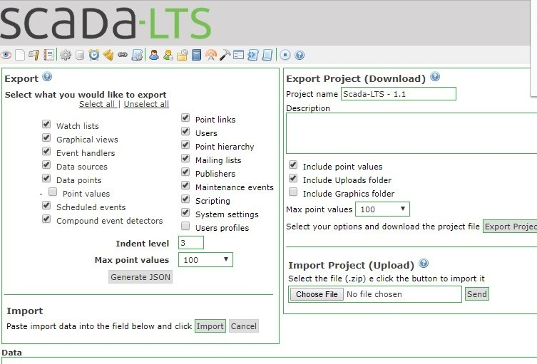

# Scada-LTS Project Import Path Traversal – CVE-2025-13791

**Path Traversal**{.cve-chip}  
**SCADA System**{.cve-chip}  
**Remote Exploitation**{.cve-chip}

## Overview

The vulnerability resides in the `Common.getHomeDir` function (in `ZIPProjectManager.java`, Project Import component). It allows manipulated input (path parameters) to result in a path traversal. The code incorrectly handles file-path sanitization, meaning a malicious ZIP or project-import request can traverse outside the intended directory.

## Technical Specifications

| **Attribute**           | **Details**                                                                 |
|-------------------------|-----------------------------------------------------------------------------|
| **CVE ID**              | CVE-2025-13791                                                              |
| **Vulnerability Type**  | Path Traversal (CWE: Improper Limitation of a Pathname to a Restricted Directory) |
| **Affected Component**  | `Common.getHomeDir` in `br/org/scadabr/vo/exporter/ZIPProjectManager.java` (Project Import) |
| **Affected Versions**   | Scada-LTS up to 2.7.8.1                                                     |
| **Attack Vector**       | Network (Remote)                                                            |
| **Authentication**      | May not be required depending on configuration                              |
| **Exploitability**      | Remote — no need for local access. **Public exploit code already available** |
| **Vendor Response**     | Vendor was contacted at disclosure time — **reportedly did not respond**    |

## Technical Details

### Vulnerability Mechanism
- **Vulnerable Function**: `Common.getHomeDir` in the Project Import component
- **Root Cause**: Incorrect handling of file-path sanitization
- **Attack Method**: Crafted project-import request (e.g., malicious ZIP file or manipulated parameters)
- **Result**: System writes or reads files outside the intended project directory

### What Can Be Accessed
- System configuration files
- Credentials
- Logs
- Other sensitive files on the server

## Attack Scenario

1. **Initial Attack**: An attacker sends a crafted project-import request (e.g., malicious ZIP file or manipulated parameters) to the Scada-LTS Project Import feature.

2. **Path Traversal**: Because of the path-traversal bug, the system writes or reads files outside the intended project directory.

3. **File System Access**: Attacker gains access to:
    - System configuration files
    - Credentials
    - Logs
    - Other sensitive files on the server

4. **Further Exploitation**: Once file system access is gained, attacker may:
    - Further pivot
    - Extract credentials or configs
    - Compromise SCADA system integrity or availability

5. **Remote Execution**: No local privileges required — so if the SCADA server is exposed (Internet-connected / reachable), attacker can exploit from anywhere.

## Impact Assessment

=== "Confidentiality Breach"
    * Access to sensitive configuration, credential files, internal data
    * Exposure of SCADA system architecture and credentials

=== "Integrity Compromise"
    * Malicious modification of configuration or project files
    * Possibly subverting monitoring or control logic
    * Corruption of files or configuration could disrupt SCADA service

=== "Availability Risk"
    * Disruption of SCADA service or cause control failures
    * Potential physical-system misbehavior

=== "Operational / Safety Risk"
    * In industrial/OT context — misuse of SCADA access may cause physical-system misbehavior
    * If the attacker leverages credentials or configs

=== "Lateral Movement"
    * With credentials or config data exposed, attacker might pivot to other internal systems
    * Access to networks, controllers, or other critical infrastructure

## Mitigations

### 🌐 Network Isolation
- **Do not expose** Scada-LTS Project-Import (ZIP import) functionality to untrusted or public networks
- Isolate SCADA interface behind firewall, VPN or air-gap
- Limit to **trusted internal network only**

### 🔒 Access Control
- **Restrict access**: Only allow access to trusted administrators
- Enforce **strong authentication** and least-privilege for project import

### 📊 Audit / Monitor
- Log and monitor any file reads/writes outside the expected directory
- Detect anomalous directory traversal or config access

### 🔄 Patch / Update
- Apply vendor / community patch if/when released
- Since vendor reportedly didn't respond, **monitor official project or community forks** for a fix

### 🛡️ Compensating Controls
- Wrap the import feature in additional security layers:
  - Sandboxing
  - Chroot/jail
  - Restrict write permissions
  - **Disable project-import entirely** if not needed

### 🏗️ Network Segmentation
- Ensure **SCADA/OT is separated** from general IT network
- Implement OT-IT separation best practices

### 💾 Backup & Validation
- Have backups of configurations
- Validate integrity
- After patching — verify no malicious files or altered configs exist

## Resources & References

!!! info "Vulnerability Details & Analysis"
    * [NVD - CVE-2025-13791](https://nvd.nist.gov/vuln/detail/CVE-2025-13791)
    * [CVE-2025-13791 | Tenable®](https://www.tenable.com/cve/CVE-2025-13791)
    * [CVE-2025-13791: Path Traversal in Scada-LTS - Threat Radar | OffSeq](https://radar.offseq.com/threat/cve-2025-13791-path-traversal-in-scada-lts-5e427368)
    * [CVE-2025-13791 - Exploits & Severity - Feedly](https://feedly.com/cve/CVE-2025-13791)