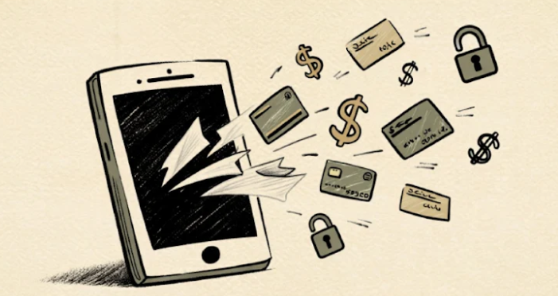
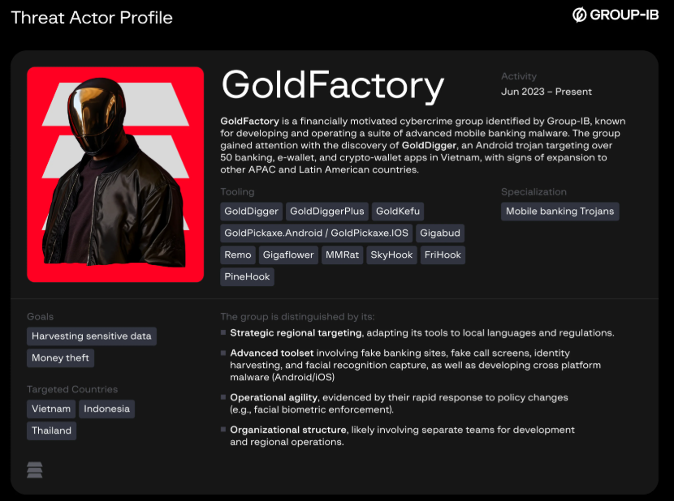

# GoldFactory Hits Southeast Asia with Modified Banking Apps Driving 11,000+ Infections

**Modified Banking Apps**{.cve-chip}  
**Hooking Malware**{.cve-chip}  
**Southeast Asia Campaign**{.cve-chip}

## Overview

GoldFactory distributed modified versions of legitimate banking apps in **Indonesia, Vietnam, Thailand**. These apps look and act like real banking apps but contain malicious hooking code. Once installed, the malware enables remote access, intercepts app logic, hides its presence, and enables attackers to steal credentials, view balances, and potentially manipulate transactions. Social engineering (phishing / vishing) is used to trick victims into downloading the fake apps.

This sophisticated campaign has resulted in **over 11,000 documented infections** across Southeast Asia, with over 300 unique modified-app samples identified.

## Technical Specifications

| **Attribute**           | **Details**                                                                 |
|-------------------------|-----------------------------------------------------------------------------|
| **Campaign Name**       | GoldFactory                                                                 |
| **Target Region**       | Indonesia, Vietnam, Thailand (Southeast Asia)                               |
| **Infection Count**     | 11,000+ documented infections                                               |
| **Modified Apps**       | 27+ legitimate banking apps injected with malicious code                    |
| **Modified Samples**    | 300+ unique modified-app samples identified                                 |
| **Malware Families**    | FriHook, SkyHook, PineHook                                                  |
| **Distribution Method** | Social engineering (vishing), fake app stores, side-loading                 |
| **C2 Infrastructure**   | ykkadm[.]icu, dgpyynxzb[.]com                                              |

## Technical Details

### Modified Banking Apps
- At least **27 original banking apps** were identified as having been injected with malicious functionality
- Apps retain normal-looking functionality, making detection by users difficult
- **~63% of the modified apps target Indonesian users**

### Malware Families Used

#### FriHook
- Uses a **"Frida gadget"** (native library injection)
- Hooks into the legitimate banking app

#### SkyHook
- Uses the publicly available **Dobby hooking framework**
- Attackers often modify the Android Manifest
- Define a custom `AppComponentFactory` or custom `Application` subclass
- Runs malicious code before the real app

#### PineHook
- Third hooking framework variant used in the campaign

### Malicious Module Capabilities

The malicious modules implement features such as:

  - **Hiding the list of apps** that have Accessibility Services enabled
  - **Preventing screencast detection**
  - **Spoofing app signatures** (so the modified app appears legitimately signed)
  - **Hiding the installation source**
  - Providing custom "integrity token" providers
  - **Retrieving victims' bank account balance**
  - Likely harvesting credentials

### Two-Stage Infection Chain

In some cases the campaign uses a two-stage infection chain:

1. **Stage 1 - Dropper**: Remote access trojan (e.g., **Gigabud, Remo, or MMRat**) is installed as a "dropper"
2. **Stage 2 - Banking Malware**: Modified banking app (with hooking malware) is installed

### Infrastructure
- Malicious hosting domains and open-directory hosting
- Examples:
    - `ykkadm[.]icu`
    - `dgpyynxzb[.]com`

## Attack Scenario

1. **Social Engineering (Vishing)**: Attackers contact victims by phone (often claiming to be from government services or utility providers).

2. **Installation Instructions**: Victims are instructed to install an "update" or a "payment/bill" app; a link is sent via messaging apps (e.g., in Vietnam via **Zalo**).

3. **Fake Landing Pages**: Victims are redirected to fake landing pages (masquerading as app store / official services) and download the malicious APK (side-loaded).

4. **Dropper Installation**: The dropper Trojan (**Gigabud, Remo, or MMRat**) is installed first; then the banking-app payload (with FriHook/SkyHook/PineHook) is deployed.

5. **Malicious Activation**: Malicious hooking code activates when the banking app runs; it:
      - Bypasses integrity checks
      - Hides malicious libraries
      - Spoofs signatures
      - Bypasses screencast detection
      - Hides installation source
      - Enables remote monitoring or control (e.g., remote-access trojan, screen capture, possibly UI overlay, credential theft)

## Impact Assessment

=== "Scale of Infections"
    * Over **300 unique modified-app samples** identified so far
    * At least **11,000 documented infections** across the region (based on telemetry / artifact detection)
    * Actual number may be higher
    * About **2,200 infections in Indonesia alone** identified

=== "Banking Security Risks"
    * Credential theft
    * Unauthorized access
    * Full takeover of banking sessions
    * Potential theft of funds
    * Identity theft

=== "Detection Challenges"
    * The malicious apps retain **normal-looking functionality**
    * Making detection by users difficult
    * Because the hooking preserves legitimate functions
    * Many victims likely remain **unaware of compromise for extended periods**

=== "Regional Impact"
    * **~63% of the modified apps target Indonesian users**
    * Significant threat to banking infrastructure across Southeast Asia
    * Undermines trust in mobile banking platforms

## Mitigations

### 📱 App Installation Security
- **Never sideload banking apps** — only install official banking apps from trusted sources (official app stores)
- Do not click on links or install apps sent via unsolicited messages

### 🚨 Social Engineering Awareness
- Be **extremely cautious** of unsolicited calls/messages claiming to be from:
  - Government agencies
  - Utilities
  - Banks
- Verify legitimacy through official channels before taking any action

### 🔒 Permission Management
- **Do not grant unnecessary permissions** to apps unless you absolutely trust them, especially:
  - Accessibility permissions
  - SMS permissions
  - Overlay permissions
  - Accessibility service permissions

### 🛡️ Mobile Security Solutions
- Use **mobile-security solutions / anti-malware / Mobile Threat Defense (MTD)** that can detect:
  - Suspicious apps or sideloaded APKs
  - Unusual permissions
  - Abnormal network behavior

### 📊 Account Monitoring
- **Monitor bank account activity carefully**, especially:
  - After installing new apps
  - After interacting with unsolicited calls/messages

### 🏢 For Organizations
- Enforce policy **forbidding installation of unapproved apps**
- **Limit BYOD (bring-your-own-device) risk**
- **Educate users** about:
  - Social engineering
  - Phishing
  - Sideload-risks

## Resources & References

!!! info "Research & Analysis"
    * [GoldFactory Malware Injects FriHook/SkyHook into Banking Apps to Exploit 11K SE Asia Users](https://meterpreter.org/goldfactory-malware-injects-frihook-skyhook-into-banking-apps-to-exploit-11k-se-asia-users/)
    * [GoldFactory Hits Southeast Asia with Modified Banking Apps Driving 11,000+ Infections](https://thehackernews.com/2025/12/goldfactory-hits-southeast-asia-with.html)
    * [Hook for Gold: Inside GoldFactory's Campaign That Turns Apps Into Goldmines | Group-IB Blog](https://www.group-ib.com/blog/turning-apps-into-gold/)
    * [Hackers observed injecting legitimate banking apps with malicious code | TechRadar](https://www.techradar.com/pro/security/hackers-observed-injecting-legitimate-banking-apps-with-malicious-code)
    * [GoldFactory Launches Sophisticated Malware Attacks on Asian Banking Apps | Blog - Comfidentia](https://blog.comfidentia.cl/en/2025/12/04/goldfactory-lanza-ataques-sofisticados-malware-apps-bancarias-asia/)
    * [GoldFactory targets Southeast Asia with over 11,000 infections](https://www.secnews.gr/en/677000/goldfactory-stoxevei-asia-11000-molinseis/)

!!! warning "Affected Regions"
    This campaign primarily targets users in **Indonesia** (~63% of modified apps), **Vietnam**, and **Thailand**. Users in these regions should exercise extreme caution when installing banking applications.