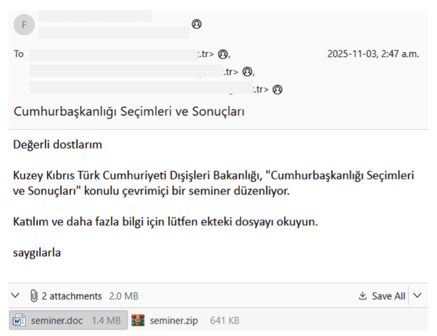
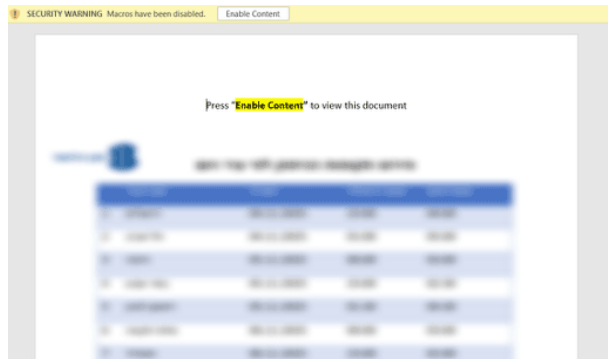

# UDPGangster Campaigns Target Multiple Countries

**Windows Backdoor**{.cve-chip}  
**UDP-Based C2**{.cve-chip}  
**MuddyWater Campaign**{.cve-chip}

## Overview

UDPGangster is a Windows backdoor that communicates with attacker C2 servers over **UDP** — unusual, since many backdoors use TCP/HTTP(S). The campaign uses spear-phishing emails that deliver a malicious Word document (or ZIP containing it). Once the victim enables macros, a VBA macro drops and executes a payload, which installs the backdoor.

This campaign has been attributed to **MuddyWater** (Iran-aligned APT) and targets multiple countries including **Turkey, Israel, and Azerbaijan**.

## Technical Specifications

| **Attribute**           | **Details**                                                                 |
|-------------------------|-----------------------------------------------------------------------------|
| **Threat Actor**        | MuddyWater (Iran-aligned APT)                                               |
| **Target Countries**    | Turkey, Israel, Azerbaijan                                                  |
| **Malware Name**        | UDPGangster                                                                 |
| **Platform**            | Windows                                                                     |
| **C2 Protocol**         | UDP (port 1269)                                                             |
| **C2 IP Observed**      | 157.20.182.75                                                               |
| **Initial Access**      | Spear-phishing with malicious Word documents                                |
| **Delivery Method**     | Macro-enabled Word documents or ZIP files                                   |
| **Persistence Location**| %AppData%\RoamingLow\SystemProc.exe                                        |
| **Mutex Name**          | xhxhxhxhxhxpp                                                              |

**VBA executing the encoded payload**

## Technical Details

### Initial Infection Vector

#### Malicious Document
- The malicious document uses a **VBA macro** triggered via the `Document_Open()` event
- The macro decodes a **Base64-encoded payload** (stored in a hidden form field)
- Writes it to a file, e.g., `C:\Users\Public\ui.txt`
- Then uses the Windows API (`CreateProcessA`) to execute it — launching UDPGangster

### Persistence Mechanism

After execution, UDPGangster:

  1. Copies itself to `%AppData%\RoamingLow\SystemProc.exe`
  2. Creates a **registry startup entry** under `HKCU\SOFTWARE\Microsoft\Windows\CurrentVersion\Explorer\User Shell`
  3. Creates a **mutex** (named `xhxhxhxhxhxpp`) to prevent multiple instances

### Anti-Analysis / Sandbox/VM Detection

UDPGangster performs extensive checks:

#### Environment Checks
- Checks for **debugger presence**
- Checks if **CPU cores < 2**
- Checks if **RAM < 2048 MB**
- Checks if running under **workgroup vs domain**

#### Virtualization Detection
- Checks network adapter **MAC prefixes** for known virtualized NIC vendors:
    - VMware
    - VirtualBox
    - Xen
    - Others
- Scans **WMI**, **registry**, **running processes/services** for VM/sandbox artifacts

#### Sandbox Detection
- Inspects for known sandboxing/debugging DLLs:
    - `sbiedll.dll`
    - `dbghelp.dll`
    - `dir_watch.dll`
    - Others

**If it detects such an environment, it aborts payload** — to avoid sandbox or analysis detection.

### Command & Control (C2)

- The backdoor contacts a C2 server (IP seen: **157.20.182.75**) over **UDP port 1269**
- Unusual use of UDP instead of typical TCP/HTTP(S)

#### Supported Commands
- **Heartbeat** (keep-alive)
- **Remote command execution** via `cmd.exe`
- **File extraction/exfiltration**
- **Dropping and executing additional payloads**
- **Updating the C2 address**

**Phishing mail**

**Document with VBA script**

## Attack Scenario

1. **Spear-Phishing Email**: The attacker sends a spear-phishing email impersonating a legitimate government entity (in the documented case: the **Turkish Republic of Northern Cyprus Ministry of Foreign Affairs**), inviting the target to a fake "online seminar." The email includes a malicious Word document (or ZIP) asking to "Enable Content" (macros).

2. **Macro Execution**: If the user enables macros, the embedded VBA script runs:
    - Decodes the hidden payload and writes to disk
    - Executes it — installing UDPGangster silently
    - The document may show a benign-looking decoy image (e.g., about service outages) to distract the user while the malware executes

3. **Anti-Analysis & Installation**: UDPGangster carries out its anti-analysis checks to evade sandbox detection:
    - If environment passes, proceeds to collect system info
    - Opens a **UDP-based C2 connection** for remote control, exfiltration, and possibly further payloads or lateral movement

## Impact Assessment

=== "Remote Control"
    * Full remote control of infected Windows systems by attackers
    * Ability to execute arbitrary commands via `cmd.exe`
    * Deploy additional payloads

=== "Data Exfiltration"
    * Ability to exfiltrate files and sensitive data
    * Access to system information
    * Potential for long-term data collection

=== "Stealth & Persistence"
    * Potential for **long-term stealthy presence** on networks
    * Persistence mechanisms ensure survival across reboots
    * **UDP C2 that evades many detection tools** (since most focus on TCP/HTTP traffic)

=== "Espionage Risk"
    * Because of the use of social engineering (phishing) and custom malware
    * This represents a **serious espionage risk** to organizations
    * Especially government, critical infrastructure, or those with sensitive data
    * Targeted countries: Turkey, Israel, Azerbaijan

## Mitigations

### 👥 User Awareness & Training
- Be **extremely cautious** about unsolicited emails, especially those with attachments requesting to "Enable Content" (macros)
- **Treat macro-enabled documents with suspicion** unless expected
- Verify sender authenticity through alternative channels

### 📧 Email Filtering & Gateway Protections
- Use **phishing protection**, sandboxing, and **macro-blocking** on email gateways
- Stop malicious macro-laden documents before they reach users

### 🛡️ Endpoint Protection & Content Disarm/Reconstruction
- Solutions that **strip or disable macros** or sandbox suspicious documents can stop the initial malware dropper
- Use **content-disarm/reconstruction** services

### 🌐 Network Monitoring & Anomaly Detection
- Pay attention to **unusual outbound UDP traffic** (especially to unknown external IPs or on unusual ports, e.g., **port 1269**)
- Since using UDP for C2 is atypical and may bypass traditional monitoring

### 🔄 Keep AV/EDR Signatures Updated
- The report indicates that Fortinet's AV detects UDPGangster with signatures such as:
    - `VBA/Agent.NFYP!tr`
    - `W64/Agent.ALD!tr`
- Ensure all security tools are up-to-date

### 🏗️ Harden Security Posture
Use **layered defenses**:

- Email gateways
- Endpoint security
- Network-based content disarm + sandboxing
- Strong egress filtering
- **Least-privilege principle**
- Multi-factor authentication (MFA)
- Network segmentation

(Even though MFA or segmentation won't by itself block a macro-based infection, they help **limit lateral movement or impact**)

### 🔍 Detection & Response
- Monitor for:
    - Unexpected UDP traffic on port 1269
    - Registry modifications in User Shell Folders
    - Files appearing in `%AppData%\RoamingLow\`
    - Mutex creation: `xhxhxhxhxhxpp`
    - VBA macro execution
    - Suspicious `cmd.exe` spawning

## Resources & References

!!! info "Research & Analysis"
    * [UDPGangster Campaigns Target Multiple Countries | FortiGuard Labs](https://www.fortinet.com/blog/threat-research/udpgangster-campaigns-target-multiple-countries)
    * [MuddyWater Deploys UDPGangster Backdoor in Targeted Turkey-Israel-Azerbaijan Campaign](https://thehackernews.com/2025/12/muddywater-deploys-udpgangster-backdoor.html)
    * [Iran-Linked MuddyWater Deploys UDPGangster Backdoor, Using UDP Protocol for Covert C2](https://securityonline.info/iran-linked-muddywater-deploys-udpgangster-backdoor-using-udp-protocol-for-covert-c2/)
    * [MuddyWater Hackers Use UDPGangster Backdoor to Bypass Network Defenses on Windows](https://gbhackers.com/muddywater-hackers/)
    * [MuddyWater Hackers Using UDPGangster Backdoor to Attack Windows Systems Evading Network Defenses](https://cybersecuritynews.com/muddywater-hackers-using-udpgangster-backdoor/)
    * [Windows Systems Under Attack as MuddyWater Hackers Use UDPGangster Backdoor to Bypass Defenses](https://cyberpress.org/muddywater-hackers/)

!!! warning "Attribution"
    This campaign has been attributed to **MuddyWater**, an Iran-aligned APT group. The use of government impersonation and targeted countries suggests **state-sponsored espionage objectives**.