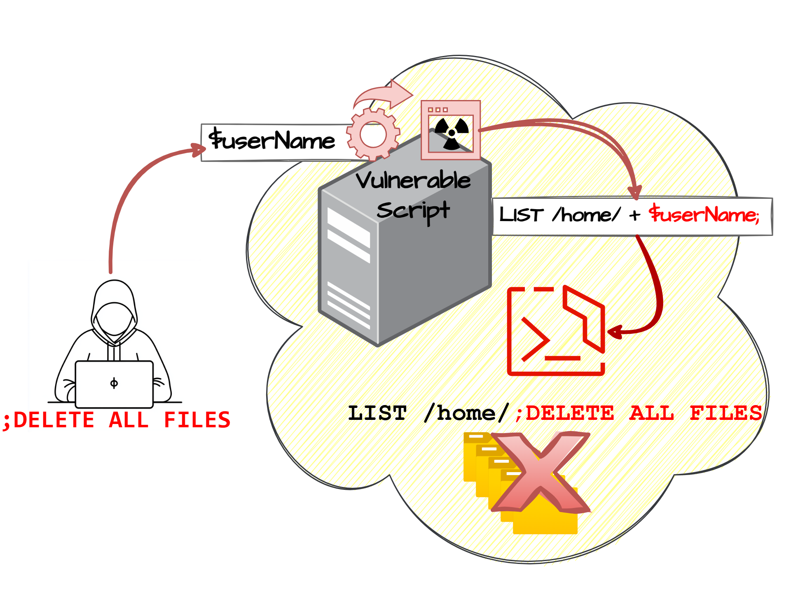

# OS Command Injection in Fortinet FortiSandbox

**CVE-2025-53949**{.cve-chip}
**OS Command Injection**{.cve-chip}
**Remote Code Execution**{.cve-chip}

## Overview
Fortinet FortiSandbox contains a critical OS command injection vulnerability in the `upload_vdi_file` endpoint accessible through the GUI and API. The system fails to properly validate user-supplied data before passing it to operating system commands, allowing an authenticated attacker to inject and execute arbitrary commands on the underlying system. Successful exploitation grants root-level access to the FortiSandbox appliance, enabling complete device compromise, disruption of malware analysis workflows, and potential lateral movement into protected networks. This vulnerability affects multiple versions of FortiSandbox and requires immediate patching to prevent exploitation.

## Technical Specifications

| **Attribute** | **Details** |
|---------------|-------------|
| **CVE ID** | CVE-2025-53949 |
| **Vulnerability Type** | OS Command Injection (CWE-78) |
| **Attack Vector** | Network (authenticated) |
| **Authentication** | Required (valid credentials) |
| **Complexity** | Low |
| **User Interaction** | Not required |
| **Privileges Required** | Low (authenticated user) |
| **Impact** | Root-level code execution |
| **Severity** | High |

## Affected Products

### Vulnerable Versions
- **FortiSandbox 5.0.0 through 5.0.2**
- **FortiSandbox 4.4.0 through 4.4.7**
- **FortiSandbox 4.2** (all versions)
- **FortiSandbox 4.0** (all versions)

### Fixed Versions
- **FortiSandbox 5.0.3** or later
- **FortiSandbox 4.4.8** or later
- For older 4.x branches: **Migration to fixed release required**

### Deployment Context
- On-premises FortiSandbox appliances used for malware analysis
- Security operations center (SOC) infrastructure
- Threat intelligence and analysis platforms
- Integrated security monitoring environments

## Vulnerability Details

### OS Command Injection (CWE-78)
OS command injection occurs when an application passes unsafe user-supplied data to a system shell. The vulnerability allows attackers to execute arbitrary operating system commands on the server that is running the application.

### Vulnerable Endpoint: upload_vdi_file
The vulnerability exists in the `upload_vdi_file` endpoint, which is accessible through:
- **Web GUI**: FortiSandbox administrative interface
- **API**: Programmatic access to FortiSandbox functions

### Root Cause
The system fails to properly sanitize or validate user input before incorporating it into operating system commands. This allows specially crafted input containing command separators (e.g., `;`, `|`, `&&`, `||`) and shell metacharacters to break out of the intended command context and execute attacker-controlled commands.

### Exploitation Requirements
- **Authentication**: Valid credentials to FortiSandbox web interface or API
- **Network Access**: Connectivity to FortiSandbox management interface
- **Privileges**: Standard authenticated user access (not necessarily administrative)

### Command Execution Context
Successful exploitation results in command execution with **root privileges**, granting the attacker:
- Full control over the FortiSandbox appliance
- Ability to read, modify, or delete any files
- Capacity to install backdoors or malicious software
- Access to modify system configurations
- Potential to pivot to other network segments

## Attack Scenario
1. **Credential Acquisition**: Attacker gains valid credentials to a vulnerable FortiSandbox instance through credential theft, password reuse, weak passwords, phishing, or compromised accounts
2. **Authentication**: Attacker authenticates to the FortiSandbox web interface or API using the obtained credentials
3. **Malicious Request Crafting**: Attacker crafts specially formatted HTTP requests targeting the vulnerable `upload_vdi_file` endpoint with injected OS commands
4. **Input Processing**: The FortiSandbox system fails to properly sanitize the malicious input and incorporates it into an operating system command
5. **Command Execution**: Injected commands are executed with root privileges on the FortiSandbox appliance, granting the attacker full system control
6. **Post-Exploitation**: From root access, attacker can exfiltrate malware samples and analysis data, install persistent backdoors, disable security monitoring, or pivot into the internal network for lateral movement

## Impact Assessment

=== "Integrity"
    * Full compromise of FortiSandbox appliances
    * Unauthorized modification of system configurations
    * Installation of backdoors and malicious software
    * Tampering with malware analysis results
    * Manipulation of threat intelligence data

=== "Confidentiality"
    * Exposure of malware samples under analysis
    * Access to threat intelligence and analysis reports
    * Disclosure of network configurations and credentials
    * Leakage of security monitoring data
    * Exposure of integrated security tool credentials

=== "Availability"
    * Disruption of malware analysis workflows
    * Service degradation or outage of FortiSandbox
    * Loss of threat detection capabilities
    * Interruption of security operations
    * Potential for destructive attacks on analysis infrastructure

=== "Lateral Movement Risk"
    * **Network Pivot Point**: Use compromised FortiSandbox as launching point for attacks on internal networks
    * **Credential Harvesting**: Access to credentials for integrated systems and tools
    * **Tool Integration**: Exploitation of trust relationships with other security tools
    * **Data Exfiltration**: Use of FortiSandbox's network position for data theft
    * **Persistent Access**: Establishment of long-term foothold in security infrastructure

## Mitigation Strategies

### 🔄 Immediate Actions
- **Apply Security Updates**: Upgrade affected FortiSandbox versions to patched releases immediately
    - FortiSandbox 5.0.3 or later
    - FortiSandbox 4.4.8 or later
    - Migrate older 4.x branches to fixed releases
- **Access Restriction**: Restrict access to FortiSandbox management interface using VPN or firewall rules
- **Credential Review**: Audit all user accounts and reset suspicious credentials
- **Activity Monitoring**: Review logs for suspicious administrative activity or unusual API calls

### 🛡️ Access Control Hardening
- **Network Isolation**: Place FortiSandbox behind VPN or on isolated management network
- **Firewall Rules**: Implement strict firewall rules limiting access to management interfaces
- **IP Whitelisting**: Allow management access only from specific trusted IP addresses
- **VPN Requirement**: Require VPN connection for all remote FortiSandbox access
- **Principle of Least Privilege**: Limit user accounts to minimum necessary permissions

### 🔒 Authentication & Credential Security
- **Strong Credentials**: Use strong, unique administrative credentials
- **Multi-Factor Authentication**: Implement MFA for all FortiSandbox access
- **Password Policies**: Enforce complex password requirements
- **Credential Rotation**: Regularly rotate administrative passwords
- **Account Auditing**: Review and remove unnecessary user accounts
- **Privileged Access Management**: Implement PAM solutions for credential management

### 🔍 Monitoring & Detection
- **Log Monitoring**: Monitor logs for suspicious administrative activity
- **API Call Tracking**: Track and alert on unusual API usage patterns
- **Command Execution Monitoring**: Deploy monitoring for unexpected system commands
- **Configuration Changes**: Alert on unauthorized configuration modifications
- **Failed Authentication**: Monitor for brute force or credential stuffing attempts
- **SIEM Integration**: Integrate FortiSandbox logs into security monitoring platform

### 📊 Vulnerability & Patch Management
- **Vulnerability Scanning**: Integrate FortiSandbox into vulnerability scanning program
- **Patch Management**: Establish process for timely Fortinet security updates
- **Version Tracking**: Maintain inventory of FortiSandbox versions and patch status
- **Vendor Advisories**: Subscribe to Fortinet security advisories and PSIRT notices
- **Testing Procedures**: Test patches in non-production before deployment
- **Rollback Planning**: Maintain rollback procedures for patch issues

## Additional Context

### FortiSandbox Role in Security Infrastructure
FortiSandbox is a critical component of security operations:

- **Malware Analysis**: Advanced threat detection through sandbox analysis
- **Threat Intelligence**: Generation of threat intelligence from malware samples
- **Integration**: Connected to firewalls, email gateways, and security tools
- **SOC Function**: Essential tool for security operations center activities

### Why This Vulnerability is Critical
- **Root Access**: Exploitation grants complete system control
- **Security Tool**: Compromise of security infrastructure is especially damaging
- **Trust Relationships**: FortiSandbox has trusted connections to other security tools
- **Sensitive Data**: Contains malware samples and threat intelligence
- **Network Position**: Often has visibility into multiple network segments

## Resources and References

!!! info "Official Documentation"
    - [ZDI-25-1096 | Zero Day Initiative](https://www.zerodayinitiative.com/advisories/ZDI-25-1096/)
    - [PSIRT | FortiGuard Labs](https://www.fortiguard.com/psirt/FG-IR-25-479)
    - [FortiSandbox OS command injection Vulnerability Let Attackers execute Malicious code](https://cybersecuritynews.com/fortisandbox-os-command-injection-vulnerability/amp/)
    - [FortiSandbox Flaw Allows OS Command Injection and Remote Code Execution](https://gbhackers.com/fortisandbox-flaw-allows-os-command-injection/)
    - [NVD - CVE-2025-53949](https://nvd.nist.gov/vuln/detail/CVE-2025-53949)

!!! danger "Critical Warning"
    This vulnerability allows **authenticated attackers** to execute **arbitrary commands as root** on FortiSandbox appliances. Because FortiSandbox is a critical security infrastructure component, compromise can have cascading effects on your security posture. **Immediate patching is essential**.
