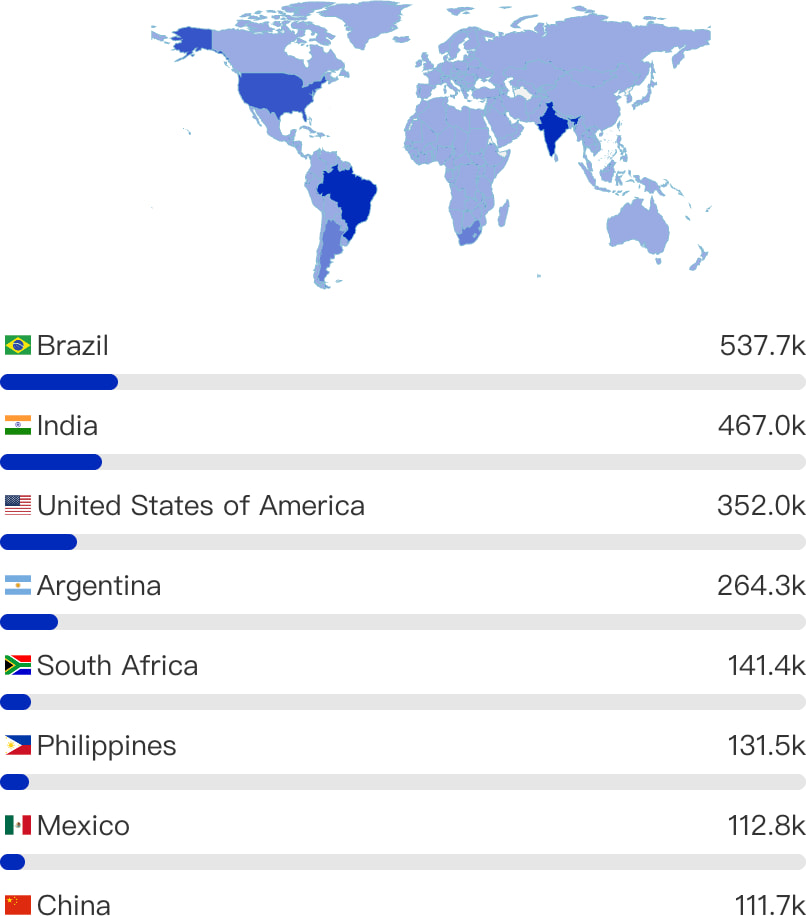

# Kimwolf Botnet: 1.8 Million Android Devices Hijacked

**Android Botnet**{.cve-chip} 
**1.8M Devices**{.cve-chip} 
**DDoS**{.cve-chip} 
**Proxy Network**{.cve-chip}

## Overview

**Kimwolf** is a newly identified **Android botnet** that has compromised approximately **1.8 million Android-based devices**—especially **smart TVs, set-top boxes, and tablets**—turning them into a **distributed attack network** capable of **massive DDoS attacks**, **proxy traffic forwarding**, and **remote command execution**. Built using **Android NDK** (native compiled binary), the botnet employs advanced evasion techniques including **encrypted DNS-over-TLS communications**, **ECDSA signature validation**, and **Ethereum Name Service (ENS)** blockchain domains for resilient command-and-control infrastructure. The botnet is **linked to the AISURU botnet** through shared code, infrastructure, and infection scripts, suggesting common operators. Over a short period, Kimwolf issued approximately **1.7 billion DDoS commands**, with **over 96% of commands focused on proxy use**, indicating a **monetization strategy** through illicit proxy network services.

---

## Technical Specifications

| **Attribute**              | **Details**                                                                 |
|----------------------------|-----------------------------------------------------------------------------|
| **Botnet Name**            | Kimwolf                                                                    |
| **Compromised Devices**    | Approximately 1.8 Million                                                  |
| **Affected Platforms**     | Android-based IoT devices (Smart TVs, Set-Top Boxes, Tablets)              |
| **Development Framework**  | Android NDK (Native Development Kit) — native compiled binary              |
| **Attack Capabilities**    | DDoS (TCP/UDP/ICMP), Proxy Forwarding, Reverse Shell, File Management     |
| **C2 Communication**       | DNS-over-TLS (encrypted), TLS-encrypted channels                           |
| **C2 Resilience**          | Ethereum Name Service (ENS) blockchain domains (e.g., pawsatyou.eth)       |
| **Command Authentication** | ECDSA (Elliptic Curve Digital Signature Algorithm) signature validation    |
| **DDoS Commands Issued**   | ~1.7 Billion (over short observation period)                               |
| **Primary Activity**       | 96% of commands for proxy traffic forwarding (monetization)                |
| **Related Botnet**         | AISURU (shared code, infrastructure, and infection scripts)                |
| **Geographic Spread**      | Global distribution                                                        |

---

## Technical Details

### Botnet Architecture

Kimwolf represents a **sophisticated Android-based botnet** with advanced capabilities:

- **Native Code Implementation**: Built using **Android NDK**, producing native ARM binaries that execute directly on Android's Linux kernel, improving performance and complicating reverse engineering
- **Multi-Function Payload**: Single malware package includes DDoS engine, proxy server, remote shell, and file management modules
- **Modular Command System**: Bots receive and execute commands dynamically, allowing operators to pivot between DDoS, proxy, and remote access operations
- **Persistent Infection**: Malware achieves persistence through system-level installation or abuse of accessibility services

### Command and Control Infrastructure

Kimwolf employs **layered C2 resilience** to evade takedown efforts:

1. **DNS-over-TLS (DoT)**: All C2 communications encrypted using DNS-over-TLS protocol, preventing network inspection and DNS monitoring
2. **Ethereum Name Service (ENS)**: Uses blockchain-based domain names (e.g., `pawsatyou.eth`) that resolve to C2 server IPs, providing censorship-resistant infrastructure (EtherHiding technique)
3. **ECDSA Signature Validation**: Commands authenticated using elliptic curve cryptography, preventing unauthorized command injection or botnet hijacking
4. **TLS-Encrypted Channels**: All bot-to-C2 communications use TLS encryption, hiding payload contents from network defenders
5. **Dynamic Infrastructure**: C2 servers can change IPs while maintaining ENS domain continuity, complicating blocklist efforts

### Attack Capabilities

#### DDoS Attack Modes

- **TCP Floods**: SYN floods, ACK floods, and connection exhaustion attacks against web servers and network infrastructure
- **UDP Floods**: High-volume UDP packet floods targeting DNS servers, game servers, and network equipment
- **ICMP Floods**: Ping floods and ICMP redirect attacks to saturate network bandwidth

#### Proxy Network

- **Traffic Forwarding**: Infected devices act as residential proxy nodes, routing attacker traffic through victim devices to mask origin
- **Monetization Strategy**: 96% of commands focus on proxy operations, suggesting operators sell access to compromised device IPs as proxy service
- **Residential IP Value**: Smart TV and set-top box IPs highly valued for bypassing geo-restrictions, account verification, and ad fraud

#### Remote Access

- **Reverse Shell**: Operators can execute arbitrary shell commands on infected devices, enabling data theft, credential harvesting, and lateral movement
- **File Management**: Upload, download, delete, and execute files on compromised devices, facilitating payload updates and data exfiltration

### AISURU Botnet Connection

Kimwolf shares **significant infrastructure overlap** with the **AISURU botnet**:

- **Shared Codebase**: Analysis reveals common code patterns, library usage, and command structures
- **Overlapping Infrastructure**: Both botnets use same C2 servers, ENS domains, and DNS-over-TLS resolvers
- **Common Infection Scripts**: Identical or near-identical installation scripts suggest shared development or operator collaboration
- **Coordinated Campaigns**: Kimwolf and AISURU campaigns exhibit temporal correlation, indicating unified control

---

## Attack Scenario

### Step-by-Step Infection and Operation

1. **Device Compromise (Initial Infection)**  
   Devices infected through multiple potential vectors:

    * **(A)** Trojanized apps distributed via third-party app stores or sideloaded APKs.
    * **(B)** Pre-infected firmware on **uncertified Android TV boxes** and tablets (supply chain compromise).
    * **(C)** Exploitation of unpatched vulnerabilities in outdated Android builds.
    * **(D)** ADB (Android Debug Bridge) exposure on internet-connected devices with default credentials.

2. **Bot Enrollment and C2 Connection**  
    * Malware establishes persistence by installing system-level service or abusing accessibility permissions. 
    * Bot initiates encrypted connection to C2 infrastructure using **DNS-over-TLS** to resolve **ENS blockchain domain** (e.g., `pawsatyou.eth`). 
    * Connection established via **TLS-encrypted channel** to C2 server IP obtained from ENS resolution.

3. **Command Authentication**  
    * C2 server sends commands **digitally signed with ECDSA**. 
    * Bot validates signature using embedded public key before executing commands. 
    * This prevents third-party command injection and botnet hijacking by security researchers or rival operators.

4. **Command Execution — DDoS and Proxy Operations**  
    * Bots receive and execute commands. 
    * Approximately **1.7 billion DDoS commands** observed over short period, with **96% focused on proxy forwarding**. 
    * DDoS targets include web servers, gaming platforms, and financial services. 
    * Proxy operations route attacker traffic through residential IPs for anonymity, bypassing geo-restrictions, and ad fraud campaigns.

5. **Monetization and Scaling**  
    * Operators sell access to **1.8 million-device proxy network** on underground markets. 
    * Buyers purchase residential IP proxies for account creation, credential stuffing, sneaker bots, and ad click fraud. 
    * DDoS-for-hire services offered on darknet markets. 
    * Continuous infection campaigns expand botnet size, increasing revenue potential.

---

## Impact Assessment

=== "Device Owner Impact"
    * **1.8 million device owners** unknowingly participate in criminal activity. 
    * Compromised smart TVs, set-top boxes, and tablets experience **degraded performance** due to background DDoS and proxy operations consuming bandwidth and processing power. 
    * Devices may become **unstable or crash** under heavy botnet workload. 
    * **Privacy violations** as personal data accessible via reverse shell. 
    * Potential **legal liability** if device IP associated with cybercrimes (unlikely but possible).

=== "Network Impact"
    * Botnet capable of generating **massive DDoS traffic volumes** approaching record levels. 
    * C2 domain **briefly ranked above Google** in Cloudflare's most active domains, indicating extraordinary traffic scale. 
    * DDoS attacks can **disrupt critical services**, financial institutions, gaming platforms, and government websites. 
    * **Residential proxy abuse** enables credential stuffing, account takeover attacks, and fraud campaigns difficult to attribute.

=== "Enterprise Impact"
    * Organizations face **DDoS attacks** from distributed residential IPs difficult to block without collateral damage. 
    * **Credential stuffing attacks** through proxy network bypass IP-based rate limiting and geo-blocking. 
    * **Ad fraud campaigns** using residential IPs undermine digital advertising trust. 
    * Security teams struggle to distinguish **legitimate residential traffic from botnet proxy abuse**.

=== "Ecosystem Impact" 
    * Incident highlights **supply chain security failures** in Android IoT ecosystem. 
    * **Uncertified Android TV boxes** and tablets with insecure firmware create persistent botnet recruitment pipeline. 
    * Lack of **mandatory security updates** for consumer IoT devices enables long-term botnet persistence. 
    * **ENS blockchain abuse** for C2 infrastructure demonstrates challenges in disrupting decentralized criminal infrastructure. 
    * Precedent set for future botnets leveraging blockchain resilience.

---

## Mitigation Strategies

### For End Users and Consumers

- **Use Certified Devices**: Purchase **Google-certified Android TV devices** (e.g., Chromecast with Google TV, NVIDIA Shield) that receive regular security updates. Avoid uncertified "Android TV boxes" from unknown manufacturers.
- **Avoid Sideloading Apps**: Only install apps from **Google Play Store**. Avoid sideloading APKs from third-party stores, file-sharing sites, or unknown sources. Enable "Play Protect" in Google Play Store settings.
- **Firmware and App Updates**: Regularly check for and install **system updates** and **app updates**. Enable automatic updates where available. Outdated firmware is primary attack vector.
- **Change Default Credentials**: Immediately change default passwords on smart TVs, set-top boxes, and routers. Use strong, unique passwords. Disable **ADB (Android Debug Bridge)** if not actively used for development.
- **Disable Unused Features**: Turn off **remote access features**, **network file sharing**, and **developer options** unless specifically needed. Reduce attack surface.
- **Monitor Network Activity**: Use router traffic monitoring to detect unusual outbound traffic from IoT devices. Investigate unexplained bandwidth consumption or connections to unknown IPs.

### For Network Administrators

- **Network Segmentation**: Isolate IoT devices (smart TVs, set-top boxes, tablets) on **separate VLAN** from critical systems, workstations, and servers. Implement strict firewall rules limiting IoT device communication.
- **Intrusion Detection Systems (IDS/IPS)**: Deploy network monitoring solutions to detect **DDoS traffic patterns**, **proxy abuse**, and **C2 communications**. Alert on sustained high-volume traffic from IoT devices.
- **DNS Monitoring**: Monitor for **DNS-over-TLS** usage from IoT devices. While legitimate uses exist, IoT devices typically don't require encrypted DNS. Block or inspect DoT traffic where appropriate.
- **Block Malicious Domains**: Maintain threat intelligence feeds to block known Kimwolf C2 domains, ENS-associated IPs, and AISURU infrastructure. Update blocklists regularly.
- **Rate Limiting and Traffic Filtering**: Implement egress filtering to limit volume of outbound connections from IoT devices. Rate-limit ICMP, UDP, and TCP SYN packets to prevent DDoS participation.
- **Baseline Behavioral Analysis**: Establish normal traffic patterns for IoT devices. Alert on deviations such as sudden high outbound connections, proxy-like forwarding behavior, or external shell connections.

### For IoT Manufacturers

- **Mandatory Security Updates**: Commit to **minimum 5-year security update lifecycle** for consumer IoT devices. Implement automatic update mechanisms with rollback capabilities.
- **Secure Boot and Verified Boot**: Implement secure boot chains preventing installation of unsigned firmware. Use verified boot to detect and reject compromised system partitions.
- **Default Credential Elimination**: Ship devices with **unique default credentials** or force credential setup during initial configuration. Prohibit universal default passwords.
- **ADB Security**: Disable ADB by default. If enabled, require physical interaction and strong authentication. Never expose ADB on network interfaces accessible from internet.
- **Google Certification**: Pursue **Google Mobile Services (GMS) certification** for Android devices to ensure compliance with security baseline requirements and access to Play Protect.

### Detection Indicators

- **Network Behavior**: High volume of outbound connections, DNS-over-TLS traffic from IoT devices, connections to ENS blockchain domains (*.eth), sustained UDP/TCP/ICMP floods
- **Device Behavior**: Excessive CPU/memory usage, device overheating, network interface constantly active, unusual background processes visible in developer tools
- **C2 Indicators**: Connections to known Kimwolf/AISURU infrastructure, ECDSA-signed command traffic patterns, periodic beaconing to external IPs
- **Blockchain Indicators**: DNS queries for ENS domains (pawsatyou.eth and variants), connections to Ethereum RPC endpoints for domain resolution

### Incident Response

- **Device Quarantine**: Immediately isolate suspected infected devices from network. Disable WiFi/Ethernet until remediation complete.
- **Factory Reset**: Perform **full factory reset** on infected devices. Note: Some pre-infected firmware may survive factory reset if compromised at ROM level.
- **Firmware Reinstallation**: If possible, manually reinstall clean firmware from manufacturer's official website. Verify firmware integrity using checksums.
- **Network Investigation**: Review network logs for other devices exhibiting similar traffic patterns. Assess scope of botnet presence in network.
- **Credential Rotation**: Change WiFi passwords, router admin passwords, and any credentials potentially accessible from compromised device.

---

## Resources

!!! info "Threat Analysis"
    - ['Kimwolf' Android Botnet Ensnares 1.8 Million Devices — SecurityWeek](https://www.securityweek.com/kimwolf-android-botnet-ensnares-1-8-million-devices/)
    - [Kimwolf Botnet Infected 1.8 Million Android TV Boxes Worldwide](https://cyberinsider.com/kimwolf-botnet-infected-1-8-million-android-tv-boxes-worldwide/)
    - [Kimwolf Botnet Hijacks 1.8 Million Android TVs, Launches Large-Scale DDoS Attacks](https://thehackernews.com/2025/12/kimwolf-botnet-hijacks-18-million.html)
    - [Nearly 2 Million Android Devices Hijacked by Massive New Botnet — Tom's Guide](https://www.tomsguide.com/computing/malware-adware/nearly-2-million-android-devices-hijacked-by-massive-new-botnet-how-to-see-if-yours-are-infected)

!!! danger "Indicators of Compromise"
    - Connections to ENS domains: `pawsatyou.eth` and variants
    - DNS-over-TLS traffic from Android IoT devices
    - Sustained high-volume outbound UDP/TCP/ICMP traffic
    - Unauthorized ADB connections or root access attempts
    - Unknown system-level services with network access

---
