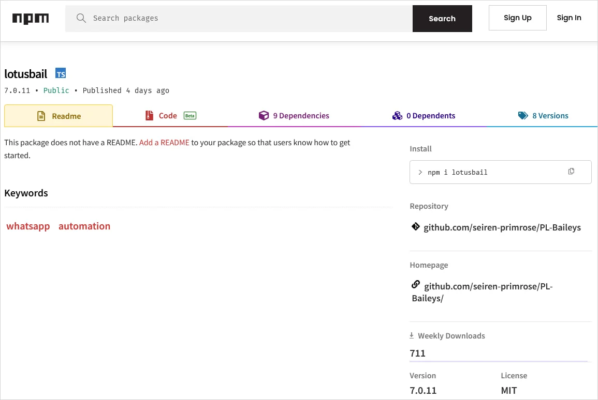

# Lotusbail: Malicious npm Package Targeting WhatsApp Web API Developers

**Supply Chain Attack**{.cve-chip} **npm Package**{.cve-chip} **WhatsApp Compromise**{.cve-chip} **56,000+ Downloads**{.cve-chip}

## Overview

**Lotusbail** is a **malicious npm package** disguised as a legitimate **WhatsApp Web API library** that was published on npm and downloaded over **56,000 times** before detection. While appearing functional and allowing normal WhatsApp messaging operations, the package **secretly captured credentials, messages, contact lists, media files, and session tokens**, then exfiltrated that data to attacker-controlled servers. The package was a **trojanized fork** of the legitimate WhatsApp Web API library inspired by **@whiskeysockets/baileys**, implementing a **malicious WebSocket wrapper** that intercepted all WhatsApp traffic. Most critically, the package used a **hardcoded pairing code** to **silently link the attacker's device** to the victim's WhatsApp account, creating **persistent access** that survives even after the malicious package is removed. This represents a sophisticated **supply chain attack** targeting developers building WhatsApp integration services.

---

## Attack Specifications

| **Attribute**              | **Details**                                                                 |
|----------------------------|-----------------------------------------------------------------------------|
| **Malicious Package Name** | lotusbail                                                                  |
| **Package Repository**     | npm (Node Package Manager)                                                 |
| **Total Downloads**        | 56,000+ (before removal)                                                   |
| **Disguise**               | WhatsApp Web API library (legitimate-looking functionality)                |
| **Legitimate Inspiration** | @whiskeysockets/baileys (popular WhatsApp Web API library)                 |
| **Attack Type**            | Supply Chain Attack, Typosquatting/Brandjacking                            |
| **Primary Targets**        | Developers building WhatsApp integrations, chatbots, automation tools      |
| **Malicious Capabilities** | Credential theft, message interception, contact exfiltration, media theft  |
| **Persistence Mechanism**  | Silent WhatsApp device pairing via hardcoded pairing code                  |
| **Exfiltration Method**    | Custom encrypted WebSocket to attacker-controlled servers                  |
| **Data Stolen**            | Session tokens, auth credentials, chat histories, contacts, phone numbers  |
| **Detection Difficulty**   | High (package appeared functional, used encryption and obfuscation)        |
| **Persistence Duration**   | Indefinite (until manually unlinked in WhatsApp settings)                  |
| **Discovery Status**       | Detected and removed from npm                                              |

---

## Technical Details

### Package Deception

Lotusbail employed **sophisticated deception tactics** to appear legitimate:

- **Functional Facade**: Package actually worked as a WhatsApp Web API library, allowing developers to send/receive messages, manage contacts, and handle media—making malicious behavior harder to detect
- **Forked Codebase**: Built atop legitimate WhatsApp Web API code inspired by **@whiskeysockets/baileys**, a well-known open-source library, providing credible foundation
- **Naming Strategy**: "lotusbail" similar enough to "baileys" to appear related or as alternative implementation, exploiting developer trust in ecosystem
- **npm Publication**: Published to official npm registry with description and documentation mimicking legitimate packages

### Malicious WebSocket Wrapper

The core attack vector was a **trojanized WebSocket client**:

- **Interception Layer**: Package wrapped the standard WebSocket connection used for WhatsApp Web protocol communication
- **Man-in-the-Middle**: All traffic between developer's application and WhatsApp servers routed through attacker-controlled wrapper
- **Transparent Operation**: Wrapper passed through legitimate traffic unchanged, maintaining normal application functionality while logging data
- **Data Capture**: Intercepted authentication tokens, session keys, message payloads (text, images, videos, documents), contact information, and metadata

### Data Exfiltration Mechanism

Stolen data was transmitted to attacker infrastructure using **obfuscation techniques**:

- **Custom Encryption**: Captured data encrypted using custom encryption scheme before transmission, evading plaintext detection
- **Obfuscated Endpoints**: Exfiltration endpoints dynamically constructed or obfuscated in code to avoid static analysis detection
- **Covert Channels**: Data potentially exfiltrated via legitimate-looking HTTPS requests or WebSocket connections to attacker servers disguised as API calls
- **Batched Transmission**: Data possibly batched and transmitted periodically rather than real-time to reduce network anomaly detectability

### Silent Device Pairing

The **most persistent aspect** of the attack:

- **Hardcoded Pairing Code**: Package contained hardcoded WhatsApp device pairing code that automatically linked attacker's device to victim's account
- **Automatic Linking**: During initial authentication or session establishment, attacker's device silently added to victim's linked devices list
- **Persistent Access**: Once paired, attacker retains full access to WhatsApp account—can read messages, send messages, view contacts—**even after lotusbail package removed**
- **Difficult Detection**: Linked devices require manual review in WhatsApp settings; most users unaware of unauthorized pairing

### Evasion Techniques

- **Code Obfuscation**: Malicious code likely obfuscated using JavaScript minification, variable name randomization, or packing techniques
- **Legitimate Functionality**: By providing working API library, package avoided immediate suspicion from developers testing functionality
- **Delayed Activation**: Malicious behavior may have activated only after initial testing period or in production environments
- **Dynamic Code Loading**: Additional payloads potentially loaded at runtime from external sources, avoiding static code analysis

---

## Attack Scenario

### Step-by-Step Compromise

1. **Malicious Package Publication**  
   Attacker creates **lotusbail** package as trojanized fork of legitimate WhatsApp Web API library. Publishes to npm registry with convincing description: "WhatsApp Web API library for Node.js - message automation, chatbots, and integrations." Includes documentation and examples mimicking real libraries.

2. **Developer Discovery and Installation**  
   Developer searches npm for WhatsApp API libraries for project (chatbot, customer service automation, notification system). Discovers **lotusbail** via npm search, web search, or recommendation. Installs package: `npm install lotusbail`. Package added to `package.json` and deployed to development or production environment.

3. **Application Integration**  
   Developer integrates lotusbail into application code following provided documentation. Application authenticates with WhatsApp using QR code or phone number verification. Establishes WebSocket connection to WhatsApp servers for message handling.

4. **Malicious Wrapper Activation**  
   Upon initialization, lotusbail's **malicious WebSocket wrapper** activates. Wrapper intercepts WhatsApp Web protocol handshake, capturing **authentication tokens** and **session credentials**. All subsequent WhatsApp traffic (messages, contacts, media) routed through attacker-controlled interception layer.

5. **Silent Device Pairing**  
   Package uses **hardcoded pairing code** to automatically link attacker's device to victim's WhatsApp account. Pairing occurs during authentication flow, invisible to developer. Attacker's device appears in victim's **Linked Devices** list (but typically unnoticed without manual inspection). Attacker gains **persistent full access** to WhatsApp account.

6. **Data Exfiltration**  
   Captured data (credentials, messages, contacts with phone numbers, media files, session tokens) encrypted using custom encryption. Exfiltrated to attacker-controlled servers via obfuscated HTTPS/WebSocket connections. Attacker amasses database of compromised WhatsApp accounts, credentials, and sensitive communications.

7. **Persistent Compromise**  
   Even if developer eventually removes lotusbail package (due to suspicion, security scan, or public disclosure), **attacker's device remains linked** to WhatsApp account. Attacker retains access to read/send messages, view contacts, and monitor account activity **indefinitely** until victim manually unlinks device in WhatsApp settings.

---

## Impact Assessment

=== "Developer Impact" 
    * **56,000+ developers** potentially compromised, exposing their **WhatsApp accounts** to unauthorized access. 
    * Developers' **personal and professional communications** visible to attackers. 
    * If developers used compromised accounts for business purposes (customer support, notifications), **customer data exposed**. 
    * Persistent device pairing means compromise continues until manually remediated. 
    * Reputation damage for developers whose applications inadvertently facilitated data theft.

=== "End-User Impact"
    * Applications built with lotusbail (chatbots, automation services, customer support platforms) inadvertently exposed **end-user WhatsApp messages and contacts**. 
    * Users communicating with compromised services had conversations intercepted. 
    * **Phone numbers and contact information** exfiltrated, enabling targeted phishing, social engineering, or spam campaigns. 
    * Users unaware their communications compromised until public disclosure.

=== "Data Confidentiality Impact" 
    * Stolen data includes **sensitive personal and business communications**: private messages, financial discussions, health information, credentials shared via chat, business secrets, customer data. 
    * **Contact lists with phone numbers** enable identity correlation and targeted attacks. 
    * **Media files** (photos, videos, documents) potentially contain sensitive visual information or proprietary documents. 
    * Session tokens allow **account impersonation**.

=== "Ecosystem Trust Impact"
    * Incident erodes trust in **npm ecosystem security**. 
    * Developers question safety of third-party dependencies, especially for security-sensitive integrations (messaging platforms, authentication services). 
    * Highlights inadequacy of npm's package vetting process. 
    * Competitors to npm (e.g., pnpm, Yarn with alternative registries) may benefit from trust erosion. 
    * Calls for improved supply chain security controls intensify.

=== "Enterprise Impact"
    * Organizations whose developers integrated lotusbail into internal tools or customer-facing applications face **data breach incidents**. 
    * Potential **regulatory violations** (GDPR, CCPA) if customer communications exposed. 
    * **Incident response costs** for investigating scope, notifying affected users, and remediating compromise. 
    * Potential **legal liability** for inadequate supply chain security controls.

---

## Mitigation Strategies

### Immediate Actions (For Affected Users)

- **Remove lotusbail Package**: Immediately uninstall lotusbail from all projects: `npm uninstall lotusbail`. Search entire codebase and monorepos for package usage: `grep -r "lotusbail" .` or `npm ls lotusbail`. Remove from `package.json`, `package-lock.json`, and `yarn.lock`.
- **Unlink Unknown Devices**: Open WhatsApp on phone → Settings → Linked Devices → **Review all linked devices**. Unlink any unrecognized devices or devices from unfamiliar locations/IP addresses. Log out all devices and re-link only trusted devices.
- **Rotate WhatsApp Session Credentials**: If possible, log out and re-authenticate WhatsApp integration with fresh credentials. Generate new session tokens and API keys if using WhatsApp Business API.
- **Review Communication History**: Check WhatsApp chat history for unauthorized messages sent by attacker. Notify contacts if suspicious messages sent from your account. Change passwords for services if credentials shared via WhatsApp.
- **Monitor Account Activity**: Enable WhatsApp two-step verification (PIN code) to add security layer. Regularly review linked devices for new unauthorized pairings.

### Dependency Auditing

- **npm Audit**: Run `npm audit` to scan for known vulnerabilities and malicious packages in dependency tree. Review audit report for high-severity issues. Address findings before deployment.
- **Automated Scanning Tools**: Integrate dependency scanning into CI/CD pipeline:
    - **Snyk**: Continuous security monitoring for npm dependencies
    - **npm audit signatures**: Verify package integrity using signatures
    - **Socket.dev**: Detect supply chain attacks and malicious packages in real-time
    - **Dependabot**: Automated dependency updates and security alerts (GitHub)
- **Lock File Review**: Commit `package-lock.json` or `yarn.lock` to version control. Review lock file changes in pull requests to detect unexpected dependency additions or updates.
- **Software Composition Analysis (SCA)**: Deploy enterprise SCA tools (Sonatype Nexus, JFrog Xray, WhiteSource) for comprehensive supply chain risk management.

### Package Vetting Process

- **Source Code Review**: Before installing third-party packages, review source code on GitHub/GitLab. Check for obfuscated code, suspicious network calls, or unusual permission requests. Look for active maintenance and community engagement.
- **Reputation Assessment**: Evaluate package reputation:
    - **Download statistics**: Extremely low or extremely high downloads for new package (suspicious)
    - **Maintainer history**: Check npm profile for maintainer's other packages and reputation
    - **GitHub stars/forks**: Legitimate packages typically have community validation
    - **Recent activity**: Check last update date; abandoned packages pose security risk
- **Typosquatting Detection**: Be cautious of packages with names similar to popular libraries (e.g., lotusbail vs baileys). Verify official package name before installation. Use autocomplete or copy-paste from official documentation.
- **Dependency Tree Analysis**: Examine package dependencies (`npm ls <package>`) for unexpected or suspicious sub-dependencies. Malicious code often hidden in transitive dependencies.

### Runtime Monitoring

- **Network Traffic Monitoring**: Deploy network monitoring to detect unusual outbound connections from Node.js applications. Alert on connections to unknown external IPs, especially from third-party package code.
- **Behavioral Analysis**: Monitor application behavior for anomalies:
    - Unexpected file system access (reading credentials, SSH keys, browser data)
    - Unusual WebSocket connections to non-WhatsApp servers
    - High-volume data exfiltration patterns
    - Environment variable access by third-party code
- **Process Isolation**: Run Node.js applications with **least privilege** principle. Use containers (Docker) with restricted network policies, filesystem mounts, and capability dropping.

### Authentication Security

- **Credential Isolation**: Avoid storing sensitive credentials (API keys, tokens) in code or environment variables accessible to application. Use secrets management solutions (AWS Secrets Manager, HashiCorp Vault, Azure Key Vault).
- **Token Rotation**: Implement automatic token rotation for WhatsApp integrations. Limit token lifetime and require re-authentication periodically.
- **Two-Factor Authentication**: Enable WhatsApp two-step verification for all accounts used in integrations. Requires PIN code for device linking, preventing unauthorized pairing.
- **Separate Accounts**: Use dedicated WhatsApp Business accounts for integrations, separate from personal accounts. Limit blast radius if compromise occurs.

### Developer Education

- **Security Training**: Train development teams on supply chain security risks, typosquatting attacks, and malicious package identification. Conduct regular security awareness sessions.
- **Secure Development Guidelines**: Establish organizational policies for third-party dependency usage:
    - Require security team approval for new dependencies
    - Mandate source code review for security-sensitive packages (authentication, messaging, payment)
    - Document approved package registry and private mirror usage
- **Incident Response Procedures**: Prepare incident response playbook for supply chain compromise scenarios. Define roles, communication channels, and remediation steps.

### Ecosystem-Level Solutions

- **npm Package Signing**: Advocate for and use npm package signature verification when available. Verify cryptographic signatures before installation.
- **Private npm Registry**: Organizations should consider hosting **private npm mirror** with curated, vetted packages. Tools: Verdaccio, npm Enterprise, Artifactory, Nexus Repository.
- **Dependency Pinning**: Pin exact dependency versions in `package.json` (avoid `^` or `~` version ranges for critical packages). Review and test updates explicitly before deploying.
- **Continuous Monitoring**: Subscribe to security advisories (npm security advisories, Snyk vulnerability database, GitHub Security Advisories) for real-time alerts on compromised packages.

---

## Resources

!!! info "Incident Coverage"
    - [Poisoned WhatsApp API Package Steals Messages and Accounts — The Register](https://www.theregister.com/2025/12/22/whatsapp_npm_package_message_steal/)
    - [Malicious npm Package Steals WhatsApp Accounts and Messages](https://www.bleepingcomputer.com/news/security/malicious-npm-package-steals-whatsapp-accounts-and-messages/)
    - [This WhatsApp API Keeps Spying on Your Messages — Cybernews](https://cybernews.com/security/malicious-npm-whatsapp-supply-chain/)
    - [Worrying WhatsApp Attack Can Steal Messages and Even Accounts — TechRadar](https://www.techradar.com/pro/security/worrying-whatsapp-attack-can-steal-messages-and-even-accounts-heres-how-to-stay-safe-from-poisoned-attack)

---
