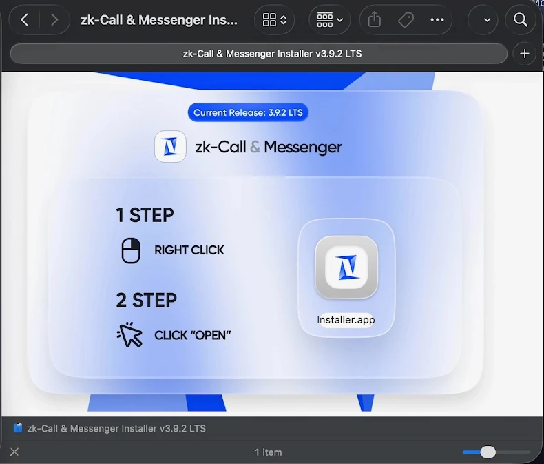

# MacSync macOS Stealer: Code-Signed Malware Bypassing Gatekeeper

**macOS Malware**{.cve-chip} **Code-Signed**{.cve-chip} **Gatekeeper Bypass**{.cve-chip} **Credential Theft**{.cve-chip}

## Overview

**MacSync** is a **macOS stealer malware** distributed through **digitally signed and Apple-notarized applications** disguised as legitimate installers (e.g., "zk-call-messenger-installer-3.9.2-lts.dmg"). The malware leverages **valid Apple developer signatures and notarization** to bypass **Gatekeeper and XProtect protections**, allowing execution on unsuspecting macOS systems without security warnings. The dropper, a **code-signed Swift application** packaged in a .dmg disk image, performs environment checks before downloading and executing an encoded payload from remote servers. The core malware is a **Go-based agent** derived from earlier Mac.c malware, supporting **credential theft**, **cryptocurrency wallet exfiltration**, and **remote command-and-control capabilities**. The distribution method exploits user trust in Apple's security infrastructure, demonstrating how **legitimate code-signing processes can be abused** for malware distribution until certificate revocation occurs.

---

## Malware Specifications

| **Attribute**              | **Details**                                                                 |
|----------------------------|-----------------------------------------------------------------------------|
| **Malware Name**           | MacSync (macOS Stealer)                                                    |
| **Variant**                | New code-signed variant (2024-2025)                                        |
| **Platform**               | macOS (all recent versions vulnerable before certificate revocation)       |
| **Distribution Method**    | Fake installers hosted on malicious websites                               |
| **Disguise**               | Legitimate applications (e.g., "zk-Call & Messenger" installer)            |
| **File Format**            | .dmg disk image containing signed Swift application                        |
| **File Size**              | ~25.5 MB (padded with decoy PDFs to appear legitimate)                     |
| **Code Signature**         | Valid Apple Developer ID signature (later revoked)                         |
| **Notarization**           | Apple-notarized (passed automated security checks before revocation)       |
| **Gatekeeper Bypass**      | Yes (valid signature allows execution without warnings)                    |
| **XProtect Bypass**        | Yes (not detected until signature database updated)                        |
| **Dropper Language**       | Swift (native macOS development language)                                  |
| **Payload Language**       | Go (compiled binary, cross-platform)                                       |
| **Payload Retrieval**      | Remote server download after environment checks                            |
| **Malware Heritage**       | Derived from Mac.c malware family                                          |
| **Primary Capabilities**   | Credential theft, wallet exfiltration, data harvesting, remote C2          |
| **Persistence**            | LaunchAgents, hidden files, background processes                           |
| **Detection Status**       | Now detected after certificate revocation and signature updates            |

---

## Technical Details

### Distribution and Packaging

MacSync employs **sophisticated packaging** to evade detection and appear legitimate:

- **Fake Installer Branding**: Disguised as popular applications like "zk-Call & Messenger", "productivity tools", or "video conferencing software" to lure victims
- **.dmg Disk Image**: Standard macOS installation format, familiar to users, containing the malicious application
- **File Padding**: .dmg inflated to **~25.5 MB** by including **decoy PDF files** and placeholder content, making it appear more substantial and legitimate (small files raise suspicion)
- **Professional Appearance**: Installer includes icons, splash screens, and UI elements mimicking legitimate software

### Code Signing and Notarization Abuse

The **most significant evasion technique** is abuse of Apple's security infrastructure:

- **Valid Developer Certificate**: Attackers obtained or compromised **legitimate Apple Developer ID certificate** to sign the application
- **Apple Notarization**: Application submitted to Apple's **notarization service** and passed automated malware scanning (before malware behavior was known)
- **Gatekeeper Bypass**: macOS **Gatekeeper** (default security mechanism preventing unsigned apps) allows execution without warnings because signature is valid and notarized
- **User Trust Exploitation**: Users see no security warnings, leading to higher execution rates compared to unsigned malware
- **Certificate Revocation**: Apple eventually **revoked the certificate** after malware discovery, but not before widespread distribution

### Dropper Behavior

The **Swift-based dropper** implements several anti-analysis checks:

1. **Internet Connectivity Check**: Verifies network connection to ensure payload can be downloaded
2. **Timing Checks**: Implements delays or timestamp validation to evade automated sandbox analysis
3. **Environment Validation**: May check for virtualization indicators, debuggers, or analysis tools
4. **Payload Download**: Connects to attacker-controlled remote server to download **encoded script or binary**
5. **Payload Decoding**: Decodes/decrypts downloaded payload (obfuscation layer to evade network inspection)
6. **Payload Execution**: Launches the MacSync stealer payload with appropriate privileges

### MacSync Stealer Core

The **Go-based payload** provides comprehensive data theft capabilities:

- **Credential Harvesting**: Extracts passwords from:
  - macOS Keychain (login passwords, certificates, secure notes)
  - Browser password stores (Safari, Chrome, Firefox, Edge)
  - Application-specific credentials (Slack, Discord, email clients)
  
- **Cryptocurrency Wallet Theft**: Targets wallet files and credentials for:
  - Bitcoin Core, Ethereum wallets, Electrum, Exodus, Atomic Wallet
  - Browser extension wallets (MetaMask, Coinbase Wallet)
  - Wallet seed phrases and private keys

- **Data Exfiltration**: Steals:
  - SSH keys (~/.ssh/)
  - Cloud service tokens (AWS CLI, Google Cloud SDK)
  - Session cookies and authentication tokens
  - Documents from user directories
  - Browser history and bookmarks

- **Remote Command & Control**: Communicates with C2 server for:
  - Receiving additional commands
  - Uploading stolen data
  - Downloading and executing additional payloads
  - Remote file system access

### Persistence Mechanisms

MacSync establishes **multiple persistence methods**:

- **LaunchAgents**: Installs plist files in `~/Library/LaunchAgents/` for automatic startup
- **Hidden Files**: Places malware in hidden directories (e.g., `~/Library/.hidden/`, `/tmp/`, `/var/tmp/`)
- **Background Processes**: Runs as background daemon mimicking legitimate system services
- **Cron Jobs**: May create scheduled tasks for periodic execution

---

## Attack Scenario

### Step-by-Step Infection Chain

1. **Malicious Site Setup**  
   Threat actor creates fake website or compromises legitimate site to host malicious .dmg installer. Site may impersonate popular software, use SEO poisoning to appear in search results, or be promoted via phishing emails, social media, or forum posts. Domain names chosen to appear legitimate (e.g., zk-call-messenger[.]com).

2. **Victim Downloads Fake Installer**  
   User searches for software (video conferencing, messaging, productivity tools) and finds malicious site. Downloads .dmg file believing it to be legitimate installer. File named to match real software (e.g., "zk-call-messenger-installer-3.9.2-lts.dmg").

3. **Gatekeeper Bypass via Valid Signature**  
   User double-clicks .dmg to mount disk image. Opens installer application. **Gatekeeper checks code signature**, finds valid Apple Developer ID certificate and notarization, and **allows execution without warnings**. User sees no security alerts, increasing trust. Some installers may still prompt "Open" confirmation, but lack of security warning encourages user to proceed.

4. **Dropper Environment Checks**  
   Swift dropper application launches and performs checks: verifies internet connectivity, implements timing delays to evade automated analysis, checks for virtualization or debugging environment. If checks pass, proceeds to payload download; otherwise, may display fake error message and exit cleanly.

5. **Payload Download and Execution**  
   Dropper connects to attacker-controlled server (C2 infrastructure). Downloads **encoded/encrypted payload** (MacSync stealer binary). Decodes payload and writes to temporary directory. Launches payload with appropriate permissions. User may see brief loading screen or progress indicator mimicking legitimate installation.

6. **Data Theft and Exfiltration**  
   **MacSync stealer** activates and begins harvesting: accesses macOS Keychain (may prompt for administrator password if user is admin), extracts browser passwords and cookies, locates and copies cryptocurrency wallet files, steals SSH keys and cloud service credentials. Collected data compressed and encrypted. Exfiltrated to C2 server via HTTPS to blend with legitimate traffic.

7. **Persistence Establishment**  
   Malware installs **LaunchAgent** for automatic startup on reboot. Creates hidden files in system directories. May install additional backdoors for redundant access. C2 connection maintained for remote command execution. Victim's system now under attacker control with ongoing data theft.

---

## Impact Assessment

=== "Individual User Impact" 
    * Victims lose access to **all stored credentials**: email accounts, banking websites, social media, corporate VPNs. 
    * **Cryptocurrency wallets emptied**, potentially causing significant financial loss (irreversible blockchain transactions). 
    * **Personal data exposed**: documents, photos, browsing history. **Identity theft risk** from stolen credentials and personal information. 
    * **Account takeovers** across multiple services enable further fraud, phishing campaigns using victim's identity, or ransomware attacks on victim's contacts.

=== "Enterprise Impact"
    * If victim uses macOS system for work, **corporate credentials compromised**: VPN access, cloud services (AWS, Azure, Google Cloud), corporate email, Slack/Teams accounts. 
    * **SSH keys for production servers** potentially stolen, enabling lateral movement to enterprise infrastructure. 
    * **Source code or intellectual property** in user directories exfiltrated. 
    * **Supply chain risk** if developer's signing certificates or code repositories compromised. 
    * Incident response costs, notification requirements, and reputational damage.

=== "Cryptocurrency Impact" 
    * Cryptocurrency wallet theft represents **irreversible financial loss**. 
    * Once private keys or seed phrases stolen, attackers can transfer funds to their wallets **with no recourse for recovery**. 
    * Victims may lose **life savings, investment portfolios, or business capital** stored in crypto wallets. 
    * No insurance or fraud protection available for most cryptocurrency losses. 
    * High-value targets (crypto traders, investors, developers) face particularly severe financial impact.

=== "Privacy and Identity Impact"
    * Stolen browser history, cookies, and session tokens enable **session hijacking** of active accounts without passwords. 
    * Cloud service tokens (AWS CLI, GCP SDK) provide **persistent access** to cloud infrastructure. 
    * SSH keys grant **long-term access** to servers even after password changes. 
    * Stolen documents may contain **sensitive personal information**: tax records, medical documents, contracts, private communications. 
    * Identity theft, blackmail, or targeted phishing possible with exfiltrated data.

---

## Mitigation Strategies

### For macOS Users (Individual)

- **Download from Official Sources Only**: Install software exclusively from **Mac App Store** or **verified developer websites**. Never download installers from search results, third-party download sites, or unsolicited links.
- **Verify Developer Identity**: Before opening downloaded software, right-click → Get Info to verify developer signature. Cross-reference developer name with official website. Be suspicious of generic developer names or unfamiliar certificates.
- **Check File Reputation**: Search for filename or software online before installation. Check security forums (Reddit r/cybersecurity, Apple Support Communities) for reports of malicious installers.
- **Monitor Gatekeeper Prompts**: Even for signed apps, macOS sometimes requires right-click → Open for first launch. Don't bypass security prompts reflexively—research the software first.
- **Keychain Access Protection**: When prompted for Keychain password, verify which application is requesting access. Deny access to unfamiliar applications. Review Keychain Access app regularly for unexpected access entries.

### System Security Updates

- **macOS Updates**: Keep macOS updated to latest version. Security updates include XProtect signature updates detecting newly-discovered malware. Enable automatic security updates in System Settings → General → Software Update.
- **XProtect and MRT Updates**: macOS automatically updates **XProtect** (malware signatures) and **Malware Removal Tool (MRT)** independently of OS updates. Ensure these run automatically.
- **Revoked Certificate Checks**: macOS periodically checks certificate revocation status. Ensure "Check certificate revocation" enabled in Keychain Access settings.

### Endpoint Security Solutions

- **EDR for macOS**: Deploy **Endpoint Detection and Response** solutions with macOS support:
    - **CrowdStrike Falcon** (behavioral analysis, threat hunting)
    - **SentinelOne** (AI-driven detection, automated response)
    - **Microsoft Defender for Endpoint** (cross-platform protection)
    - **Jamf Protect** (macOS-specific security, integrates with Jamf MDM)

- **Behavioral Monitoring**: Use security tools that monitor **application behavior** rather than relying solely on signatures. Detect anomalous network connections, Keychain access patterns, and suspicious process execution.

- **Application Firewall**: Enable macOS Application Firewall (System Settings → Network → Firewall). Configure to **block incoming connections** to unauthorized apps. Use third-party firewalls (Little Snitch, Lulu) for **outbound connection monitoring**.

### Detection and Monitoring

- **Network Traffic Monitoring**: Monitor for connections to suspicious domains or IPs. MacSync C2 infrastructure may use newly-registered domains, bulletproof hosting, or compromised legitimate sites. Tools: Little Snitch, Lulu, Wireshark.

- **Keychain Access Auditing**: Regularly review Keychain Access for unexpected entries. Investigate applications with access to Keychain items. Remove unused certificates and credentials.

- **Process Monitoring**: Use Activity Monitor to identify suspicious processes: unusually high CPU usage, unfamiliar process names, processes running from `/tmp/` or `/var/tmp/`, hidden files (names starting with `.`).

- **File System Monitoring**: Check for suspicious LaunchAgents: `~/Library/LaunchAgents/`, `/Library/LaunchAgents/`, `/Library/LaunchDaemons/`. Review for unknown plist files. Tools: KnockKnock, LuLu (both free from Objective-See).

### Incident Response (If Infected)

1. **Immediate Isolation**: Disconnect Mac from network (disable Wi-Fi, unplug Ethernet) to prevent further data exfiltration or lateral movement.

2. **Credential Rotation**: Assume **all stored credentials compromised**. Change passwords for:
    - Financial accounts (banking, investment, crypto exchanges)
    - Email accounts (primary and recovery emails)
    - Cloud services (iCloud, Google Drive, Dropbox)
    - Corporate accounts (VPN, email, Slack, AWS, etc.)
    - Social media and other online services

3. **Cryptocurrency Wallet Security**: If crypto wallets stored on infected system, **immediately transfer funds** to new wallets with newly-generated keys. Assume all wallet files, private keys, and seed phrases compromised.

4. **Malware Removal**: Use reputable removal tools:
    - **Malwarebytes for Mac** (comprehensive scanning)
    - Apple's built-in **MRT (Malware Removal Tool)** (automatic, requires update)
    - Manual removal: identify and delete LaunchAgents, hidden files, suspicious processes

5. **System Reinstallation**: For high-certainty cleanup, **completely erase and reinstall macOS**. Restore data from pre-infection backup. Do not restore applications—reinstall from official sources.

---

## Resources

!!! info "Threat Analysis"
    - [New MacSync macOS Stealer Uses Signed App to Bypass Apple Gatekeeper](https://thehackernews.com/2025/12/new-macsync-macos-stealer-uses-signed.html)
    - [Updated macOS Malware Uses a Code-Signed Swift App to Bypass Built-In macOS Gatekeeper Protections — MacTrast](https://www.mactrast.com/2025/12/updated-macos-gatekeeper-malware-uses-a-code-signed-swift-app-to-bypass-built-in-macos-gatekeeper-protections/)
    - [New MacSync Malware Variant Bypasses Gatekeeper, Steals macOS Credentials](https://www.webpronews.com/new-macsync-malware-variant-bypasses-gatekeeper-steals-macos-credentials/)
    - [MacSync macOS Malware Distributed via Signed Swift Application — SecurityWeek](https://www.securityweek.com/macsync-macos-malware-distributed-via-signed-swift-application/)
    - [Nieuwe MacSync macOS Stealer gebruikt ondertekende app om Apple Gatekeeper te omzeilen](https://www.techidee.nl/nieuwe-macsync-macos-stealer-gebruikt-ondertekende-app-om-apple-gatekeeper-te-omzeilen/32136/)
    
---
