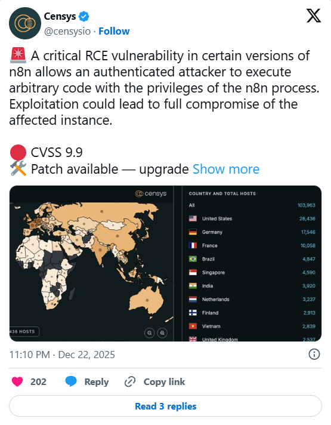

# CVE-2025-68613: Critical n8n Remote Code Execution Vulnerability

**Remote Code Execution**{.cve-chip} 
**CVSS 9.9**{.cve-chip} 
**103,000+ Instances**{.cve-chip} 
**Authenticated**{.cve-chip}

## Overview

**CVE-2025-68613** is a **critical remote code execution (RCE) vulnerability** in the **n8n workflow automation platform** that allows **authenticated attackers** to execute arbitrary code on the host server. The vulnerability arises from **insufficient isolation** when evaluating **user-supplied expressions** during workflow configuration, enabling attackers to **escape sandboxing** and run **system-level commands** with the same privileges as the n8n process. With an estimated **103,000+ exposed instances** globally, the vulnerability poses a **widespread threat** to organizations relying on n8n for business process automation. Successful exploitation enables **full system compromise**, **sensitive data exposure** (integration credentials, tokens, workflow logic), **operational disruption**, and **lateral movement** to connected systems. The vulnerability affects **n8n v0.211.0 through v1.120.3** and early **v1.121.0**, with patches available in **v1.120.4, v1.121.1, and v1.122.0**.

---

## Technical Specifications

| **Attribute**              | **Details**                                                                 |
|----------------------------|-----------------------------------------------------------------------------|
| **CVE ID**                 | CVE-2025-68613                                                             |
| **CVSS Score**             | 9.9 (Critical)                                                             |
| **Vulnerability Type**     | Remote Code Execution (RCE) via Expression Injection                       |
| **Affected Product**       | n8n Workflow Automation Platform                                           |
| **Affected Versions**      | v0.211.0 through v1.120.3, v1.121.0 (pre-patch)                            |
| **Patched Versions**       | v1.120.4, v1.121.1, v1.122.0 and later                                     |
| **Attack Vector**          | Network (Remote)                                                           |
| **Authentication Required**| Yes (authenticated access with workflow creation/edit permissions)         |
| **User Interaction**       | None                                                                       |
| **Exploit Complexity**     | Low (once authenticated)                                                   |
| **Root Cause**             | Improper sandboxing of Node.js evaluation context for workflow expressions |
| **Privileges Required**    | Low (authenticated user with workflow permissions)                         |
| **Privileges Gained**      | High (full n8n process privileges, potentially system-level)               |
| **Scope**                  | Changed (can affect host system beyond n8n application)                    |
| **Exposed Instances**      | ~103,000+ publicly accessible n8n instances (Censys/Shodan estimates)      |
| **Exploitation Status**    | Proof of concept available; active exploitation not confirmed              |
| **Patch Availability**     | Available (upgrade required)                                               |

---

## Vulnerability Details

### Root Cause

The vulnerability stems from **insecure evaluation of user-supplied expressions** within n8n workflow configurations:

- **Workflow Expression Language**: n8n allows users to define dynamic workflow behavior using JavaScript expressions (e.g., `{{ $json.field }}` for data transformation)
- **Insufficient Sandboxing**: The Node.js evaluation context used to execute these expressions lacks proper isolation, allowing access to internal runtime objects and APIs
- **Sandbox Escape**: Attackers can craft expressions that escape the intended sandbox by accessing Node.js internal objects (e.g., `process`, `require`, `child_process`)
- **Arbitrary Code Execution**: Once escaped, attackers can execute arbitrary JavaScript code with full n8n process privileges, including spawning system processes via `child_process.exec()` or `child_process.spawn()`

### Attack Requirements

- **Authenticated Access**: Attacker must have valid credentials for n8n instance (user account with workflow creation/modification permissions)
- **Workflow Permissions**: Ability to create or edit workflows (typically granted to all standard users in default configurations)
- **Network Access**: Ability to reach n8n web interface (internal network or internet-exposed instance)
- **No User Interaction**: Once authenticated, exploitation requires no interaction from other users or administrators

### Technical Exploitation

Example attack vector (conceptual):

1. Attacker logs into n8n with valid credentials
2. Creates or edits a workflow containing malicious expression in data transformation node
3. Crafts expression accessing internal Node.js objects: `{{ process.mainModule.require('child_process').execSync('whoami').toString() }}`
4. Workflow execution evaluates expression in insecure context
5. Malicious code executes with n8n process privileges, returning command output
6. Attacker expands exploitation to install backdoors, exfiltrate credentials, or pivot to internal network

### Privilege Escalation Path

- **Initial**: Authenticated user account (low privilege)
- **Exploited**: n8n process privileges (typically application-level, may be root/administrator depending on deployment)
- **Potential**: Full host system control if n8n runs with elevated privileges (common in containerized deployments)

---

## Attack Scenario

### Step-by-Step Exploitation

1. **Account Compromise or Creation**  
   Attacker obtains authenticated access via **credential theft** (phishing, password reuse, leaked credentials), **social engineering** (requesting account from administrator), or **public registration** (if enabled). Many n8n instances allow user registration without approval, or use weak default credentials.

2. **Reconnaissance — Identify n8n Instance**  
   Attacker identifies target n8n instance via internet scanning (Shodan, Censys queries for n8n fingerprints), corporate reconnaissance, or insider knowledge. Verifies vulnerable version through API endpoints or HTTP headers revealing version information.

3. **Workflow Creation with Malicious Expression**  
   Attacker creates new workflow or edits existing workflow, inserting malicious JavaScript expression in data transformation node (e.g., "Set" node, "Function" node, or "Code" node). Crafts expression to escape sandbox and access Node.js `process` object or `require()` function.

4. **Sandbox Escape and Code Execution**  
   Attacker triggers workflow execution (manual test or automated trigger). n8n evaluates malicious expression in insecure context, allowing sandbox escape. Expression accesses `child_process` module to spawn system commands: `{{ process.mainModule.require('child_process').execSync('id').toString() }}` confirms code execution.

5. **Host Compromise and Persistence**  
   Attacker executes commands to install backdoor (SSH key, web shell, reverse shell). Exfiltrates sensitive data: **workflow configurations** (containing API keys, database credentials, OAuth tokens for integrated services), **environment variables**, **filesystem access**. Creates persistent access mechanism for future exploitation.

6. **Lateral Movement and Data Exfiltration**  
   Attacker uses compromised n8n instance as pivot point. Access to **integration credentials** (Slack, Google Workspace, Salesforce, AWS, databases) enables lateral movement to connected systems. Exfiltrates customer data, business intelligence, or proprietary automation logic. Modifies workflows to inject malicious behavior into automated processes.

---

## Impact Assessment

=== "Confidentiality"
    * Full access to **all workflow configurations** containing sensitive integration credentials (API keys, OAuth tokens, database passwords, service account credentials). 
    * Exposure of **business-critical automation logic** and proprietary process workflows. 
    * Ability to read **environment variables** and configuration files containing secrets. 
    * Access to **data processed by workflows** (customer records, financial data, internal communications). 
    * For organizations using n8n as central automation hub, compromise exposes **credentials for dozens of integrated services**.

=== "Integrity"
    * Attacker can **modify existing workflows** to inject malicious behavior into automated processes (data manipulation, unauthorized actions, fraudulent transactions). 
    * Can **delete or corrupt workflows** causing operational disruption. 
    * Ability to **alter integration configurations** to redirect data flows or inject false data into downstream systems. 
    * **Supply chain risk**: compromised workflows may propagate malicious data to integrated SaaS platforms, databases, and business applications.

=== "Availability"
    * Attacker can **disrupt or disable critical automated processes** by deleting workflows or modifying execution logic. 
    * Denial of service through **resource exhaustion** (CPU-intensive code execution, memory leaks). 
    * Potential **ransomware deployment** targeting host system and connected storage. 
    * Organizations heavily reliant on n8n for business-critical automation face **operational paralysis** if workflows corrupted or unavailable.

=== "Scope" 
    * Exploitation extends **beyond n8n application** to underlying host system. 
    * Attacker gains execution capabilities at **operating system level** with n8n process privileges. 
    * In containerized deployments (Docker, Kubernetes), potential for **container escape** to compromise host infrastructure. 
    * Access to **host filesystem, network, and system resources** enables lateral movement to other internal systems and services.

---

## Mitigation Strategies

### Immediate Actions (Critical)

- **Upgrade n8n Immediately**: Update to patched versions **v1.120.4, v1.121.1, v1.122.0 or later**. This is the only complete remediation. Prioritize internet-facing instances and those handling sensitive data.
- **Verify Patch Application**: After upgrade, confirm version through admin interface or API endpoint. Test critical workflows to ensure compatibility with patched version.
- **Emergency Incident Response**: If compromise suspected, immediately **isolate instance from network**, **revoke all integration credentials**, **review workflow modification logs**, and conduct forensic analysis.
- **Credential Rotation**: Assume all credentials stored in workflows potentially compromised. **Rotate all API keys, OAuth tokens, database passwords, and service account credentials** for integrated services.

### Access Control Hardening

- **Restrict Workflow Permissions**: Limit workflow creation and editing privileges to **trusted administrators only**. Remove workflow permissions from standard user accounts. Implement role-based access control (RBAC) with principle of least privilege.
- **Disable Public Registration**: Turn off user self-registration features. Require administrator approval for new accounts. Remove unused or dormant user accounts. Conduct audit of existing users.
- **Implement Strong Authentication**: Enforce **multi-factor authentication (MFA)** for all n8n user accounts. Use SSO integration (SAML, OAuth) with organizational identity provider. Rotate passwords for existing accounts.
- **Network Segmentation**: Restrict n8n access to **internal network only** if possible. Use VPN or IP whitelisting for remote access. Place n8n behind reverse proxy with authentication layer.

### Deployment Hardening

- **Principle of Least Privilege**: Run n8n process with **minimal OS privileges**—use dedicated non-root user account in Linux environments. In Docker, avoid running as root; use `--user` flag to specify non-privileged UID.
- **Container Security**: If using Docker, implement **resource limits** (CPU, memory), **read-only filesystem where possible**, and **network policies** restricting outbound connections. Use security scanning for container images.
- **Filesystem Isolation**: Mount workflow data and configuration directories with **restricted permissions**. Use separate volumes for sensitive data with encryption at rest.
- **Network Firewall Rules**: Implement strict egress filtering allowing only necessary outbound connections (e.g., to integrated services). Block or monitor unexpected destinations.

### Monitoring and Detection

- **Workflow Audit Logging**: Enable comprehensive logging of **all workflow creation, modification, and deletion events**. Log user identity, timestamp, and changes made. Centralize logs to SIEM for correlation.
- **Execution Monitoring**: Monitor for **unusual workflow execution patterns**: workflows executing system commands, accessing sensitive filesystem paths, making unexpected network connections, or exhibiting abnormal resource usage.
- **Security Alerts**: Configure alerts for **suspicious expressions** in workflows (e.g., references to `process`, `require`, `child_process`, `eval`, `Function`). Alert on workflows accessing internal Node.js APIs.
- **Integration Credential Access**: Monitor integrated services for **anomalous API usage** originating from n8n credentials (unusual access patterns, data exfiltration, privilege escalation attempts).
- **File Integrity Monitoring**: Deploy FIM to detect unauthorized changes to n8n installation files, configuration, or workflow definitions stored on filesystem.

### Secure Configuration

- **Expression Validation**: If remaining on vulnerable version temporarily (not recommended), implement input validation rejecting expressions containing dangerous patterns. Note: This is **not a substitute for patching**.
- **Workflow Review**: Audit all existing workflows for suspicious expressions or logic. Review workflows created by untrusted or former users.
- **Environment Variable Security**: Avoid storing sensitive credentials in environment variables accessible to n8n. Use dedicated secrets management solutions (HashiCorp Vault, AWS Secrets Manager).
- **Regular Security Audits**: Conduct periodic security assessments of n8n deployment, workflow configurations, and integrated services. Perform penetration testing of automation infrastructure.

### Cloud and SaaS Considerations

- **n8n Cloud vs Self-Hosted**: If using self-hosted n8n, ensure dedicated security resources for maintenance. Consider migration to **n8n Cloud** (managed service) where vendor handles patching and security.
- **Third-Party Integrations**: Review and minimize number of integrated services. Remove unused integrations. Implement **integration-level access controls** limiting n8n to minimum required permissions.
- **API Rate Limiting**: Configure rate limiting on integrated services to detect and mitigate potential abuse via compromised workflows.

---

## Resources

!!! info "Vulnerability Analysis"
    - [Critical n8n Flaw (CVSS 9.9) Enables Arbitrary Code Execution Across Thousands of Instances](https://thehackernews.com/2025/12/critical-n8n-flaw-cvss-99-enables.html)
    - [Critical n8n flaw could enable arbitrary code execution](https://securityaffairs.com/186036/hacking/critical-n8n-flaw-could-enable-arbitrary-code-execution.html)
    - [NVD - CVE-2025-68613](https://nvd.nist.gov/vuln/detail/CVE-2025-68613)
    - [CVE-2025-68613: Critical n8n RCE & Server Compromise | Orca Security](https://orca.security/resources/blog/cve-2025-68613-n8n-rce-vulnerability/)
    - [103K n8n Automation Instances at Risk From RCE Flaw | eSecurity Planet](https://www.esecurityplanet.com/threats/103k-n8n-automation-instances-at-risk-from-rce-flaw/)
    - [Massive RCE Threat in n8n Platform Impacts Thousands of Exposed Systems](https://sqmagazine.co.uk/n8n-critical-rce-vulnerability/)
    - [Critical n8n Automation Platform Vulnerability Enables RCE, Exposing 103,000+ Instances](https://cyberpress.org/n8n-automation-platform-vulnerability/)
    - [Critical n8n Automation Platform Vulnerability Enables RCE Attacks - 103,000+ Instances Exposed](https://cybersecuritynews.com/n8n-automation-platform-vulnerability/)

---
