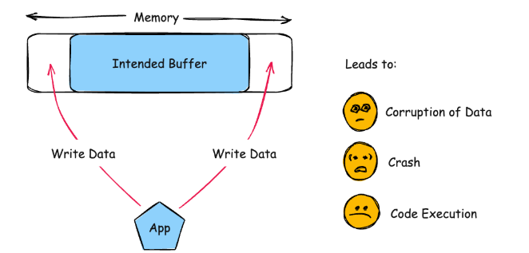

# WatchGuard Firebox Fireware OS IKEv2 Out-of-Bounds Write Vulnerability

**CVE-2025-14733**{.cve-chip}
**Out-of-Bounds Write**{.cve-chip}
**Remote Code Execution**{.cve-chip}

## Overview
CVE-2025-14733 is a critical memory corruption vulnerability in the iked (IKEv2 daemon) process of WatchGuard Fireware OS. The flaw allows a remote, unauthenticated attacker to exploit IKEv2 VPN handling logic through crafted packets, potentially executing arbitrary code on the firewall with high privileges. The vulnerability affects both Mobile User VPN (IKEv2) and Branch Office VPN (IKEv2) when configured with dynamic gateway peers. WatchGuard has warned of **active exploitation** in the wild, making immediate patching critical. As perimeter security devices, compromised WatchGuard Firebox appliances provide attackers with complete control over network traffic, VPN access, and potential entry points for lateral movement into protected networks.

## Technical Specifications

| **Attribute** | **Details** |
|---------------|-------------|
| **CVE ID** | CVE-2025-14733 |
| **Vulnerability Type** | Out-of-Bounds Write (CWE-787) |
| **Attack Vector** | Network (IKEv2 traffic over UDP ports 500/4500) |
| **Authentication** | None required |
| **Complexity** | Medium |
| **User Interaction** | Not required |
| **Affected Component** | iked (IKEv2 daemon) in WatchGuard Fireware OS |
| **Exploitation Status** | **Active exploitation confirmed** |

## Affected Products

### WatchGuard Firebox Appliances
- **Product**: WatchGuard Firebox firewall appliances running vulnerable Fireware OS
- **Affected Configurations**: 
    - Mobile User VPN (IKEv2) with dynamic gateway peers
    - Branch Office VPN (IKEv2) with dynamic gateway peers
- **Fixed Versions**: Updated Fireware OS releases from WatchGuard (specific versions per product line)
- **Deployment Context**: Network perimeter firewalls, VPN gateways, security appliances

### VPN Configuration Requirements
The vulnerability is exploitable when:

- IKEv2 VPN is enabled on the Firebox
- Dynamic gateway peers are configured (common in mobile VPN and branch office scenarios)
- VPN service is accessible from untrusted networks

## Vulnerability Details

### Out-of-Bounds Write (CWE-787)
An out-of-bounds write vulnerability occurs when a program writes data to a memory location outside the boundaries of the allocated buffer. This can lead to:

- Memory corruption affecting program execution
- Overwriting critical data structures or code pointers
- Potential for arbitrary code execution
- Denial of service through application crashes

### Root Cause
The vulnerability stems from **improper bounds checking** in the iked process when processing crafted IKEv2 messages. Specifically:

- The iked daemon fails to validate the size or content of certain IKEv2 message fields
- When handling dynamic peer configurations, the code writes data beyond allocated buffer boundaries
- Crafted IKEv2 packets can trigger controlled memory corruption
- Attackers can leverage this to overwrite memory and potentially execute code

### IKEv2 Protocol Context
IKEv2 (Internet Key Exchange version 2) is used for:

- Establishing VPN security associations
- Authenticating VPN peers
- Negotiating encryption parameters
- Managing VPN tunnel lifecycle

The vulnerability occurs during the IKEv2 negotiation phase, before authentication completes, allowing unauthenticated exploitation.

## Attack Scenario
1. **Target Identification**: Attacker identifies an internet-facing WatchGuard Firebox appliance with IKEv2 VPN enabled, typically by scanning for UDP ports 500 (IKE) and 4500 (NAT-T)
2. **Crafted Packet Transmission**: Specially crafted IKEv2 packets are sent to the VPN service, containing malformed or oversized fields designed to trigger the bounds check failure
3. **Memory Corruption**: The iked process performs an out-of-bounds memory write when processing the malicious IKEv2 message, corrupting critical memory structures
4. **Code Execution**: Through carefully crafted payloads, the attacker gains the ability to execute arbitrary code with the privileges of the iked process (typically high privileges on the firewall)
5. **Post-Exploitation**: Successful exploitation results in full firewall compromise, allowing the attacker to install persistent backdoors, intercept VPN traffic, harvest credentials, modify firewall rules, or use the compromised device as a pivot point for lateral movement into the internal network

## Impact Assessment

=== "Integrity"
    * Full compromise of perimeter firewall
    * Unauthorized modification of firewall rules and policies
    * Tampering with VPN configurations
    * Installation of persistent backdoors and malware
    * Manipulation of security logging and monitoring

=== "Confidentiality"
    * Interception and decryption of VPN traffic
    * Access to network topology and configurations
    * Exposure of VPN credentials and pre-shared keys
    * Harvesting of user authentication data
    * Access to traffic flowing through the firewall

=== "Availability"
    * Denial of service through VPN service crashes
    * Complete firewall device failure
    * Disruption of network connectivity
    * Loss of VPN access for legitimate users
    * Service degradation affecting network operations

=== "Network Security Impact"
    * **Perimeter Breach**: Complete compromise of network security boundary
    * **VPN Traffic Exposure**: Loss of confidentiality and integrity for all VPN communications
    * **Network-Wide Breach**: Entry point for extensive internal network compromise
    * **Lateral Movement**: Compromised firewall enables pivot to internal systems
    * **Persistent Access**: Long-term unauthorized access to protected networks

=== "Enterprise Impact"
    * **Critical Infrastructure Compromise**: Firewall is foundational security control
    * **Credential Theft**: Access to VPN user credentials and certificates
    * **Compliance Violations**: Breach of network security and access control requirements
    * **Operational Disruption**: Loss of secure remote access capabilities
    * **Forensics Challenges**: Firewall compromise complicates incident investigation
    * **Trust Erosion**: Loss of confidence in perimeter security

## Mitigation Strategies

### 🔄 Immediate Actions
- **Apply Security Patches**: Immediately upgrade Fireware OS to fixed versions released by WatchGuard
- **Version Verification**: Check current Fireware OS versions on all WatchGuard Firebox appliances
- **Emergency Mitigation**: If patching cannot be immediate, disable IKEv2 VPN with dynamic gateway peers
- **Threat Hunting**: Search for indicators of compromise on all WatchGuard devices
- **Credential Rotation**: Rotate VPN credentials, certificates, and pre-shared keys after patching

### 🛡️ VPN Configuration Hardening
- **Disable Unnecessary Features**: Disable IKEv2 VPN with dynamic gateway peers if not strictly required
- **IP Allowlisting**: Restrict VPN access using IP allowlists where possible
- **Static Peers**: Use static gateway peers instead of dynamic peers where feasible
- **Authentication Strengthening**: Implement strong authentication mechanisms (certificates over PSK)
- **Rate Limiting**: Configure rate limiting for IKEv2 connection attempts
- **Geo-blocking**: Block VPN access from unexpected geographic regions

### 🔍 Monitoring & Detection
- **Log Analysis**: Monitor firewall logs for abnormal IKEv2 negotiation attempts
- **Failed Handshakes**: Alert on repeated failed or malformed VPN handshakes
- **Anomalous Traffic**: Detect unusual patterns in IKEv2 traffic (UDP 500/4500)
- **Crash Detection**: Monitor for iked process crashes or restarts
- **Memory Anomalies**: Watch for signs of memory corruption or exploitation attempts
- **Authentication Monitoring**: Track unusual VPN authentication patterns

### 📊 Network Architecture
- **Defense-in-Depth**: Implement multiple security layers beyond perimeter firewall
- **Network Segmentation**: Segment internal networks to limit lateral movement from compromised perimeter
- **VPN Segmentation**: Isolate VPN users in separate network segments
- **Intrusion Prevention**: Deploy IPS to detect exploitation attempts
- **Traffic Inspection**: Implement deep packet inspection for VPN traffic
- **Redundancy**: Maintain redundant firewall infrastructure for resilience

## Additional Context

### Why This Vulnerability is Critical
- **Unauthenticated RCE**: No credentials needed for exploitation
- **Perimeter Device**: Firewalls are first line of defense
- **VPN Compromise**: Affects secure remote access infrastructure
- **High Privileges**: Code execution likely runs with elevated privileges
- **Active Exploitation**: Confirmed exploitation in the wild
- **Wide Deployment**: WatchGuard firewalls widely deployed in enterprises

### Out-of-Bounds Write Exploitation
Out-of-bounds write vulnerabilities are particularly dangerous because:

- Enable precise memory corruption for code execution
- Can bypass modern exploit mitigations
- Difficult to detect without proper bounds checking
- Often exploitable remotely without authentication
- High reliability for skilled attackers

## Resources and References

!!! info "Official Documentation & Analysis"
    - [WatchGuard Firebox iked Out of Bounds Write Vulnerability | WatchGuard Technologies](https://www.watchguard.com/wgrd-psirt/advisory/wgsa-2025-00027)
    - [CVE Record: CVE-2025-14733](https://www.cve.org/CVERecord?id=CVE-2025-14733)
    - [NVD - CVE-2025-14733](https://nvd.nist.gov/vuln/detail/CVE-2025-14733)
    - [WatchGuard Warns of Active Exploitation of Critical Fireware OS VPN Vulnerability](https://thehackernews.com/2025/12/watchguard-warns-of-active-exploitation.html)

!!! danger "Active Exploitation Warning"
    WatchGuard has confirmed **active exploitation** of this vulnerability in the wild. As an **unauthenticated remote code execution** flaw in perimeter firewall devices, this represents an **immediate and critical threat**. Organizations using WatchGuard Firebox appliances with IKEv2 enabled must apply patches **immediately**.

!!! warning "Perimeter Security Compromise"
    Compromise of perimeter firewalls is particularly severe as it:
    
    - Breaches the network security boundary
    - Provides access to all traffic flowing through the device
    - Enables lateral movement into protected networks
    - Compromises VPN security and confidentiality
    - Often goes undetected due to privileged position
