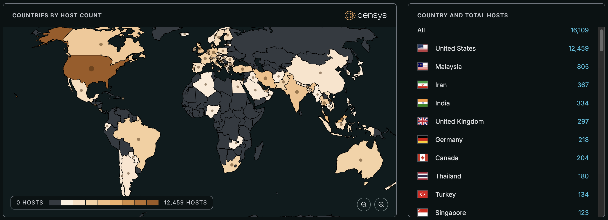

# Critical SmarterMail Arbitrary File Upload / Remote Code Execution Vulnerability

**CVE-2025-52691**{.cve-chip}  
**Remote Code Execution**{.cve-chip}  
**Arbitrary File Upload (CWE-434)**{.cve-chip}

## Overview
A critical security flaw in SmarterTools SmarterMail (email server software) could allow an unauthenticated remote attacker to upload arbitrary files anywhere on the server and potentially execute code — leading to full server compromise.

## Technical Specifications

| **Attribute** | **Details** |
|---------------|-------------|
| **CVE ID** | CVE-2025-52691 |
| **Vulnerability Type** | Unrestricted Arbitrary File Upload → Remote Code Execution (CWE-434) |
| **Attack Vector** | Network |
| **Authentication** | None (unauthenticated) |
| **Complexity** | Low |
| **User Interaction** | Not required |
| **Affected Versions** | SmarterMail Build 9406 and earlier |
| **Fixed Version** | Build 9413 and later |
| **CVSS Score** | 10.0 (Critical) |

## Affected Products
- SmarterTools SmarterMail — Build 9406 and earlier

## Attack Scenario
1. Attacker scans for internet-exposed SmarterMail servers.
2. Without logging in, attacker uploads a malicious file (for example a web shell) to an arbitrary location on the server.
3. Attacker locates and triggers the uploaded file to execute code with the server's privileges.
4. Attacker achieves remote code execution and persistent access.
5. Attacker performs post-exploitation activities (data exfiltration, malware installation, lateral movement).

### Potential Access Points
- Publicly accessible SmarterMail management or upload endpoints
- Misconfigured virtual directories or web paths
- Services reachable from the internet due to insufficient firewalling

## Impact Assessment

=== "Integrity"
    * Full compromise of server configuration and message integrity
    * Unauthorized modification of mail handling rules and content
    * Injection of malicious scripts or routing rules

=== "Confidentiality"
    * Access to emails, attachments and credentials
    * Exposure of contact lists and internal communications
    * Theft of stored credentials and keys

=== "Availability"
    * Service disruption or denial of email services
    * Ransomware or destructive payloads causing outages
    * Operational interruption across business-critical messaging

## Mitigation Strategies

### 🔄 Immediate Actions
- Update SmarterMail to Build 9413 or later immediately.
- Isolate affected servers from the internet where possible.
- Block known malicious IPs and tighten firewall rules.

### 🛡️ Short-term Measures
- Inventory all SmarterMail instances and validate version/build.
- Apply web server hardening and remove unnecessary write permissions.
- Implement strict ACLs on upload paths and content-type validation.

### 🔍 Monitoring & Detection
- Monitor logs for unexpected upload activity and new files in web roots.
- Alert on file creation events in web-accessible directories.
- Use file integrity monitoring to detect unauthorized changes.

### 🔒 Long-term Solutions
- Enforce network segmentation to limit exposure of mail servers.
- Adopt a vulnerability management program to track vendor updates.
- Use application-level protections (WAF rules) to block suspicious uploads.

## Resources and References

!!! danger "Threat Intelligence Reports"
    - [December 30 Advisory: SmarterMail Unauthenticated Arbitrary File Upload Vulnerability Allows RCE [CVE-2025-52691]](https://censys.com/advisory/cve-2025-52691)
    - [CSA Issues Alert on Critical SmarterMail Bug Allowing Remote Code Execution](https://thehackernews.com/2025/12/csa-issues-alert-on-critical.html)
    - [Vulnerability in SmarterTools Software | Cyber Security Agency of Singapore](https://www.csa.gov.sg/alerts-and-advisories/alerts/al-2025-124/)
    - [NVD - CVE-2025-52691](https://nvd.nist.gov/vuln/detail/CVE-2025-52691)

---