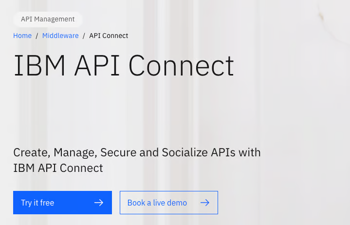

# IBM API Connect Critical Authentication Bypass (CVE-2025-13915)


**CVE-2025-13915**{.cve-chip} **CVSS 9.8**{.cve-chip} **Authentication Bypass**{.cve-chip} **API Gateway**{.cve-chip} **IBM**{.cve-chip}

## Overview

**IBM has disclosed a critical authentication bypass vulnerability** in its **API Connect platform**, a comprehensive API lifecycle management solution used to design, secure, manage, and analyze APIs across cloud, on-premises, and hybrid environments. 

**CVE-2025-13915** allows **unauthenticated attackers with network access** to bypass authentication mechanisms and gain **unauthorized access to applications and APIs** protected by the platform. 

The vulnerability was **discovered during IBM's internal security testing** and affects specific versions: **API Connect 10.0.8.0 through 10.0.8.5** and **API Connect 10.0.11.0**. 
With a **CVSS score of 9.8 (Critical)**, the flaw requires **no privileges, no user interaction**, and is **network-exploitable**, making it an extremely high-severity threat. 

The root cause is classified as **CWE-305: Authentication Bypass by Primary Weakness**, indicating that core authentication logic can be circumvented through crafted requests. 
API Connect typically serves as the **front-line gateway** for enterprise API infrastructure, enforcing authentication, authorization, rate limiting, and security policies for backend services. 
Bypassing this gateway **undermines the security assumptions** of downstream systems that rely on API Connect to validate user identity. 

While **no active exploitation has been confirmed**, the widespread deployment of API Connect in **financial services, healthcare, government, and Fortune 500 enterprises** makes this vulnerability a high-priority target once exploit details become public. 

IBM has released **interim fixes (iFixes)** and recommends **immediate patching** along with **temporary mitigation measures** including disabling Developer Portal self-service sign-up and restricting network access to API Connect administrative interfaces.

---

## Vulnerability Specifications

| **Attribute**              | **Details**                                                                 |
|----------------------------|-----------------------------------------------------------------------------|
| **CVE ID**                 | CVE-2025-13915                                                             |
| **CVSS Score**             | 9.8 (Critical)                                                             |
| **CWE Classification**     | CWE-305: Authentication Bypass by Primary Weakness                         |
| **Vulnerability Type**     | Authentication Bypass, Improper Authentication                             |
| **Affected Product**       | IBM API Connect                                                            |
| **Affected Versions**      | 10.0.8.0, 10.0.8.1, 10.0.8.2, 10.0.8.3, 10.0.8.4, 10.0.8.5, 10.0.11.0      |
| **Patched Versions**       | Available via IBM Fix Central (iFixes for affected versions)               |
| **Discovery Method**       | Internal IBM security testing                                              |
| **Attack Vector**          | Network (remote exploitation via HTTP/HTTPS)                               |
| **Attack Complexity**      | Low (simple crafted requests)                                              |
| **Privileges Required**    | None (unauthenticated exploitation)                                        |
| **User Interaction**       | None                                                                       |
| **Scope**                  | Unchanged (impact limited to API Connect, but affects protected backends)  |
| **Confidentiality Impact** | High (unauthorized access to protected APIs and data)                      |
| **Integrity Impact**       | High (potential data manipulation via API access)                          |
| **Availability Impact**    | High (potential denial of service via API abuse)                           |
| **Exploit Availability**   | Not publicly available (no confirmed active exploitation)                  |
| **Exploit Complexity**     | Low (once vulnerability details known)                                     |
| **Affected Component**     | Authentication subsystem, Developer Portal (specific attack surface)       |
| **Public Awareness**       | High (IBM security bulletin, CVSS 9.8 drives attention)                    |
| **Deployment Scope**       | Enterprise API gateways (financial, healthcare, government, Fortune 500)   |
| **Advisory Sources**       | IBM Security Bulletin, NVD, multiple security outlets                      |

---

## Technical Details

### IBM API Connect Architecture

Understanding the vulnerability requires context on **API Connect's role** in enterprise infrastructure:

**API Connect Components**:
- **API Gateway**: Enforces security policies, authentication, rate limiting for API requests
- **API Manager**: Administrative console for API lifecycle management, policy configuration
- **Developer Portal**: Self-service portal for API consumers to discover APIs, register applications, obtain credentials
- **Analytics**: Monitors API usage, performance metrics, security events
- **Data Power Gateway**: Optional high-performance gateway component

**Typical Deployment**:
```
Internet/Partners → Firewall → API Connect Gateway → Backend Services
                                      ↓
                              Authentication/Authorization
                              Rate Limiting
                              Threat Protection
                              Analytics
```

**Security Function**: API Connect acts as **policy enforcement point** (PEP):
- Validates **OAuth tokens**, **API keys**, **client certificates**
- Enforces **role-based access control** (RBAC)
- Applies **rate limits**, **IP allowlists**, **threat protection rules**
- Backend services **trust** that API Connect has validated identity and authorization

### Vulnerability Root Cause: CWE-305 Authentication Bypass

**CWE-305: Authentication Bypass by Primary Weakness** indicates that **core authentication logic** can be circumvented, not due to secondary issues (like weak crypto or session management) but through **fundamental design or implementation flaws** in authentication checks.

## Attack Scenario

### Step-by-Step Exploitation

1. **Reconnaissance: Target Identification**  
   Attacker identifies **IBM API Connect** instances exposed to network:
      - **Public internet**: Internet-facing API gateways serving partner/customer APIs
      - **Corporate network**: Internal API gateways (if attacker has VPN access or compromised internal host)
      - **Cloud environments**: API Connect deployed in AWS, Azure, IBM Cloud
   
      **Discovery methods**:

      - **Port scanning**: Ports 443/tcp (HTTPS), 9443/tcp (API Gateway), 2443/tcp (Cloud Manager)
      - **Banner grabbing**: HTTP headers reveal "API Connect" or "DataPower" in responses
      - **Shodan/Censys**: `"IBM API Connect"`, `"DataPower Gateway"`
      - **URL patterns**: Recognize API Connect-specific paths (`/api/`, `/manager/`, `/portal/`)

2. **Version Fingerprinting**  
   Attacker determines if target runs vulnerable version:
      - **Management console access**: Visit `https://api-gateway.targetcompany.com:9443/admin/` → Login page reveals version
      - **HTTP headers**: `X-API-Connect-Version: 10.0.8.4` in responses
      - **Developer Portal**: Visit developer portal, inspect HTML/JavaScript comments or API responses for version strings
      - **API responses**: Call documented API endpoints, analyze response structure/headers for version indicators

3. **Authentication Bypass Testing**  
   Attacker tests authentication bypass techniques (without knowing exact exploit):
   
      **Test 1: Path Traversal Variants**
      ```bash
      curl -X GET https://api-gateway.targetcompany.com/api/v1//protected-endpoint
      curl -X GET https://api-gateway.targetcompany.com/api/v1/./protected-endpoint
      curl -X GET https://api-gateway.targetcompany.com/api/v1/../v1/protected-endpoint
      ```

      **Test 2: Header Manipulation**
      ```bash
      curl -X GET https://api-gateway.targetcompany.com/api/v1/protected-endpoint \
        -H "X-Internal-Request: true" \
        -H "X-Authenticated-User: admin"
      ```

      **Test 3: Developer Portal Bypass**
      ```bash
      # Register account via Developer Portal API
      curl -X POST https://api-gateway.targetcompany.com/portal/api/register \
        -H "Content-Type: application/json" \
        -d '{"username": "attacker", "email": "attacker@evil.com", "bypass_approval": true}'
      ```

      **Test 4: Direct Management API Access**
      ```bash
      curl -X GET https://api-gateway.targetcompany.com:9443/api/admin/users
      curl -X GET https://api-gateway.targetcompany.com/api/internal/config
      ```

      One of the above techniques returns **HTTP 200** with data instead of **HTTP 401 Unauthorized** → Bypass successful.

4. **Successful Authentication Bypass**  
   Attacker confirms bypass technique works:
      ```bash
      # Example: Path traversal bypass
      curl -X GET https://api-gateway.targetcompany.com/api/v1//customer/list

      Response (HTTP 200):
      {
        "customers": [
          {"id": 1, "name": "Acme Corp", "email": "contact@acme.com"},
          {"id": 2, "name": "Beta Inc", "email": "info@beta.com"},
          ...
        ]
      }
      ```

5. **API Enumeration**  
   Attacker enumerates available APIs and endpoints:
      - **OpenAPI/Swagger documentation**: Access API documentation portal (often available unauthenticated)
      - **Endpoint discovery**: Use tools like `ffuf`, `gobuster` to brute-force API paths
      - **GraphQL introspection**: If GraphQL APIs exposed, run introspection queries to map schema
      - **API response analysis**: Call discovered endpoints, analyze responses for additional endpoints (HATEOAS links)
   
    Discovered APIs:

      - `/api/v1/customer/*` - Customer data management
      - `/api/v1/orders/*` - Order processing
      - `/api/v1/admin/*` - Administrative functions
      - `/api/v1/payments/*` - Payment processing

6. **Data Exfiltration**  
      Attacker exploits unauthenticated API access to steal sensitive data:
      ```bash
      # Extract customer database
      curl https://api-gateway.targetcompany.com/api/v1//customer/list?limit=10000 > customers.json

      # Extract order history
      curl https://api-gateway.targetcompany.com/api/v1//orders/recent?days=365 > orders.json

      # Extract payment information (if accessible)
      curl https://api-gateway.targetcompany.com/api/v1//payments/transactions > payments.json
      ```

      Exfiltrated data includes:

      - Customer PII (names, emails, addresses, phone numbers)
      - Order histories and transaction details
      - Payment information (potentially including credit card data if not properly masked)
      - Business intelligence (sales data, customer behavior)

7. **Data Manipulation**  
      Attacker modifies data via unauthenticated API access:
      ```bash
      # Modify customer record
      curl -X PUT https://api-gateway.targetcompany.com/api/v1//customer/123 \
        -H "Content-Type: application/json" \
        -d '{"email": "attacker@evil.com", "phone": "+1-555-HACKER"}'

      # Cancel orders
      curl -X DELETE https://api-gateway.targetcompany.com/api/v1//orders/456

      # Modify pricing (if API allows)
      curl -X POST https://api-gateway.targetcompany.com/api/v1//admin/pricing \
        -d '{"product_id": 789, "price": 0.01}'
      ```

      Integrity violations include:

      - Customer data tampering (change contact information to attacker-controlled)
      - Order manipulation (cancel legitimate orders, create fraudulent orders)
      - Financial fraud (modify pricing, issue refunds to attacker accounts)

8. **Credential Harvesting**  
      If administrative or management APIs accessible, attacker extracts credentials:
      ```bash
      # Extract user accounts
      curl https://api-gateway.targetcompany.com/api/v1//admin/users > users.json

      # Extract API keys
      curl https://api-gateway.targetcompany.com/api/v1//admin/api-keys > keys.json

      # Extract OAuth client secrets
      curl https://api-gateway.targetcompany.com/api/v1//admin/oauth-clients > oauth.json
      ```

      Harvested credentials:
      
      - Admin usernames and password hashes (if exposed)
      - API keys for partner integrations
      - OAuth client IDs and secrets
      - Service account credentials for backend systems

9. **Lateral Movement to Backend Services**  
    Attacker uses API access to pivot to backend systems:
    - **Backend API abuse**: Call backend services directly via API Connect (if it proxies requests)
    - **Credential reuse**: Use harvested credentials against backend systems (databases, application servers)
    - **SSRF exploitation**: Craft API requests that cause API Connect to make requests to internal systems
    - **File upload abuse**: If file upload APIs accessible, upload webshells or malware to backend storage

    Attacker escalates from API gateway compromise to full backend infrastructure access.

10. **Persistence and Advanced Exploitation**  
    Attacker establishes long-term access:
    - **Backdoor API keys**: Generate new API keys with attacker-controlled credentials
    - **Create admin accounts**: Use admin APIs to create privileged accounts
    - **Modify security policies**: Disable rate limiting, threat protection, audit logging
    - **Deploy malware**: Upload malicious plugins or extensions to API Connect (if extensible)
    - **Ransomware preparation**: Map critical APIs and backend systems for potential ransomware deployment

---

## Impact Assessment

=== "Confidentiality"
    Complete exposure of API-protected data and credentials:

    - **API data exposure**: All APIs protected by compromised API Connect instance become accessible without authentication, exposing customer data, financial transactions, health records, proprietary business data
    - **Credential theft**: Admin credentials, API keys, OAuth secrets, service account tokens extracted from management APIs
    - **Backend system mapping**: Attacker gains complete visibility into backend architecture, service endpoints, data schemas via API documentation and responses
    - **Intellectual property**: APIs often expose sensitive business logic, algorithms, and proprietary data models
    - **Compliance violations**: Unauthorized access to protected data violates GDPR, HIPAA, PCI DSS, SOX depending on data types accessed
    
    Confidentiality breach extends to all systems and data protected by compromised API gateway.

=== "Integrity"
    Unauthorized data and configuration manipulation:

    - **Data tampering**: Attackers modify customer records, financial transactions, order data via API calls
    - **Policy manipulation**: Modify API Connect security policies, disable authentication requirements, alter rate limits
    - **Account creation**: Create backdoor admin accounts or API consumers for persistent access
    - **Fraud**: Execute fraudulent transactions (orders, refunds, payments) via unauthenticated API access
    - **Supply chain poisoning**: If APIs manage software updates or package distribution, inject malicious content
    - **Evidence destruction**: Delete or modify audit logs to hide exploitation
    
    Integrity violations undermine trust in data accuracy and system configurations.

=== "Availability"
    Potential denial of service and operational disruption:

    - **API abuse**: Unauthenticated attackers bypass rate limiting, overwhelm backend services with requests
    - **Resource exhaustion**: Trigger resource-intensive APIs (database queries, computations) causing performance degradation
    - **Service disruption**: Delete critical configurations, disable APIs, or modify routing rules
    - **Ransomware deployment**: Use API access as pivot point for ransomware attack on backend infrastructure
    - **DDoS amplification**: Abuse APIs to amplify DDoS attacks (e.g., trigger notification APIs sending mass emails/SMS)
    
    Availability impact escalates if attackers leverage access for destructive actions.

=== "Scope" 
    API gateway compromise affects entire connected ecosystem:

    - **Backend systems**: All services behind API Connect assume authentication enforced—compromise breaks trust model
    - **Partner integrations**: If APIs serve partners/vendors, compromise exposes partner data and access
    - **Mobile/web applications**: Client applications relying on API Connect for backend access become exploitable
    - **Microservices architecture**: In microservices environments, API gateway compromise grants lateral movement across service mesh
    - **Cloud infrastructure**: API Connect often manages cloud service APIs—compromise may extend to underlying cloud resources
    
    Single authentication bypass vulnerability cascades across entire API-driven infrastructure.

---

## Mitigation Strategies

### Immediate Patching 

- **Apply IBM iFixes**: Download and install interim fixes from **IBM Fix Central**
  
- **Patch Verification**: After applying iFix:
    - Review IBM security bulletin for verification steps
    - Test authentication on previously vulnerable endpoints
    - Check API Connect logs for successful iFix application
    - Re-scan with vulnerability scanners to confirm remediation

### Temporary Mitigation 

- **Disable Developer Portal Self-Service Sign-Up**
  This reduces attack surface while patching is prepared.

- **Network Access Restrictions**: Limit exposure via firewall rule

- **Web Application Firewall (WAF)**: Deploy WAF in front of API Connect:
    - **Rate limiting**: Aggressive rate limits on all API endpoints
    - **Anomaly detection**: Flag unusual request patterns (path traversal, header manipulation)
    - **IP reputation**: Block requests from known malicious IPs
    - **Geo-blocking**: If legitimate traffic only from specific regions, block others

### Monitoring and Detection

- **API Gateway Log Monitoring**: Analyze API Connect logs for exploitation attempts
- **SIEM Integration**: Forward API Connect logs to SIEM (Splunk, QRadar, Sentinel)
- **API Traffic Analysis**: Monitor for exploitation indicators
- **Backend Service Monitoring**: Monitor services behind API Connect

### Access Control Hardening

- **Principle of Least Privilege**: Restrict API Connect access:
    - **Management interfaces**: Limit admin console access to specific IP addresses or VPN-only
    - **API Gateway**: Expose only necessary APIs to internet; keep internal APIs on private networks
    - **Developer Portal**: If self-service sign-up required, implement manual approval workflow

- **Network Segmentation**: Isolate API Connect in DMZ:
  ```
  Internet → Firewall → DMZ (API Gateway) → Internal Firewall → Backend Services
  
  DMZ Firewall Rules:
  - Allow inbound: Internet → API Gateway (port 443)
  - Allow outbound: API Gateway → Backend Services (specific ports only)
  - Deny: API Gateway → Corporate network (lateral movement prevention)
  - Deny: API Gateway → Internet (except for required external APIs)
  ```

- **API Key Rotation**: Regularly rotate API keys and OAuth credentials:
    - Implement key rotation policy (e.g., every 90 days)
    - Revoke unused or stale API keys
    - Monitor key usage for anomalies

---

## Resources

!!! info "Threat Intelligence"
    - [IBM Issues Critical Alert Over Authentication Bypass Flaw in API Connect Platform - CySecurity News](https://www.cysecurity.news/2026/01/ibm-issues-critical-alert-over.html)
    - [Critical Vulnerability in IBM API Connect | Cyber Security Agency of Singapore](https://www.csa.gov.sg/alerts-and-advisories/alerts/al-2025-126/)
    - [Security Bulletin: Authentication bypass in IBM API Connect](https://www.ibm.com/support/pages/security-bulletin-authentication-bypass-ibm-api-connect-0)
    - [IBM warns of critical API Connect bug enabling remote access](https://securityaffairs.com/186417/security/ibm-warns-of-critical-api-connect-bug-enabling-remote-access.html)
    - [IBM warns of critical API Connect auth bypass vulnerability](https://www.bleepingcomputer.com/news/security/ibm-warns-of-critical-api-connect-auth-bypass-vulnerability/)
    - [Critical CVSS 9.8 Flaw Found in IBM API Connect Authentication System — The Hacker News](https://thehackernews.com/2025/12/ibm-warns-of-critical-api-connect-bug.html)
    - [NVD - CVE-2025-13915](https://nvd.nist.gov/vuln/detail/CVE-2025-13915)

---

*Last Updated: January 4, 2026*
