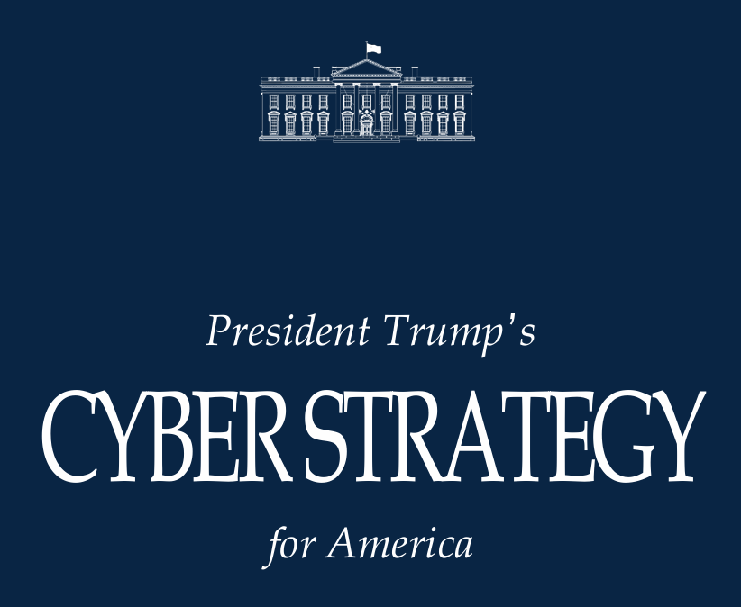

# US Cyber Strategy Targets Adversaries, Critical Infrastructure, and Emerging Technologies

**National Cyber Strategy**{.cve-chip}  **Critical Infrastructure**{.cve-chip}  **Zero Trust**{.cve-chip}  **AI & Quantum Security**{.cve-chip}

## Overview
The United States released a new national cyber strategy focused on strengthening resilience against nation-state actors, cybercriminal operations, and emerging technology risks. The strategy emphasizes coordinated action across federal agencies, private-sector operators, and international partners to improve prevention, response, and deterrence.

Strategic priorities include protection of critical infrastructure, modernization of federal cyber defenses, and maintaining technological leadership in AI and quantum-era security.

## Technical Specifications

| **Attribute** | **Details** |
|---------------|-------------|
| **Policy Type** | National cyber strategy framework |
| **Primary Objective** | Strengthen U.S. cyber resilience and deterrence posture |
| **Threat Focus** | Nation-state actors, cybercriminal groups, emerging-tech-enabled threats |
| **Implementation Model** | Whole-of-government + public-private + international coordination |
| **Core Security Domains** | Federal modernization, critical infrastructure protection, supply chain trust |
| **Technology Focus** | AI-enabled defense, post-quantum cryptography, continuous monitoring |
| **Architecture Priority** | Zero Trust adoption across federal environments |
| **Operational Direction** | Defensive hardening plus consequence-based deterrence measures |

## Affected Products
- Federal civilian and national security information systems
- Critical infrastructure sectors: energy, telecommunications, finance, water, healthcare, and data-center ecosystems
- Software and technology supply chains used by government/infrastructure operators
- AI and quantum-adjacent technology stacks requiring secure-by-design protections
- Status: Strategic policy direction requiring phased implementation across sectors

## Technical Details

### Six Strategic Pillars

#### 1) Shape Adversary Behavior
- Combine defensive and offensive cyber capabilities.
- Impose consequences on state-linked intrusions and criminal cyber operations.

#### 2) Promote Practical Cybersecurity Regulation
- Reduce regulatory fragmentation and overlapping compliance burden.
- Align baseline cybersecurity expectations across industries.

#### 3) Modernize Federal Networks
- Implement Zero Trust architecture principles.
- Expand AI-assisted security analytics and threat detection.
- Introduce post-quantum cryptography transition planning.
- Improve continuous monitoring and proactive threat hunting.

#### 4) Secure Critical Infrastructure
- Strengthen resilience of high-impact sectors and operational technology environments.
- Improve preparedness for cross-sector cyber disruption events.

#### 5) Sustain Emerging Technology Superiority
- Protect AI systems, datasets, and supporting compute infrastructure.
- Advance secure cryptographic modernization for quantum-era threats.

#### 6) Build Cybersecurity Workforce Capacity
- Expand education, training, and talent pipelines.
- Deepen partnerships between academia, industry, and government.

## Attack Scenario
1. **Nation-State Espionage Campaign**:
    - Advanced adversaries target government networks for intelligence collection and strategic access.

2. **Critical Infrastructure Disruption Attempt**:
    - Attackers exploit vulnerabilities in ICS/OT systems linked to power or water operations.

3. **Supply Chain Compromise**:
    - Malicious code is inserted into trusted software update pipelines.

4. **AI-Enabled Offensive Operations**:
    - Threat actors use AI for automated phishing, vulnerability discovery, and attack scaling.

5. **Strategic Response Objective**:
    - Policy framework guides prevention, coordinated response, deterrence, and resilience hardening.

## Impact Assessment

=== "National and Sectoral Risk"
    * Potential disruption of essential public services and economic systems
    * Increased exposure of government and strategic industry data
    * Elevated national security risk from coordinated foreign cyber campaigns

=== "Economic and Operational Impact"
    * Large-scale financial losses from cyber incidents and recovery operations
    * Cross-sector downtime affecting infrastructure reliability and public trust
    * Increased burden on incident response and continuity planning

=== "Technology and Strategic Impact"
    * Risks from misuse/manipulation of AI systems and infrastructure
    * Long-term cryptographic exposure without post-quantum transition
    * Competitive and geopolitical pressure in emerging technology domains

## Mitigation Strategies

### Federal and Infrastructure Controls
- Accelerate Zero Trust implementation in federal and mission-critical networks
- Expand AI-driven detection and continuous threat-hunting capabilities
- Improve segmentation between IT, OT, and management-plane systems

### Cryptographic and Technology Resilience
- Plan and execute phased migration to post-quantum cryptography
- Harden AI pipelines, model governance, and supporting infrastructure
- Reduce dependency on adversarial or untrusted technology supply sources

### Coordination and Governance
- Strengthen public-private cyber collaboration mechanisms
- Improve cross-agency incident response coordination and shared playbooks
- Align sector regulations to reduce complexity and increase practical compliance outcomes

### Supply Chain and Workforce
- Tighten software supply-chain assurance controls and vendor risk governance
- Expand cyber workforce development through training and partnership programs

## Resources and References

!!! info "Policy and Reporting"
    - [President-Trumps-Cyber-Strategy-for-America.pdf](https://www.whitehouse.gov/wp-content/uploads/2026/03/President-Trumps-Cyber-Strategy-for-America.pdf)
    - [US Cyber Strategy Targets Adversaries, Critical Infrastructure, and Emerging Technologies - SecurityWeek](https://www.securityweek.com/us-cyber-strategy-targets-adversaries-critical-infrastructure-and-emerging-technologies/)
    - [Trump's cyber strategy emphasizes offensive operations, deregulation, AI | CSO Online](https://www.csoonline.com/article/4141989/trumps-cyber-strategy-emphasizes-offensive-operations-deregulation-ai.html)
    - [Trump's new cybersecurity strategy makes promises but lacks details | Cybersecurity Dive](https://www.cybersecuritydive.com/news/white-house-trump-cybersecurity-strategy/814120/)
    - [Reading White House President Trump's Cyber Strategy for America (March 2026)](https://securityaffairs.com/189083/security/reading-white-house-president-trumps-cyber-strategy-for-america-march-2026.html)

---

*Last Updated: March 8, 2026* 
