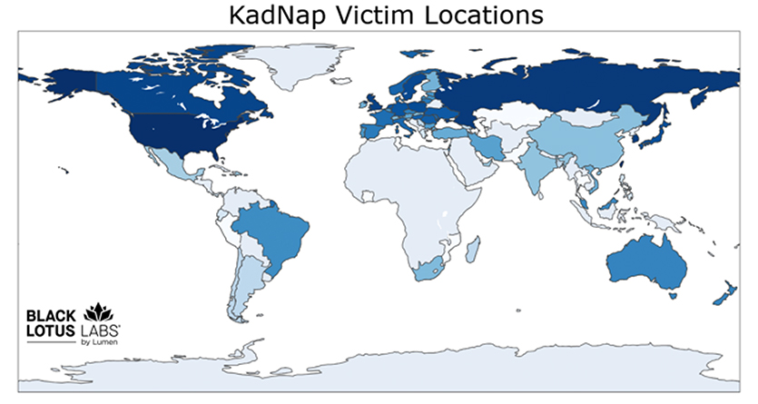
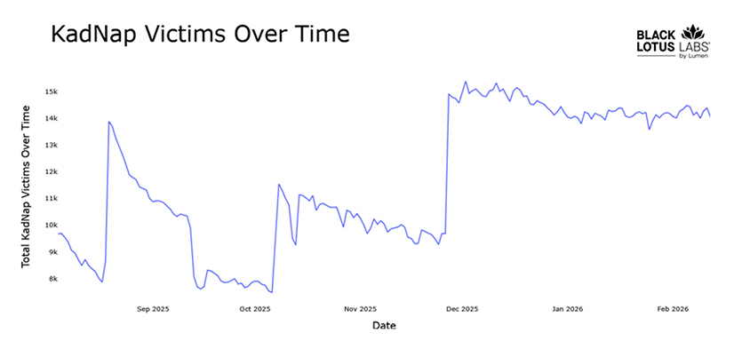
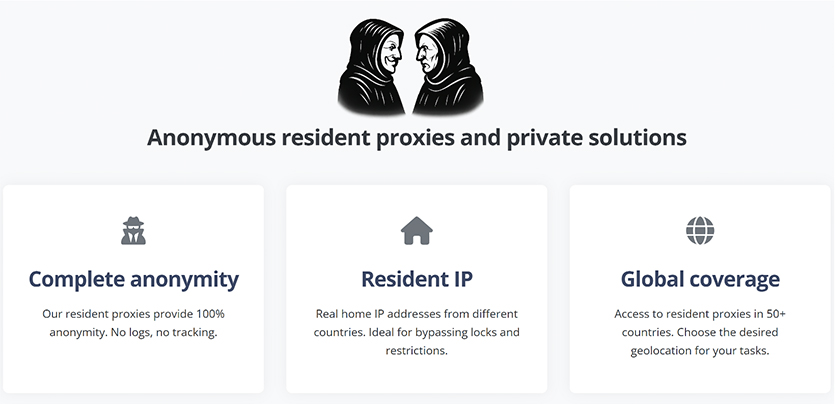

# KadNap Botnet Targeting ASUS Routers

**KadNap Botnet**{.cve-chip}  **ASUS Routers**{.cve-chip}  **Proxy Abuse**{.cve-chip}  **P2P C2**{.cve-chip}

## Overview
Researchers identified a malware campaign involving a botnet known as **KadNap**, which compromises ASUS routers and other edge devices and repurposes them as proxy nodes. These compromised devices are then used to relay malicious traffic, helping threat actors mask origin infrastructure during cybercrime operations.

Reporting indicates sustained growth since first observation in August 2025, with botnet access being leveraged in cybercriminal proxy-service ecosystems.

## Technical Specifications

| **Attribute** | **Details** |
|---------------|-------------|
| **Malware Family** | KadNap |
| **Primary Targets** | ASUS routers and internet-exposed edge devices |
| **Initial Stage Artifact** | `aic.sh` script downloaded from attacker infrastructure |
| **Persistence Mechanism** | Cron job execution every 55 minutes |
| **Main Payload** | ELF binary `kad` |
| **C2/Coordination Method** | Modified Kademlia DHT (peer-to-peer control) |
| **Operational Support** | NTP synchronization across infected nodes |
| **Abuse Outcome** | Proxy network for anonymized malicious traffic |

## Affected Products
- ASUS routers with vulnerable exposure/configuration states
- Other edge devices susceptible to script/binary execution pathways
- Networks with weak router credential hygiene or exposed management surfaces
- Residential and SMB environments used as relay infrastructure
- Status: Active botnet risk with global infection footprint

## Technical Details

### 1) Initial Infection Script
- Infection begins with retrieval of `aic.sh` from remote attacker-controlled servers.
- Script orchestrates setup, payload download, and persistence logic.

### 2) Persistence
- `aic.sh` creates a cron-based persistence task scheduled every 55 minutes.
- Repeated execution supports malware durability and re-establishment after interruption.

### 3) Payload Deployment
- Script retrieves and executes `kad` (ELF malware binary).
- Device transitions into active KadNap bot/client behavior.

### 4) P2P Command Infrastructure
- KadNap uses a modified Kademlia DHT model for bot discovery/coordination.
- Decentralized peer architecture obscures direct C2 endpoints and complicates takedown.

### 5) Time Synchronization
- Compromised devices contact multiple NTP servers to coordinate timing/operations.

### 6) Criminal Proxy Monetization
- Infected nodes are reportedly integrated into proxy access offerings (e.g., Doppelganger-referenced reporting context).
- Adversaries route malicious campaigns through hijacked residential/edge infrastructure.

## Attack Scenario
1. **Reconnaissance**:
    - Attacker scans internet for vulnerable ASUS routers/edge devices.

2. **Script Delivery**:
    - Malicious `aic.sh` is fetched and executed on target device.

3. **Persistence Setup**:
    - Cron job established to maintain recurring execution.

4. **Bot Payload Install**:
    - `kad` ELF binary is downloaded and launched.

5. **Botnet Enrollment**:
    - Device joins KadNap P2P botnet and synchronizes operations.

6. **Operational Abuse**:
    - Device used as proxy relay for anonymized attacks and cybercrime activities.

## Impact Assessment

=== "Scale and Exposure"
    * Reported compromise of 14,000+ devices globally
    * Expansion of criminal proxy infrastructure using hijacked edge assets
    * Increased difficulty tracing true attacker origins

=== "Security and Privacy Risk"
    * Residential/SMB networks exposed to abusive traffic relay
    * Potential interception or misuse of local network pathways
    * Elevated risk of follow-on exploitation from compromised gateway devices

=== "Attack Enablement"
    * Infrastructure for DDoS, credential stuffing, brute-force, and fraud operations
    * Enhanced operational cover for criminal campaigns via distributed proxies
    * Longer botnet survivability due to decentralized control model

## Mitigation Strategies

### Router and Edge Hardening
- Update router firmware regularly from official vendor channels
- Change default admin credentials and enforce strong unique passwords
- Disable remote administration unless strictly required

### Detection and Monitoring
- Monitor router logs for suspicious outbound connections and recurring script activity
- Track unusual cron entries, unknown binaries, and abnormal NTP/peer traffic patterns
- Alert on signs of proxy-service abuse and unexplained network throughput spikes

### Incident Response
- Reset compromised routers to factory settings and securely reconfigure
- Re-apply patched firmware and hardening baselines after reset
- Block known malicious infrastructure and applicable indicators of compromise

## Resources and References

!!! info "Open-Source Reporting"
    - [New KadNap botnet hijacks ASUS routers to fuel cybercrime proxy network](https://www.bleepingcomputer.com/news/security/new-kadnap-botnet-hijacks-asus-routers-to-fuel-cybercrime-proxy-network/)
    - [KadNap Malware Infects 14,000+ Edge Devices to Power Stealth Proxy Botnet](https://thehackernews.com/2026/03/kadnap-malware-infects-14000-edge.html)
    - [KadNap Malware Turning Asus Routers Into Botnets](https://blog.lumen.com/silence-of-the-hops-the-kadnap-botnet/)
    - [Silence of the hops: The KadNap botnet - Malware News - Malware Analysis, News and Indicators](https://malware.news/t/silence-of-the-hops-the-kadnap-botnet/104759)
    - [Ongoing Botnet Campaign Targeting ASUS Routers | Cyber Security Agency of Singapore](https://www.csa.gov.sg/alerts-and-advisories/alerts/al-2025-052/)

---

*Last Updated: March 11, 2026* 
