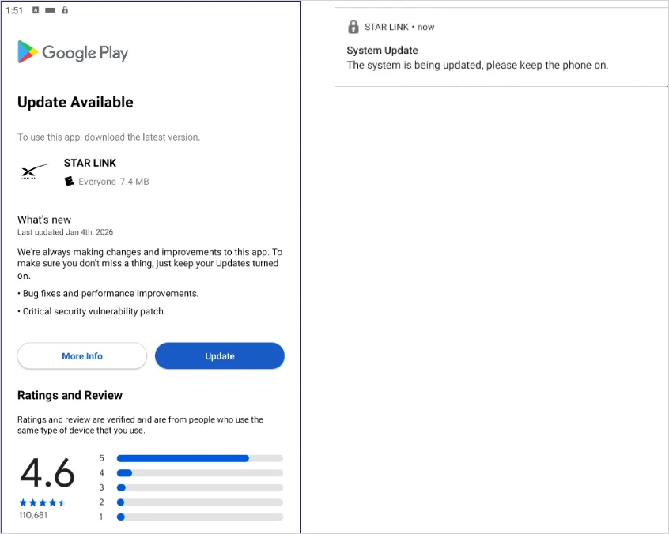
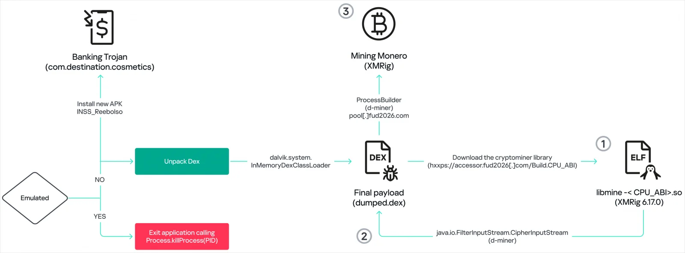

# BeatBanker Android Malware Campaign (Fake Starlink App)

**BeatBanker**{.cve-chip}  **Android Banking Trojan**{.cve-chip}  **Fake App Distribution**{.cve-chip}  **Crypto Miner**{.cve-chip}

## Overview
Researchers identified a new Android malware campaign known as **BeatBanker** that spreads via malicious APK files disguised as legitimate apps, including fake Starlink-branded mobile applications. The malware is distributed through websites that imitate the Google Play Store to trick users into sideloading trojanized software.

After installation, BeatBanker can retrieve additional modules enabling financial credential theft, remote access, and device resource abuse (including cryptocurrency mining), significantly increasing risk to both individual users and enterprise-managed mobile devices.

## Technical Specifications

| **Attribute** | **Details** |
|---------------|-------------|
| **Malware Family** | BeatBanker |
| **Primary Delivery** | Malicious APK (dropper) via fake Play Store-like websites |
| **Lure Theme** | Fake Starlink application branding |
| **Target Platform** | Android |
| **High-Risk Permissions** | Accessibility Service, overlay permissions, package installation permissions |
| **Additional Payloads** | Banking trojan module, Monero miner, BTMOB RAT |
| **Credential Theft Method** | Overlay-based fake login screens over banking/crypto apps |
| **Persistence Method** | Near-inaudible looping audio to keep foreground service alive |

## Affected Products
- Android devices with sideloading enabled or weak app-source controls
- Users installing APKs from untrusted websites mimicking official app stores
- Banking and cryptocurrency apps vulnerable to overlay credential theft
- Devices with excessive app permissions granted (Accessibility/overlay/install)
- Status: Active social-engineering and modular malware distribution risk

## Technical Details

### 1) Dropper APK Stage
- Campaign uses malicious APK droppers distributed outside official channels.
- Fake Play Store-style websites and Starlink-themed lures increase user trust.

### 2) Permission Abuse
- App requests high-risk permissions to gain broad UI/device control.
- Accessibility and overlay access enable interaction hijacking and credential theft workflows.

### 3) Modular Payload Retrieval
- Post-installation, malware contacts C2 infrastructure.
- Additional modules may include:
    - Banking credential theft components
    - Cryptocurrency mining payloads
    - Remote access module (BTMOB RAT)

### 4) Overlay Credential Theft
- Malware displays counterfeit login interfaces over legitimate banking/crypto apps.
- Captured credentials and session data can be transmitted to attacker servers.

### 5) Crypto Mining and Persistence
- Mining module consumes CPU for Monero operations.
- Foreground-service persistence is reinforced using a nearly inaudible looping audio trick to reduce process termination by Android.

### 6) Anti-Analysis Behavior
- Malware attempts to detect emulators/sandbox environments and may terminate execution to evade analysis.

## Attack Scenario
1. **Social Engineering Setup**:
    - Attacker hosts fake Play Store-like site advertising a Starlink-themed APK.

2. **User Installation**:
    - Victim downloads and sideloads malicious APK from outside official store.

3. **Privilege Granting**:
    - App requests Accessibility/overlay/install-related permissions.

4. **C2 Registration & Module Download**:
    - Device contacts C2 and retrieves additional malicious components.

5. **Operational Abuse**:
    - Attackers perform credential theft, screen/user monitoring, and optional remote control.

6. **Monetization & Persistence**:
    - Financial theft and crypto mining occur while malware maintains long-lived background presence.

## Impact Assessment

=== "Financial and Account Risk"
    * Theft of banking credentials and unauthorized transactions
    * Compromise of cryptocurrency wallet credentials and assets
    * Account takeover risk across mobile-linked services

=== "Device and Privacy Risk"
    * Full or partial device takeover via RAT capabilities
    * Privacy exposure through screen/activity/location monitoring
    * Elevated persistence that resists normal process cleanup

=== "Operational and Performance Impact"
    * Battery drain and performance degradation from mining/activity
    * Increased incident response complexity due to modular payload chains
    * Potential enterprise risk when compromised mobile devices access work resources

## Mitigation Strategies

### User Protection
- Install apps only from official Google Play Store sources
- Disable "install from unknown sources" where possible
- Review and tightly restrict Accessibility/overlay permissions
- Keep Android OS and security updates current

### Organizational Controls
- Enforce mobile app source restrictions via MDM/EMM policy
- Detect and block sideloaded/untrusted APK execution where possible
- Monitor for abnormal outbound C2 and unusual mobile SSH/proxy-like behavior
- Deploy mobile threat defense/EDR for behavior-based detection

### Detection and Response
- Hunt for suspicious foreground-service persistence and abnormal audio-service usage
- Investigate overlay abuse patterns and unexpected accessibility service enablement
- Revoke exposed credentials and isolate affected devices quickly

## Resources and References

!!! info "Open-Source Reporting"
    - [New BeatBanker Android malware poses as Starlink app to hijack devices](https://www.bleepingcomputer.com/news/security/new-beatbanker-android-malware-poses-as-starlink-app-to-hijack-devices/)
    - [BeatBanker: both banker and miner for Android | Securelist](https://securelist.com/beatbanker-miner-and-banker/119121/)
    - [BeatBanker Android Malware Hijacks Devices Through Fake Starlink Applications](https://www.ctrlaltnod.com/news/beatbanker-android-malware-hijacks-devices-via-fake-starlink/)
    - [The Silent Rhythm: How BeatBanker Malware Uses a Looping Audio File to Hijack Android Devices](https://securityonline.info/the-silent-rhythm-how-beatbanker-malware-uses-a-looping-audio-file-to-hijack-android-devices/)

---

*Last Updated: March 11, 2026* 
