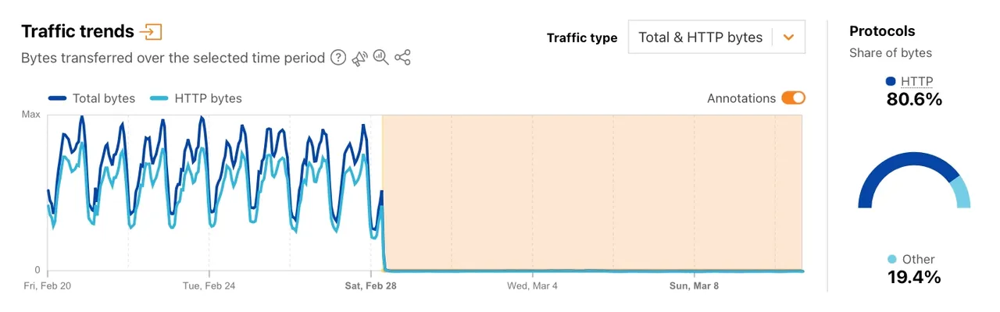

# Middle East Cloud Infrastructure Attack / AWS Data Center Drone Strikes

**Cloud Infrastructure Risk**{.cve-chip}  **Physical Disruption**{.cve-chip}  **Regional Outage**{.cve-chip}  **Geopolitical Escalation**{.cve-chip}

## Overview
During conflict escalation in the Middle East in late February 2026, multiple cloud infrastructure facilities associated with AWS in the Gulf region were reportedly impacted by drone strikes and related disruption effects. Two UAE facilities were reportedly directly hit, and a Bahrain facility reportedly experienced physical damage.

The incidents highlight that cloud service continuity can be affected by kinetic/physical events, not only cyber intrusions. Even when compute hardware is not directly destroyed, power, cooling, networking, and fiber dependencies can cause broad service degradation.

## Technical Specifications

| **Attribute** | **Details** |
|---------------|-------------|
| **Incident Type** | Physical attacks impacting cloud data center operations |
| **Region** | Middle East (UAE, Bahrain impact context) |
| **Primary Disruption Vector** | Drone strike-related facility and utility damage |
| **Infrastructure Effects** | Structural impact, power disruption, fire/water suppression consequences |
| **Service Effects** | Outages, degraded performance, and regional dependency stress |
| **Dependency Risks** | Fiber routes, power feeds, network edges, and ancillary facility systems |
| **Operational Theme** | Multi-domain risk: physical conflict with digital infrastructure consequences |
| **Strategic Concern** | Cloud concentration and regional single-point dependency exposure |

## Affected Products
- Cloud workloads hosted in impacted Middle East regions
- Regional digital services dependent on local AWS availability and connectivity
- Enterprises lacking multi-region failover and independent backup strategy
- Sectors with high uptime sensitivity (payments, logistics, communications, public services)
- Status: Elevated regional resilience risk under geopolitical/physical threat conditions

## Technical Details

### Physical Damage and Cascading Service Effects
- Reported damage included structural impact, power interruptions, and fire suppression-related water effects.
- Availability issues can arise even without direct server destruction when utility/control systems are degraded.
- Adjacent infrastructure stress can propagate through interconnected cloud/network dependencies.

### Regional Dependency Exposure
- Cloud services rely on tightly coupled systems: power delivery, cooling, transport links, and backbone connectivity.
- Disruption of fiber routes and network edge capacity can affect services beyond directly impacted facilities.
- Cross-region traffic rerouting may introduce latency, throttling, or partial service unavailability.

### Multi-Domain Threat Context
- Experts characterize these events as part of broader multi-domain conflict dynamics.
- Physical attacks on digital infrastructure can coincide with cyber operations and information disruptions.

## Attack Scenario
1. **Conflict Escalation**:
    - Regional military tension increases targeting risk for strategic infrastructure.

2. **Kinetic Strike Event**:
    - Drone attacks impact data center facilities and associated utility systems.

3. **Facility/Utility Degradation**:
    - Power instability and physical damage affect local cloud operations.

4. **Service-Level Impact**:
    - Workloads in affected regions experience outage or degraded performance.

5. **Business Continuity Stress**:
    - Organizations dependent on impacted regions face service interruption and recovery pressure.

## Impact Assessment

=== "Availability"
    * Regional cloud outages and degraded service performance
    * Interruptions in payment, application, logistics, and platform-dependent operations
    * Increased failover/recovery pressure on neighboring regions

=== "Operational and Economic Impact"
    * Business continuity disruptions and recovery costs
    * SLA/uptime risk exposure for cloud-dependent services
    * Potential cascading impact on partner ecosystems and customers

=== "Strategic Infrastructure Risk"
    * Demonstrates vulnerability of digital infrastructure to physical conflict
    * Reveals resilience gaps in region-concentrated deployments
    * Reinforces need for cross-domain risk planning (cyber + physical)

## Mitigation Strategies

### Architecture and Resilience
- Implement multi-region cloud architecture with tested failover paths
- Adopt multi-cloud deployment strategy where risk profile requires provider diversification
- Avoid concentration of critical workloads in a single geographic region

### Data Protection and Recovery
- Maintain independent backups outside primary region/failure domain
- Validate backup restore objectives and cross-region replication integrity
- Test disaster recovery runbooks under degraded-connectivity assumptions

### Operational Preparedness
- Conduct regular business continuity exercises for regional cloud outage scenarios
- Map and monitor critical dependencies (power, fiber, edge networking, control systems)
- Define incident communication and escalation plans for multi-domain disruptions

## Resources and References

!!! info "Open-Source Reporting"
    - [Middle East Conflict Highlights Cloud Resilience Gaps](https://www.darkreading.com/cyber-risk/middle-east-conflict-highlights-cloud-resilience-gaps)
    - [Iran Israel US conflict disrupts cloud infra, exposes global digital vulnerabilities - BusinessToday](https://www.businesstoday.in/technology/story/iran-israel-us-conflict-disrupts-cloud-infra-exposes-global-digital-vulnerabilities-519020-2026-03-03)
    - [When the Cloud Burns: AWS Middle East Outage and the New Era of Geopolitical Infrastructure Risk | OKINT Digital](https://www.okintdigital.com/en/insights/aws-middle-east-data-center-iran-strikes-cloud-resilience)
    - [AWS UAE Outage: A Geopolitical Test for Cloud Resilience](https://www.ainvest.com/news/aws-uae-outage-geopolitical-test-cloud-resilience-2603/)

---

*Last Updated: March 11, 2026* 
