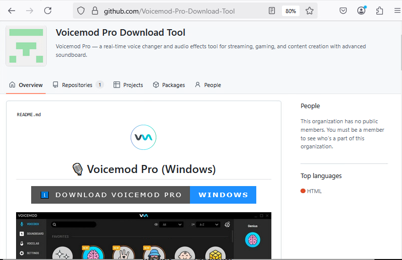
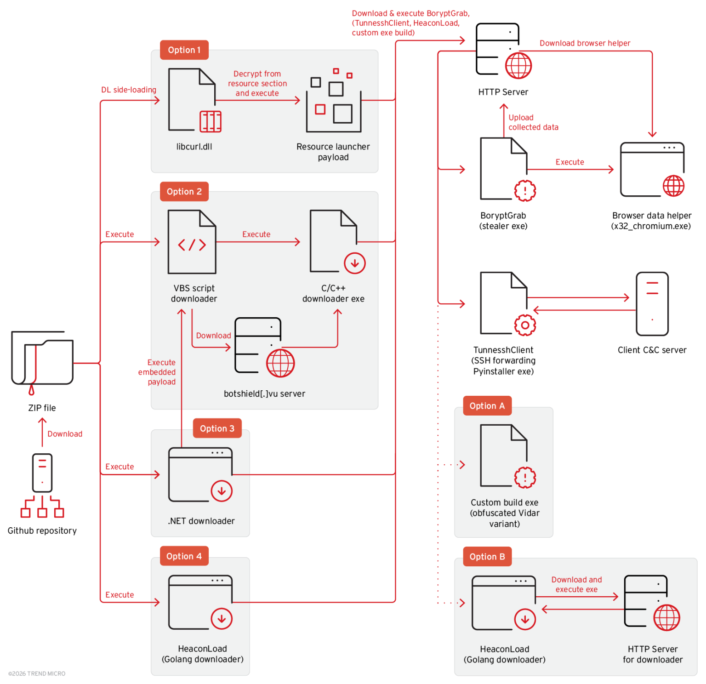

# BoryptGrab Infostealer GitHub Distribution Campaign

**BoryptGrab**{.cve-chip}  **Malicious GitHub Repos**{.cve-chip}  **Windows Infostealer**{.cve-chip}  **TunnesshClient**{.cve-chip}

## Overview
Researchers identified a large-scale malware campaign abusing GitHub repositories to distribute the BoryptGrab infostealer. Threat actors reportedly created over 100 malicious repositories masquerading as legitimate software offerings such as game cheats, cracked tools, FPS boosters, and utility applications.

Victims are lured via SEO manipulation and social engineering into downloading trojanized ZIP archives from fake repositories and GitHub Pages links. Executed payloads steal credentials, wallet data, and communication tokens, and in some cases deploy an additional backdoor component (TunnesshClient) for persistent remote access.

## Technical Specifications

| **Attribute** | **Details** |
|---------------|-------------|
| **Campaign Type** | Malware distribution and credential theft via GitHub abuse |
| **Primary Malware** | BoryptGrab infostealer |
| **Secondary Payload** | TunnesshClient (Python backdoor) |
| **Primary Target Platform** | Windows |
| **Distribution Channels** | Malicious GitHub repositories, GitHub Pages, trojanized ZIP downloads |
| **Social Engineering Themes** | Game cheats, cracked software, performance boosters, free premium tools |
| **Data Theft Focus** | Browser credentials, cookies/tokens, wallet artifacts, local files |
| **Persistence/Access Expansion** | Reverse SSH tunneling and SOCKS5 proxy capability (TunnesshClient) |

## Affected Products
- Windows user endpoints executing untrusted binaries from downloaded archives
- Browsers including Google Chrome, Microsoft Edge, and Brave
- Cryptocurrency wallet software and wallet-related local data stores
- Messaging platform sessions/tokens (e.g., Telegram/Discord token material)
- Organizations where infected user systems are connected to enterprise resources

## Technical Details

### Primary Malware: BoryptGrab
- Infostealer focused on credential and token theft.
- Reported capabilities include:
    - Browser credential extraction
    - Cookie/session token collection
    - Autofill data harvesting
    - Local file exfiltration
    - Crypto wallet artifact theft
    - Telegram/Discord token theft

### Targeted Data Sources
- **Browsers**: Chrome, Edge, Brave
- **Crypto Wallet Contexts**: Examples include Atomic Wallet, Coinomi, Ledger/Trezor-related artifacts, and selected Ethereum/Dogecoin wallet data paths

### Secondary Payload: TunnesshClient
- Python-based remote access/backdoor component.
- Reported capabilities:
    - Reverse SSH tunneling
    - SOCKS5 proxying via infected host
    - Remote command execution
    - File upload/download operations

### Distribution Infrastructure
- Large number of deceptive repositories and fake project pages.
- ZIP archives contain executables disguised as useful tools.
- SEO optimization helps malicious repositories rank for victim search queries.

## Attack Scenario
1. **Victim Search Activity**:
    - User searches for cheats, cracked software, FPS boosters, or free versions of paid tools.

2. **SEO-Driven Exposure**:
    - Malicious GitHub repository appears credible in search results.

3. **Trojanized Download**:
    - Victim downloads ZIP archive advertised as legitimate utility/software.

4. **Execution and Infection**:
    - User runs embedded executable; BoryptGrab installs and begins collection.

5. **Data Theft and Exfiltration**:
    - Credentials, session data, wallet information, and local files are sent to attacker infrastructure.

6. **Optional Access Expansion**:
    - TunnesshClient may be installed for persistent remote access and proxy-based follow-on activity.

## Impact Assessment

=== "Individual Users"
    * Password theft and account session hijacking
    * Cryptocurrency wallet compromise and potential fund loss
    * Identity theft and downstream account takeover risk

=== "Organizations"
    * Corporate credential exposure via compromised user browsers
    * Potential theft of VPN/session material enabling internal access abuse
    * Expanded data exfiltration and lateral movement risk from infected workstations

=== "Operational/Security Impact"
    * Increased incident response complexity from dual payload behavior
    * Proxy/tunnel abuse can obscure attacker infrastructure and prolong persistence
    * Brand/reputation abuse of trusted developer platforms for malware distribution

## Mitigation Strategies

### User-Level Protection
- Avoid downloading binaries from unverified or low-trust GitHub repositories
- Do not execute unknown executables from ZIP archives
- Validate project legitimacy, maintainer history, and release provenance
- Keep endpoint security tools updated and active

### Organizational Controls
- Block or tightly control execution of untrusted binaries/scripts
- Monitor for unusual outbound SSH/reverse tunnel behavior and unexpected SOCKS proxy activity
- Deploy and tune EDR for infostealer and token-theft behaviors
- Implement strong browser credential protection policies
- Enforce MFA on enterprise and high-value external services

### Detection and Response
- Hunt for suspicious archive/executable execution chains from download paths
- Monitor for token replay indicators and anomalous login geography/device patterns
- Isolate infected hosts quickly and rotate exposed credentials/session tokens

## Resources and References

!!! info "Open-Source Reporting"
    - [Massive GitHub malware operation spreads BoryptGrab stealer](https://securityaffairs.com/189110/malware/massive-github-malware-operation-spreads-boryptgrab-stealer.html)
    - [Fake GitHub Repositories Unleash BoryptGrab Stealer and TunnesshClient Backdoor](https://securityonline.info/fake-github-repositories-unleash-boryptgrab-stealer-and-tunnesshclient-backdoor/)
    - [Fake GitHub tools are wiping wallets of Windows users | Cybernews](https://cybernews.com/security/github-malware-microsoft-chrome-passwords-theft/)

---

*Last Updated: March 9, 2026* 
