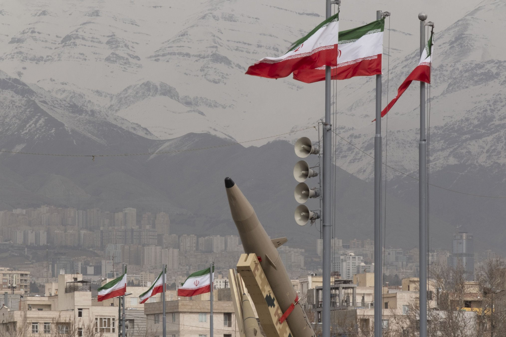
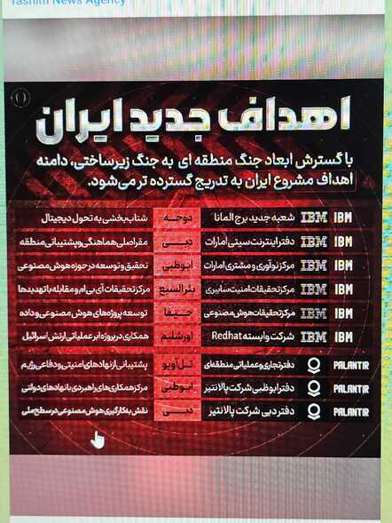
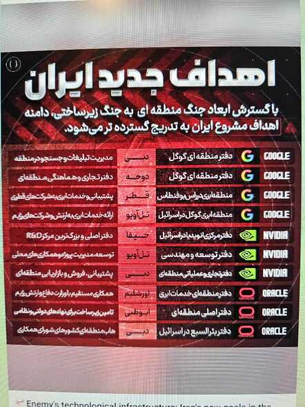

# Iran "Infrastructure Warfare" Threat Against U.S. Tech Companies

**Infrastructure Warfare**{.cve-chip}  **Geopolitical Cyber Risk**{.cve-chip}  **Cloud Targeting**{.cve-chip}  **Hybrid Threats**{.cve-chip}

## Overview
Iranian state-affiliated media reportedly published a list of infrastructure tied to major U.S. technology firms and characterized these assets as potential "legitimate targets" amid regional escalation. The messaging reflects an "infrastructure warfare" framing in which cloud facilities, R&D sites, and digital service hubs are treated as strategic objectives.

Named organizations include Google, Microsoft, Amazon, IBM, Nvidia, Oracle, and Palantir, with regional presence across Israel and Gulf countries. The threat context combines cyber, physical, and information-domain pressure against technology-dependent ecosystems.

## Technical Specifications

| **Attribute** | **Details** |
|---------------|-------------|
| **Threat Context** | State-affiliated strategic threat messaging with hybrid risk implications |
| **Reported Target Count** | 29 potential infrastructure targets (per cited reporting) |
| **Target Classes** | Cloud data centers, regional HQs, AI/cyber labs, software engineering sites |
| **Geographic Focus** | Israel, UAE, Bahrain, Qatar |
| **Named Company Profile** | Major U.S. cloud/AI/enterprise technology providers |
| **Operational Threat Modes** | Cyber disruption, supply-chain pressure, and possible kinetic/physical attack risk |
| **Strategic Narrative** | Tech infrastructure framed as military-supporting capability |
| **Risk Domain** | Multi-domain (cyber + physical + economic disruption) |

## Affected Products
- Regional cloud infrastructure and associated control-plane dependencies
- Technology offices, labs, and engineering operations in high-tension geographies
- Enterprises and public-sector customers dependent on AWS/Azure/GCP regional services
- Supply chains connected to AI, software, and semiconductor support ecosystems
- Status: Elevated geopolitical risk requiring resilience and continuity planning

## Technical Details

### Reported Targeting Pattern
- State-linked media reportedly listed technology infrastructure as potential retaliation targets.
- Reported locations include major urban and infrastructure centers in Israel and Gulf states.
- Target classes include data centers, R&D facilities, and regional operations nodes.

### Multi-Domain Risk Dynamics
- Threat model includes potential cyber operations against cloud/SaaS ecosystems.
- Physical disruption scenarios (including drone/strike/sabotage context) increase infrastructure exposure.
- Hybrid operations could sequence cyber intrusions with utility/connectivity disruption.

### Prior Incident Context
- Reporting references prior regional impacts to cloud infrastructure operations.
- Even without direct server destruction, utility/fiber/network dependencies can drive outages and cascading business impact.

## Attack Scenario
1. **Strategic Signaling**:
    - Threat actors/public channels identify high-value tech infrastructure as coercive targets.

2. **Reconnaissance and Preparation**:
    - Cyber and/or physical reconnaissance of cloud sites, regional offices, and connectivity dependencies.

3. **Coordinated Action Window**:
    - Cyber disruption (DDoS/intrusion/supply-chain pressure) and/or physical attacks occur during escalation.

4. **Service and Infrastructure Impact**:
    - Regional outages, degraded cloud service performance, and operational interruption for dependent customers.

5. **Economic and Strategic Amplification**:
    - Disruption effects spread to finance, logistics, communications, and government digital services.

## Impact Assessment

=== "Availability and Continuity"
    * Cloud and platform service disruption in affected regions
    * Outages for businesses and governments dependent on regional infrastructure
    * Potential cascading failures through connectivity and utility dependencies

=== "Economic and Operational Impact"
    * Business interruption and recovery costs across digital-dependent sectors
    * Supply-chain pressure on AI/software/semiconductor-linked operations
    * Increased operational overhead for emergency failover and crisis response

=== "Strategic and Security Impact"
    * Escalation of nation-state cyber/physical confrontation in tech domain
    * Heightened risk to trusted infrastructure supporting critical services
    * Greater urgency for resilience engineering in geopolitically exposed regions

## Mitigation Strategies

### Infrastructure Protection
- Strengthen physical security controls for data centers and critical facilities
- Expand perimeter surveillance and anti-drone readiness where applicable
- Harden utility and access dependencies (power, cooling, transport, fiber diversity)

### Cybersecurity Hardening
- Enforce continuous monitoring across cloud control planes and identity systems
- Implement network segmentation and zero-trust access models
- Integrate threat intelligence focused on region-specific nation-state actors

### Business Continuity and Resilience
- Deploy multi-region failover for critical workloads
- Maintain tested disaster recovery and incident communication plans
- Keep independent backups outside primary geopolitical risk zones
- Avoid single-region concentration for mission-critical systems

## Resources and References

!!! info "Open-Source Reporting"
    - [Iran plots 'infrastructure warfare' against US tech giants | The Register](https://www.theregister.com/2026/03/11/iran_threatens_us_tech_companies/)
    - [Iran Threatens Google, Microsoft, Nvidia Sites as "Infrastructure War" Expands — UNITED24 Media](https://united24media.com/latest-news/iran-threatens-to-strike-google-microsoft-nvidia-sites-in-expanding-infrastructure-war-16746)
    - [Iran Warns US Tech Firms Could Become Targets as War Expands | WIRED](https://www.wired.com/story/iran-warns-us-tech-firms-could-become-targets-as-war-expands/)
    - [Iran Us War: 'Legitimate targets': Iran issues warning to US tech firms including Google, Amazon, Microsoft, Nvidia - The Times of India](https://timesofindia.indiatimes.com/world/middle-east/legitimate-targets-iran-issues-warning-to-us-tech-firms-including-google-amazon-microsoft-nvidia/articleshow/129450749.cms)
    - [Iran Includes American Tech Giants on List of New Targets](https://gizmodo.com/iran-includes-american-tech-giants-on-list-of-new-targets-2000732530)
    - [Iran says it will target US-Israeli economic, banking interests in region | Reuters](https://www.reuters.com/world/middle-east/iran-will-target-us-israeli-economic-banking-interests-region-state-media-2026-03-11/)

---

*Last Updated: March 12, 2026* 
