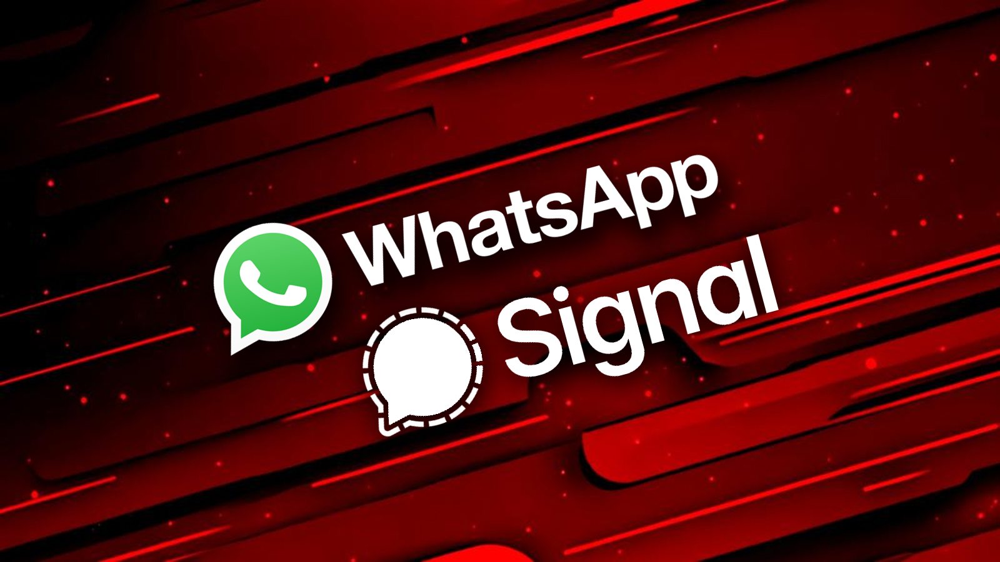
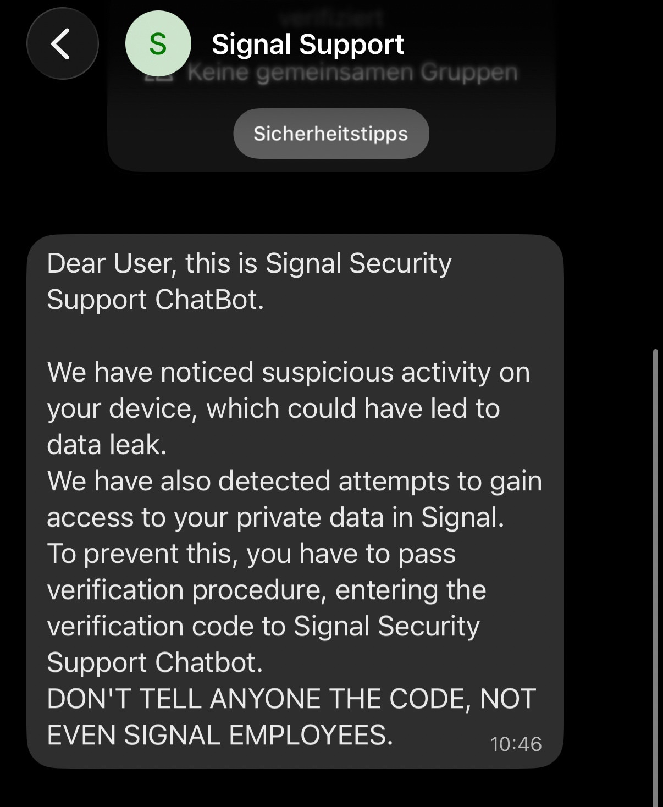

# Russia-linked Hackers Target Signal and WhatsApp Accounts of Officials Globally

**Russia-Linked Threat Activity**{.cve-chip}  **Account Hijacking**{.cve-chip}  **Signal Abuse**{.cve-chip}  **WhatsApp Abuse**{.cve-chip}

## Overview
Dutch intelligence and the Dutch government warned that Russia-linked state hackers are running a large-scale global campaign to hijack Signal and WhatsApp accounts belonging to officials, military personnel, journalists, and other high-value targets.

The campaign does not rely on breaking Signal or WhatsApp encryption and does not require a new remote code execution vulnerability. Instead, attackers abuse account lifecycle workflows, linked-device features, and social engineering to gain access and persistence.

## Technical Specifications

| **Attribute** | **Details** |
|---------------|-------------|
| **Vulnerability Type** | Social engineering, credential/OTP theft, linked-device abuse |
| **Attack Vector** | Remote (messaging chats, QR/deep-link lures, fake support interactions) |
| **Authentication** | User-assisted compromise through stolen verification code/PIN or malicious device-link approval |
| **Complexity** | Low to Medium (depends on target awareness and operational security) |
| **User Interaction** | Required |
| **Affected Platforms** | Signal and WhatsApp account recovery and multi-device linking flows |

## Affected Products
- Signal accounts used by government and high-value users
- WhatsApp accounts used by government and high-value users
- Individuals specifically highlighted by Dutch agencies: officials, civil servants, military personnel, diplomats, journalists
- Organizations dependent on consumer messaging apps for sensitive coordination

## Technical Details

### No New CVE or Encryption Break
- There is no public evidence of broken Signal or WhatsApp encryption.
- The operation focuses on account takeover mechanics and human-targeted deception.

### Core Tradecraft
- Phishing for verification codes and registration PINs via fake "support" chats.
- Automated fake support chatbots requesting codes to "secure" accounts.
- Malicious QR codes or deep links that abuse legitimate linked-device flows.
- Silent profile renaming (for example to "Deleted account") to reduce suspicion after takeover.

### WhatsApp Linked-Device Abuse
- Victims may be tricked into approving a linked-device prompt or scanning a malicious QR code.
- Attackers can mirror chats on attacker-controlled devices and maintain visibility with limited immediate signs.

## Attack Scenario
1. **Recon and Target Selection**:
   Russian-linked operators identify phone numbers used by officials, diplomats, military staff, and journalists likely to use Signal or WhatsApp for sensitive communications.

2. **Initial Contact and Social Engineering**:
   Attackers message targets while impersonating support or trusted contacts, then create urgency around account suspension, policy updates, or account risk.

3. **Code/PIN Harvesting or Device Linking**:
   In parallel, attackers trigger legitimate verification events and trick the victim into sharing codes/PINs or scanning malicious QR/deep links.

4. **Account Hijack and Persistence**:
   Attackers register the account on a new device or keep a linked device attached, potentially renaming profiles to appear as "Deleted account" and reducing detection.

5. **Exploitation of Access**:
   Attackers read private/group chats, impersonate victims, request sensitive documents, and collect policy, military, or diplomatic information.

## Impact Assessment

=== "Integrity"
    * Impersonation of officials to send false instructions or disinformation
    * Manipulation of trusted communication channels used for coordination
    * Erosion of trust when compromised identities continue to appear legitimate

=== "Confidentiality"
    * Exposure of government, military, diplomatic, and journalistic communications
    * Strategic intelligence collection from ongoing sensitive discussions
    * Potential leakage of contacts, workflows, and operational context

=== "Availability"
    * Temporary account lockouts and communication disruption during re-registration
    * Prolonged compromise if linked devices remain attached after recovery
    * Incident-response overhead and reduced confidence in messaging continuity

## Mitigation Strategies

### Immediate Actions
- Never share Signal or WhatsApp verification codes or PINs in any chat.
- If compromise is suspected, immediately re-register the account and revoke unknown linked devices.
- Notify trusted contacts that impersonation may have occurred and treat recent chats as potentially exposed.

### Short-term Measures
- Enable Signal Registration Lock PIN and WhatsApp two-step verification.
- Verify any "support" interaction only through official, out-of-band channels.
- Establish and enforce staff guidance on linked-device approvals and QR/deep-link safety.

### Monitoring & Detection
- Regularly audit linked-device lists for unknown or inactive sessions.
- Watch for suspicious prompts, unexpected verification requests, and unusual profile/account changes.
- For organizations, monitor for coordinated phishing patterns targeting diplomats, military staff, and officials.

## Resources and References

!!! info "Open-Source Reporting"
    - [Dutch government warning on Signal and WhatsApp account hijacking attacks](https://www.bleepingcomputer.com/news/security/dutch-govt-warns-of-signal-whatsapp-account-hijacking-attacks/)
    - [Russian government hackers targeting Signal and WhatsApp users, Dutch spies warn | TechCrunch](https://techcrunch.com/2026/03/09/russian-government-hackers-targeting-signal-and-whatsapp-users-dutch-spies-warn/)
    - [Russian hackers crack into officials’ Signal and WhatsApp accounts - Help Net Security](https://www.helpnetsecurity.com/2026/03/09/signal-whatsapp-accounts-russian-hackers/)
    - [Russia-backed hackers breach Signal, WhatsApp accounts of officials, journalists, Netherlands warns | Reuters](https://www.reuters.com/world/europe/russia-backed-hackers-breach-signal-whatsapp-accounts-officials-journalists-2026-03-09/)
    - [Russia-linked hackers target Signal, WhatsApp of officials globally | SOC Defenders](https://www.socdefenders.ai/item/d90e1c1c-0b30-434b-b9a0-76a391c47c0f)

---

*Last Updated: March 10, 2026*