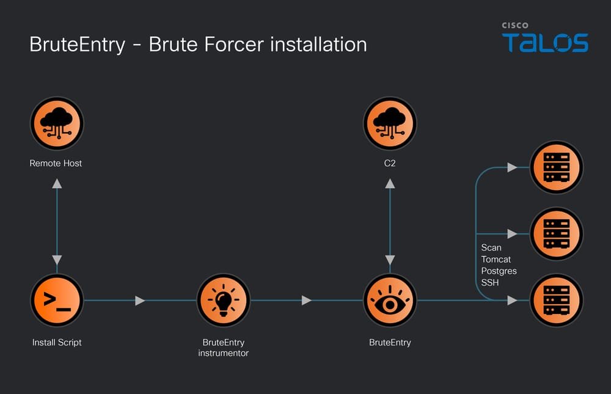

# China-Linked Hackers Use TernDoor, PeerTime, BruteEntry in South American Telecom Attacks

**UAT-9244**{.cve-chip}  **Telecom Espionage**{.cve-chip}  **TernDoor/PeerTime**{.cve-chip}  **BruteEntry**{.cve-chip}

## Overview
A China-linked threat actor tracked as **UAT-9244** was reported targeting telecommunications providers in South America using a custom multi-platform malware toolkit. The campaign deployed **TernDoor**, **PeerTime**, and **BruteEntry** to gain footholds, expand access, and sustain long-term persistence across telecom environments.

Observed tradecraft suggests an intelligence-collection objective focused on durable access to telecom infrastructure and communications-related data.

## Technical Specifications

| **Attribute** | **Details** |
|---------------|-------------|
| **Threat Actor** | UAT-9244 (China-linked, per reporting) |
| **Campaign Type** | Cyber-espionage targeting telecom infrastructure |
| **Primary Malware** | TernDoor (Windows), PeerTime (Linux), BruteEntry (credential brute-force utility) |
| **Execution Technique** | DLL side-loading via legitimate executable (`wsprint.exe`) |
| **Injected Process** | `msiexec.exe` used for evasion and execution context |
| **Persistence Methods** | Scheduled tasks and registry Run keys (Windows) |
| **Primary Target Sector** | Telecommunications providers |
| **Operational Goal** | Long-term covert access and intelligence gathering |

## Affected Products
- Windows systems in telecom enterprise and operations environments
- Linux servers used in telecom infrastructure roles
- Edge devices and network services susceptible to credential brute-force attempts
- Network segments with weak lateral-movement controls
- Status: Active espionage tradecraft with cross-platform persistence patterns

## Technical Details

### 1) TernDoor (Windows Backdoor)
- Delivered through DLL side-loading using trusted executable `wsprint.exe`.
- Loads malicious DLL `BugSplatRc64.dll`.
- Injects malicious code into `msiexec.exe` for stealth and defense evasion.
- Establishes persistence via scheduled tasks and registry Run keys.
- Capabilities include:
    - Command execution
    - File management
    - Process control
    - System information collection
    - C2 communication

### 2) PeerTime (Linux Backdoor)
- Deployed on Linux hosts within telecom infrastructure.
- Provides remote command execution and persistent remote access.
- Reported to potentially leverage peer-style communication patterns to obscure operator traffic.

### 3) BruteEntry Utility
- Used to brute-force credentials on edge devices and exposed services.
- Supports lateral movement and access expansion.
- Enables creation/use of relay-style proxy nodes (Operational Relay Boxes) for campaign resilience.

### 4) Tooling Ecosystem Notes
- Reported code/behavioral overlap with previously observed China-linked tooling families (e.g., SparrowDoor-like traits).

## Attack Scenario
1. **Initial Access**:
    - Attacker gains foothold via exploited vulnerable servers or stolen credentials.

2. **Loader/Web Shell Deployment**:
    - Initial execution artifacts are placed to stage malware delivery.

3. **Cross-Platform Implanting**:
    - TernDoor deployed on Windows assets; PeerTime deployed on Linux systems.

4. **Credential Expansion**:
    - BruteEntry performs credential attacks against edge/network services.

5. **Lateral Movement & Relay Setup**:
    - Adversary moves across telecom segments and establishes operational relay points.

6. **Long-Term C2 Operations**:
    - Persistent C2 channels maintained for surveillance and continued collection.

## Impact Assessment

=== "Confidentiality"
    * Long-term surveillance risk across telecommunications environments
    * Exposure of communications metadata and operational telemetry
    * Potential intelligence collection affecting government/corporate telecom users

=== "Integrity"
    * Unauthorized persistent access to core telecom systems
    * Potential manipulation of service configurations and management nodes
    * Increased risk of adversary-controlled relay infrastructure inside networks

=== "Availability"
    * Operational disruption potential through malware deployment or misconfiguration
    * Increased incident response burden from multi-platform compromise
    * Elevated risk of follow-on attacks leveraging entrenched footholds

## Mitigation Strategies

### Patch and Surface Reduction
- Apply current patches across telecom servers, network services, and exposed edge components
- Minimize externally reachable management interfaces and legacy exposed services

### Endpoint and Process Monitoring
- Detect DLL side-loading patterns and suspicious DLL loads near trusted binaries
- Monitor anomalous `msiexec.exe` execution chains and process injection indicators
- Deploy and tune EDR for multi-platform malware and persistence behavior

### Identity and Access Hardening
- Enforce MFA for privileged/admin access paths
- Apply account lockout and rate-limiting controls to counter brute-force attempts
- Rotate exposed credentials and monitor for password-spraying signals

### Network Defense
- Segment telecom operational zones and enforce strict lateral movement controls
- Monitor abnormal outbound C2-like traffic and peer-relay communication patterns
- Use threat intel enrichment for UAT-9244 tooling indicators and campaign TTPs

## Resources and References

!!! info "Open-Source Reporting"
    - [China-Linked Hackers Use TernDoor, PeerTime, BruteEntry in South American Telecom Attacks](https://thehackernews.com/2026/03/china-linked-hackers-use-terndoor.html?m=1)
    - [China-Nexus Hackers Target Telecommunication Providers with New Malware Attack](https://gbhackers.com/china-nexus-hackers-target-telecommunication-providers/)
    - [Chinese state hackers target telcos with new malware toolkit](https://www.bleepingcomputer.com/news/security/chinese-state-hackers-target-telcos-with-new-malware-toolkit/)
    - [China telecom cyber espionage campaign](https://securereading.com/china-telecom-cyber-espionage-campaign/)
    - [Chinese hackers target telcos in South America with new malware](https://cyberinsider.com/chinese-hackers-target-telcos-in-south-america-with-new-malware/)

---

*Last Updated: March 8, 2026* 
