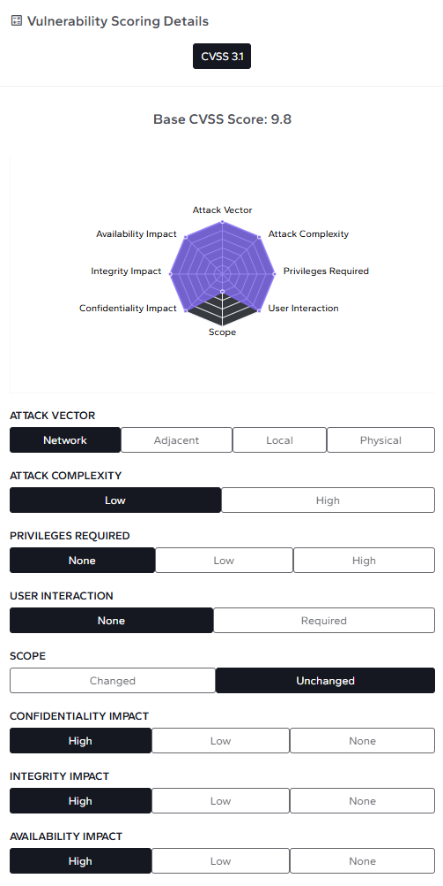

# Critical HPE Aruba Networking AOS-CX Vulnerability (CVE-2026-23813)

**HPE Aruba**{.cve-chip} **Authentication Bypass**{.cve-chip} **Critical Vulnerability**{.cve-chip}

## Overview

A critical flaw in the web-based management interface of HPE Aruba Networking AOS-CX switches allows unauthenticated remote attackers to bypass authentication controls and, in some scenarios, reset the administrator password. Successful exploitation can result in unauthorized administrative control of affected switches.

Given the central role of network infrastructure devices, exploitation could enable broad operational disruption and create a high-value foothold for further intrusions inside enterprise environments.

## Technical Specifications

| Field | Details |
|-------|---------|
| **Identifier** | CVE-2026-23813 |
| **CVSS Score** | 9.8 (Critical) |
| **Affected Component** | AOS-CX web-based management interface |
| **Affected Software** | Aruba AOS-CX versions prior to fixed releases |
| **Patched Versions (examples)** | 10.17.1001, 10.16.1030, 10.13.1161, 10.10.1180 |
| **Exploitability** | Remote, unauthenticated, no user interaction |
| **Potential Impact** | Authentication bypass, admin password reset, full device control |

## Affected Products

- HPE Aruba Networking switches running vulnerable AOS-CX releases.
- Devices exposing the web management interface to untrusted or broad network segments.

## Technical Details

- The vulnerability resides in the web administration interface used for switch management.
- Crafted requests can bypass normal authentication checks without valid credentials.
- In some exploitation paths, the flaw enables administrator password reset/change operations.
- Once administrative access is obtained, attackers can modify switch configuration and management state.
- Device compromise may support follow-on internal reconnaissance and lateral movement.

## Attack Scenario

1. An attacker identifies a reachable AOS-CX web management interface.
2. The attacker sends crafted requests to exploit authentication bypass logic.
3. The vulnerability permits password reset or credential replacement for admin access.
4. The attacker logs in with administrative privileges.
5. The switch is fully controllable, enabling configuration tampering, traffic impact, or deeper network pivoting.

## Impact Assessment

=== "Administrative Control"
    Full administrative takeover of affected switches is possible.

=== "Operational Impact"
    Attackers may disrupt network communications and normal business operations, while weakening segmentation and monitoring controls.

=== "Lateral Movement and Enterprise Risk"
    Switch takeover can serve as an entry point for broader movement across enterprise environments, increasing blast radius and incident response complexity.

## Mitigation Strategies

- Apply HPE Aruba AOS-CX security updates that remediate CVE-2026-23813 immediately.
- Restrict management interface access to trusted VLANs and approved administration networks.
- Disable unnecessary HTTP/HTTPS management exposure where operationally feasible.
- Enforce Control Plane ACLs so only trusted clients can access management endpoints.
- Enable detailed logging and continuous monitoring for abnormal management-interface activity.
- Review switch configurations and administrative accounts for unauthorized changes post-patching.

## Resources

!!! info "References"
    - [HPESBNW05027 rev.1 - HPE Aruba Networking AOS-CX, Multiple Vulnerabilities](https://support.hpe.com/hpesc/public/docDisplay?docId=hpesbnw05027en_us&docLocale=en_US)
    - [Critical HPE AOS-CX Vulnerability Allows Admin Password Resets - SecurityWeek](https://www.securityweek.com/critical-hpe-aos-cx-vulnerability-allows-admin-password-resets/)
    - [HPE warns of dangerous security flaw which could allow Aruba OS password resets | TechRadar](https://www.techradar.com/pro/security/hpe-warns-of-dangerous-security-flaw-which-could-allow-aruba-os-password-resets)
    - [CVE-2026-23813 - Critical Vulnerability - TheHackerWire](https://www.thehackerwire.com/vulnerability/CVE-2026-23813/)
    - [CVE-2026-23813 - Authentication Bypass in Web Interface allows Unauthenticated Admin Password Reset](https://cvefeed.io/vuln/detail/CVE-2026-23813)
    - [HPE warns of critical AOS-CX flaw that can let attackers reset admin passwords](https://vpncentral.com/hpe-warns-of-critical-aos-cx-flaw-that-can-let-attackers-reset-admin-passwords/)
    - [Critical 9.8 CVSS Bypass Unearthed in HPE Aruba AOS-CX Switches](https://securityonline.info/critical-9-8-cvss-bypass-unearthed-in-hpe-aruba-aos-cx-switches/)
    - [HPE Aruba Networking AOS-CX switch vulnerabilities](https://www.runzero.com/blog/hpe-aruba-networking-cx/)
    - [CVE-2026-23813: Vulnerability in Hewlett Packard Enterprise (HPE) AOS-CX - Live Threat Intelligence - Threat Radar | OffSeq.com](https://radar.offseq.com/threat/cve-2026-23813-vulnerability-in-hewlett-packard-en-bce16d68)

*Last Updated: March 15, 2026*