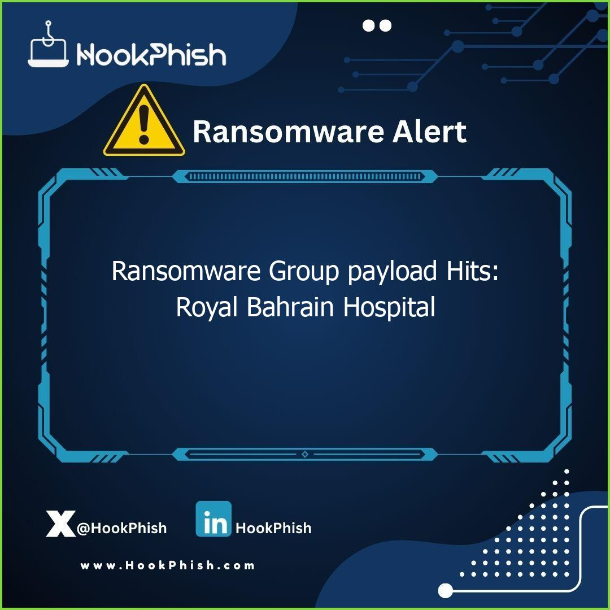
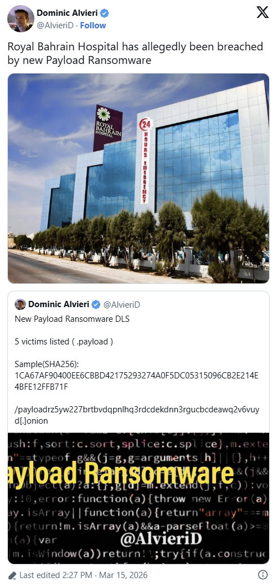
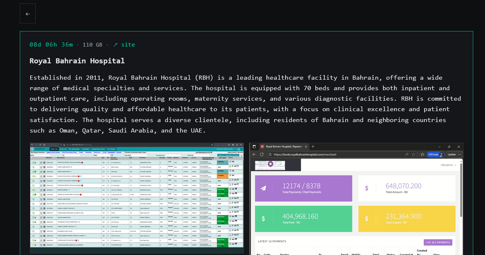

# Payload Ransomware Claims the Hack of Royal Bahrain Hospital

**Ransomware**{.cve-chip} **Healthcare Sector**{.cve-chip} **Data Extortion**{.cve-chip}

## Overview

The Payload ransomware group claimed a breach of Royal Bahrain Hospital (RBH) in Manama, stating it exfiltrated approximately 110 GB of internal and patient data. The hospital was listed on the group's Tor leak site with a threat to publish data if ransom demands are not met.

This appears to be a classic double-extortion incident involving data theft and likely encryption activity. Public reporting has not disclosed a specific exploited CVE for this case.

## Technical Specifications

| Field | Details |
|-------|---------|
| **Victim** | Royal Bahrain Hospital (RBH), Manama, Bahrain |
| **Threat Actor** | Payload ransomware group |
| **Attack Model** | Double extortion (data exfiltration + likely encryption) |
| **Claimed Data Theft** | ~110 GB |
| **Public Deadline** | March 23, 2026 (per threat-intelligence summaries) |
| **Known CVE Link** | Not publicly disclosed |

## Affected Products

- RBH internal hospital IT systems and administrative infrastructure.
- Potentially systems containing patient records and operational data.
- Public details do not confirm exact platforms or applications affected.

## Technical Details

- Payload operators publicly claimed compromise and data theft from RBH.
- The group reportedly uses a Tor leak portal for victim listing and pressure tactics.
- Claimed exfiltration volume is about 110 GB; exact dataset composition is not fully disclosed.
- Public analysis of Payload tooling describes ChaCha20 file encryption with Curve25519 key exchange.
- Reported tradecraft includes deleting shadow copies and tampering with security controls to hinder recovery.
- No reliable public disclosure currently attributes this RBH incident to a specific initial-access vulnerability.

## Attack Scenario

1. **Initial Intrusion**: Attackers gain foothold through a plausible path such as phishing, stolen credentials, exposed remote access, or an unpatched internet-facing system (exact vector not confirmed).
2. **Reconnaissance and Privilege Escalation**: Operators enumerate internal assets and attempt elevated privileges to expand control.
3. **Data Exfiltration**: Approximately 110 GB of data is exfiltrated to attacker-controlled infrastructure for extortion leverage.
4. **Encryption and Disruption**: Ransomware is deployed across reachable systems, with anti-recovery behavior such as shadow-copy deletion.
5. **Extortion Pressure**: Victim is listed on the leak site with a publication deadline and threat of full data release.

## Impact Assessment

=== "Patient and Operational Impact"
    Potential exposure of patient and internal hospital data may create privacy, fraud, and trust risks, while possible system encryption can disrupt appointments, diagnostics, billing, and internal workflows.

=== "Regional and Reputational Impact"
    Because RBH serves patients across Bahrain and neighboring GCC countries, the incident can carry cross-border privacy consequences and reputational harm for healthcare providers in the region.

=== "Strategic Threat Impact"
    The case reinforces that healthcare remains a high-priority ransomware target and highlights continued use of double-extortion pressure with anti-recovery techniques.

## Mitigation Strategies

- Isolate affected systems immediately to contain spread and limit additional impact.
- Perform triage to scope encryption and exfiltration, then prioritize restoration of critical clinical services.
- Secure remote access (RDP/VPN/admin portals), enforce MFA, and harden authentication controls.
- Segment clinical networks from administrative and internet-exposed zones to reduce lateral movement.
- Maintain offline/immutable backups and regularly test restoration paths.
- Deploy EDR plus centralized logging to detect credential abuse, mass encryption behavior, shadow-copy deletion, and security-tool tampering.
- Run targeted awareness training for healthcare staff on phishing and credential-theft indicators.

## Resources

!!! info "Open-Source Reporting"
    - [Payload Ransomware claims the hack of Royal Bahrain Hospital](https://securityaffairs.com/189467/cyber-crime/payload-ransomware-claims-the-hack-of-royal-bahrain-hospital.html)
    - [Ransomware Group payload Hits: Royal Bahrain Hospital](https://www.ransomware.live/id/Um95YWwgQmFocmFpbiBIb3NwaXRhbEBwYXlsb2Fk)
    - [Ransomware.live - Victim: Royal Bahrain Hospital](https://www.hookphish.com/blog/ransomware-group-payload-hits-royal-bahrain-hospital/)

---
*Last Updated: March 16, 2026*