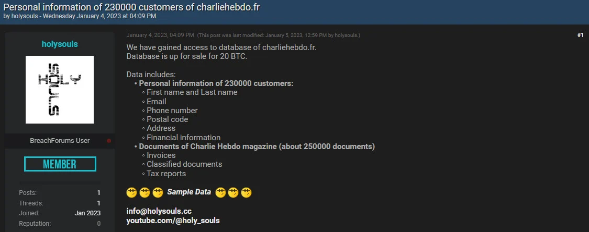

# EU Sanctions on Chinese and Iranian Cyber Actors Targeting Critical Infrastructure

**Geopolitical Cybersecurity**{.cve-chip} **Critical Infrastructure**{.cve-chip} **State-Linked Activity**{.cve-chip}

## Overview

The European Union announced sanctions against Chinese and Iranian companies and individuals for coordinated cyber operations affecting EU member states.

Reported activity included large-scale device compromise, data theft and monetization, service disruption, and disinformation operations. Public assessments describe the campaigns as state-linked or state-supported, consistent with modern cyber-enabled geopolitical conflict.

## Technical Specifications

| Field | Details |
|-------|---------|
| **Incident Type** | Coordinated cyber espionage/disruption campaign with sanctions response |
| **Primary Targets** | EU member-state infrastructure, telecom and media systems |
| **Reported Scale** | 65,000+ compromised devices across multiple EU countries |
| **Campaign Patterns** | Botnet operations (including reported Flax Typhoon / Raptor Train activity) |
| **Core Techniques** | Exploitation of internet-facing systems, data exfiltration, C2 abuse |
| **Secondary Effects** | Disinformation operations via compromised communication channels |

## Affected Products

- Internet-facing infrastructure devices vulnerable to remote exploitation.
- Telecom platforms, including systems associated with SMS handling and subscriber services.
- Media and subscriber databases containing sensitive records.
- Compromised nodes reused for command-and-control and distributed attack infrastructure.

## Technical Details

- Attackers exploited vulnerable external-facing systems to gain initial footholds.
- Large numbers of compromised devices were enrolled into botnet infrastructure for scale and persistence.
- Intrusions reportedly expanded into telecom and media environments to intercept, manipulate, or steal sensitive data.
- Companies linked in open reporting allegedly provided intrusion tooling and services enabling network compromise, surveillance, and data exfiltration workflows.
- Compromised infrastructure was reused for C2 channels and distributed offensive operations.
- Follow-on influence actions included disinformation campaigns through hijacked display or messaging channels.

## Attack Scenario

1. Threat actors scan exposed infrastructure and exploit vulnerable internet-facing devices.
2. Compromised systems are enrolled into botnet ecosystems to maintain access and scale operations.
3. Attackers pivot into high-value sectors including government networks and telecom environments.
4. Sensitive data is exfiltrated and then monetized, sold, or used for intelligence objectives.
5. Campaign operators leverage compromised communications platforms for disruptive or disinformation activity.

## Impact Assessment

=== "Infrastructure and Service Impact"
    More than 65,000 devices were reportedly compromised, with resulting disruption risk to communications and other critical services.

=== "Data and Trust Impact"
    Sensitive subscriber and government-related data exposure increased espionage and privacy risks, while disinformation activity eroded public trust.

=== "Strategic and Economic Impact"
    Operational and economic losses were amplified by geopolitical tension between the EU and sanctioned Chinese and Iranian actors.

## Mitigation Strategies

- Deploy EDR and continuous network monitoring with anomaly detection across critical assets.
- Prioritize patching and exposure reduction for internet-facing systems.
- Implement Zero Trust architecture and segment critical telecom and infrastructure networks.
- Restrict privileged and remote access paths to sensitive operational systems.
- Conduct recurring phishing-awareness training and tabletop incident-response exercises.
- Perform supply-chain and vendor risk assessments for managed service and tooling dependencies.

## Resources

!!! info "Open-Source Reporting"
    - [Europe sanctions Chinese and Iranian firms for cyberattacks](https://www.bleepingcomputer.com/news/security/europe-sanctions-chinese-and-iranian-firms-for-cyberattacks/)
    - [EU sanctions Chinese and Iranian actors over cyberattacks on critical infrastructure](https://securityaffairs.com/189585/security/eu-sanctions-chinese-and-iranian-actors-over-cyberattacks-on-critical-infrastructure.html)
    - [EU sanctions Chinese and Iranian companies for cyberattacks | Reuters](https://www.reuters.com/world/china/eu-sanctions-chinese-iranian-companies-cyber-attacks-2026-03-16/)
    - [EU sanctions Chinese and Iranian firms over cyber attacks - National Technology](https://nationaltechnology.co.uk/EU_Sanctions_Chinese_And_Iranian_Firms_Over_Cyber_Attacks.php)
    - [Cyber-attacks against the EU and its member states: Council sanctions three entities and two individuals - Consilium](https://www.consilium.europa.eu/en/press/press-releases/2026/03/16/cyber-attacks-against-the-eu-and-its-member-states-council-sanctions-three-entities-and-two-individuals/)

*Last Updated: March 18, 2026*