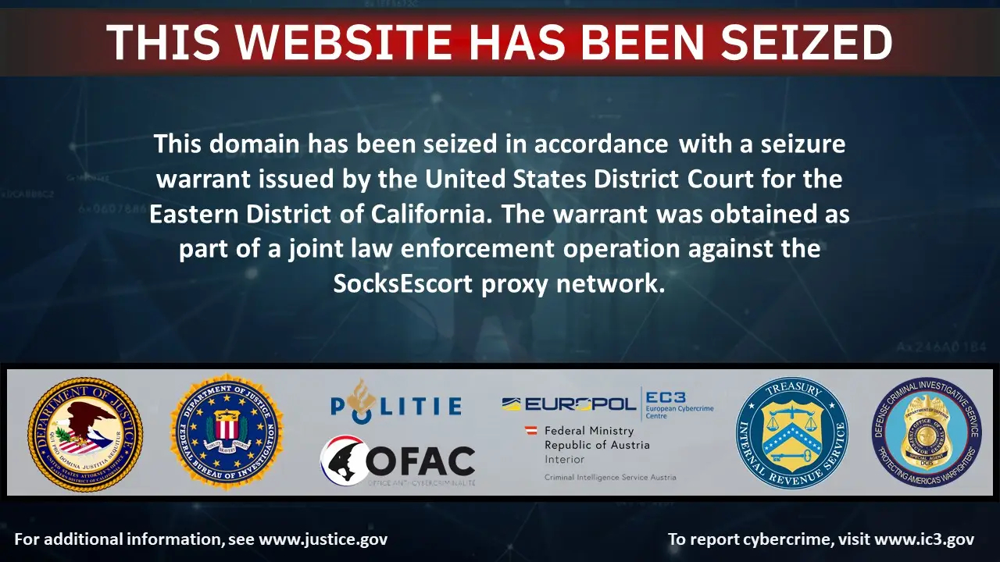
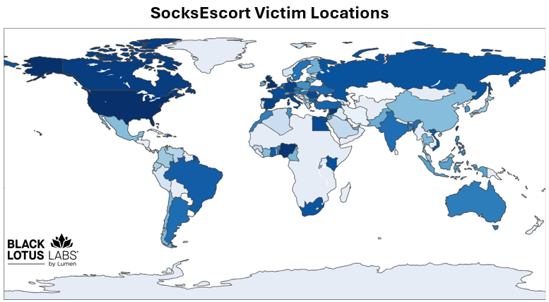

# SocksEscort Proxy Service Disruption linked to the AVrecon Botnet

**Botnet**{.cve-chip} **Proxy Abuse**{.cve-chip} **Law Enforcement Action**{.cve-chip}

## Overview

Law-enforcement agencies in the United States and Europe dismantled the SocksEscort proxy network, a malicious proxy service powered by the AVrecon botnet. The operation relied on compromised routers and IoT devices to build a large pool of residential proxy IP addresses rented by cybercriminals to obscure their activity.

By routing malicious traffic through legitimate home internet connections, the infrastructure made detection harder and supported fraud, credential-stuffing, phishing, and related cybercrime operations. Authorities seized multiple domains, servers, and cryptocurrency assets, disrupting the botnet's core infrastructure.

## Technical Specifications

| Field | Details |
|-------|---------|
| **Incident Type** | Botnet-enabled malicious proxy service |
| **Malware Family** | AVrecon |
| **Primary Targets** | Linux-based routers, SOHO routers, embedded IoT devices |
| **Botnet Function** | SOCKS proxy node creation for traffic anonymization |
| **Scale (Reported)** | ~369,000 compromised devices, 35,000+ residential proxy IPs |
| **Law Enforcement Action** | 34 domains and 23 servers seized |

## Affected Products

- Linux-based routers and embedded network appliances.
- SOHO routers and internet-connected IoT devices with weak security posture.
- Residential networks whose devices were converted into proxy nodes.

## Technical Details

- AVrecon malware targeted Linux-based routers and embedded devices.
- Attackers infected devices with weak credentials, exposed services, or known vulnerabilities.
- Compromised devices connected to command-and-control (C2) servers.
- Infected nodes were transformed into SOCKS proxy relays for criminal traffic.
- The network reportedly offered more than 35,000 residential proxy IP addresses.
- Authorities reported about 369,000 compromised devices worldwide.
- Takedown actions included seizure of 34 domains and 23 servers tied to operations.

## Attack Scenario

1. **Initial Access**: Attackers compromise vulnerable routers or IoT devices via exposed services, weak credentials, or known vulnerabilities.
2. **Malware Installation**: AVrecon malware is installed on compromised devices.
3. **Botnet Enrollment**: Infected systems establish communication with C2 infrastructure.
4. **Proxy Activation**: Devices are converted into SocksEscort SOCKS proxy nodes.
5. **Cybercriminal Usage**: Threat actors rent proxy access to mask origin and evade attribution.
6. **Operational Abuse**: Proxies are used in fraud, credential-stuffing, phishing, and account-takeover campaigns.

## Impact Assessment

=== "Scale Impact"
    The operation reportedly infected more than 369,000 devices across 163 countries.

=== "Criminal Abuse Impact"
    Attackers gained access to 35,000+ residential proxy IPs, enabling fraud, credential stuffing, account takeover, and phishing at scale, with public reporting linking activity to millions in losses.

=== "Response Impact"
    Authorities seized domains, servers, and cryptocurrency, significantly degrading botnet operations.

## Mitigation Strategies

- Secure routers and IoT assets by changing default credentials and disabling unnecessary remote access.
- Apply regular firmware and vendor security updates to close known vulnerabilities.
- Monitor networks for unusual outbound traffic and suspicious beaconing behavior.
- Segment IoT and unmanaged devices away from corporate and critical infrastructure networks.
- Use threat intelligence to block known malicious domains and IP infrastructure.
- Deploy endpoint/network detection controls tuned for botnet and proxy abuse indicators.

## Resources

!!! info "References"
    - [US and European authorities disrupt socksEscort proxy service tied to AVrecon botnet](https://securityaffairs.com/189391/security/us-and-european-authorities-disrupt-socksescort-proxy-service-tied-to-avrecon-botnet.html)
    - [Authorities Disrupt SocksEscort Proxy Botnet Exploiting 369,000 IPs Across 163 Countries](https://thehackernews.com/2026/03/authorities-disrupt-socksescort-proxy.html)
    - [Authorities Disrupt SocksEscort Proxy Service Powered by AVrecon Botnet - SecurityWeek](https://www.securityweek.com/authorities-disrupt-socksescort-proxy-service-powered-by-avrecon-botnet/)
    - [US, Europol disrupt SocksEscort network that exploited thousands of residential routers | The Record](https://therecord.media/us-europol-disrupt-socksescort-network)
    - [Major SocksEscort proxy network powered by Linux malware taken down by FBI and other police forces | TechRadar](https://www.techradar.com/pro/security/major-socksescort-proxy-network-powered-by-linux-malware-taken-down-by-fbi-and-other-police-forces)
    - [Authorities dismantle SocksEscort proxy network behind millions in fraud - Help Net Security](https://www.helpnetsecurity.com/2026/03/13/socksescort-fraud-proxy-network-takedown/)

---

*Last Updated: March 15, 2026*