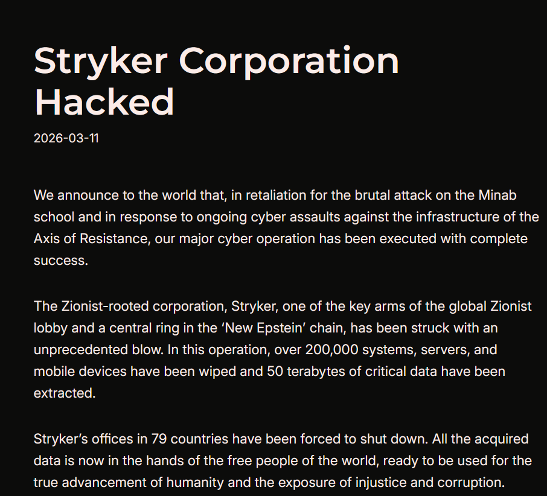

# Stryker Global Network Cyberattack (Handala Attack)

**Healthcare Sector**{.cve-chip} **Wiper Attack**{.cve-chip} **Hacktivism**{.cve-chip}

## Overview

U.S.-based medical technology company Stryker experienced a major cyberattack that disrupted global internal IT infrastructure. The incident impacted corporate systems, manufacturing workflows, and order processing operations.

The pro-Iran hacktivist group Handala claimed responsibility, framing the operation as retaliation for geopolitical events involving U.S. and Israeli actions in Iran. Stryker reported a widespread outage in its Microsoft enterprise environment while indicating that patient-facing systems and medical devices were not affected.

## Technical Specifications

| Field | Details |
|-------|---------|
| **Incident Type** | Destructive cyberattack (suspected wiper operation) |
| **Primary Target** | Stryker global corporate IT environment |
| **Attack Surface** | Microsoft-based enterprise systems and endpoint/device management infrastructure |
| **Observed Effects** | Account/device lockouts, endpoint disruption, business process outage |
| **Claimed Threat Actor** | Handala (pro-Iran hacktivist group) |
| **Data Theft Claim** | Up to 50 TB claimed by attackers (unverified) |

## Affected Products

- Global Microsoft-based internal enterprise systems.
- Corporate endpoints including laptops and mobile devices.
- Device-management-controlled assets (reported Intune-related abuse).
- Manufacturing and order processing systems.

## Technical Details

- Attack activity targeted Stryker's global Microsoft IT environment.
- Employees were reportedly locked out of corporate systems and managed devices.
- Affected login pages allegedly displayed Handala branding.
- Public reporting indicates possible abuse of device management tooling (for example, remote wipe actions through endpoint management channels).
- Attackers claimed to have wiped more than 200,000 servers, laptops, and mobile devices and exfiltrated approximately 50 TB of data; these figures are not independently verified.
- The campaign characteristics align with a destructive operation focused on disruption and data destruction rather than ransomware monetization.

## Attack Scenario

1. Threat actors gained access to Stryker's corporate network.
2. Attackers moved toward enterprise device-management infrastructure.
3. A destructive workflow (wiper payload and/or remote wipe commands) was triggered across managed endpoints.
4. Large numbers of systems became wiped, disabled, or inaccessible.
5. Employees lost access to laptops, phones, and internal enterprise services.
6. Manufacturing, shipping, and order operations were disrupted across multiple regions.

## Impact Assessment

=== "Operational Impact"
    A global outage across internal systems disrupted corporate operations, manufacturing, and order processing.

=== "Data and Safety Impact"
    Attackers claimed exfiltration of up to 50 TB of data, but this remains unverified; Stryker reported that hospital-used medical devices were not affected.

=== "Business and Financial Impact"
    Shipping delays and internal workflow interruptions were reported across operations in 61 countries, alongside short-term financial pressure and recovery costs.

## Mitigation Strategies

- Harden endpoint and mobile device management security controls (MDM/Intune).
- Apply Zero Trust principles to enterprise identity, device, and network access.
- Enforce MFA for all administrative and privileged accounts.
- Monitor and tightly restrict privileged actions within device-management platforms.
- Maintain tested offline backups and disaster recovery procedures for destructive attack recovery.
- Deploy EDR/XDR telemetry and alerting tuned for destructive behavior patterns.
- Segment corporate networks to reduce blast radius and prevent large-scale wipe propagation.

## Resources

!!! info "Open-Source Reporting"
    - [Iran-Linked Hacker Attack on Stryker Disrupted Manufacturing and Shipping - SecurityWeek](https://www.securityweek.com/iran-linked-hacker-attack-on-stryker-disrupted-manufacturing-and-shipping/)
    - [Pro-Palestinian hacktivist group Handala targets Stryker in global disruption](https://securityaffairs.com/189304/hacktivism/pro-palestinian-hacktivist-group-handala-targets-stryker-in-global-disruption.html)
    - [Stryker attack highlights nebulous nature of Iranian cyber activity amid joint U.S.-Israel conflict | CyberScoop](https://cyberscoop.com/stryker-cyberattack-iranian-hackers-handala/)
    - [Stryker flags disruption to orders, manufacturing a day after cyberattack | Reuters](https://www.reuters.com/technology/stryker-flags-disruption-orders-manufacturing-day-after-cyberattack-2026-03-12/)
    - [Iran-linked group says it hacked US company in retaliation for Minab school bombing | The Guardian](https://www.theguardian.com/world/2026/mar/12/iran-group-hack-medical-company-minab-school)
    - [Stryker hit by global cyberattack linked to pro-Iran group](https://www.fiercebiotech.com/medtech/stryker-hit-international-cyberattack-linked-pro-iran-group)
    - [Medical equipment company Stryker reports cyberattack | AP News](https://apnews.com/article/stryker-cyberattack-iran-medical-equipment-products-8dd418618a3bd4fa4c97caf7978c11ee)
    - [Iran-Linked Hacking group Handala Claims Cyberattack On US Medical Giant Stryker](https://www.ndtv.com/world-news/iran-linked-hacking-group-handala-claims-cyberattack-on-us-medical-giant-stryker-middle-east-conflict-iran-us-israel-war-11203170)
    - [Iran-Linked Hackers Claim Cyberattack on U.S. Company](https://time.com/article/2026/03/12/iran-linked-cyberattack-us-company-stryker/)
    - [Stryker cyber attack: message reportedly left by Handala after destructive endpoint impact | Times of India](https://timesofindia.indiatimes.com/technology/tech-news/what-message-iran-linked-hacker-group-handala-left-after-disabling-laptops-and-phones-of-stryker-employees-americas-medical-devices-company-with-125-billion-mrket-cap/articleshow/129506840.cms)

---
*Last Updated: March 15, 2026*