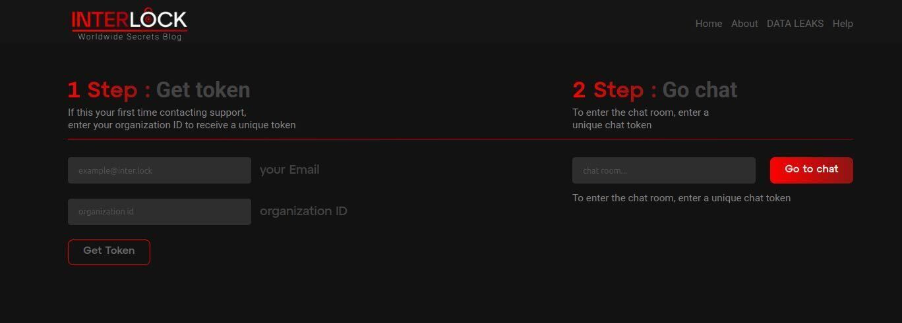

# Interlock Ransomware Exploits Cisco FMC Zero-Day CVE-2026-20131 for Root Access

**Interlock Ransomware**{.cve-chip}  **CVE-2026-20131**{.cve-chip}  **Cisco FMC**{.cve-chip}  **Unauthenticated RCE**{.cve-chip}

## Overview
The Interlock ransomware group has been actively exploiting a zero-day vulnerability in Cisco Secure Firewall Management Center (FMC), allowing attackers to gain root access without authentication.

Successful exploitation enables ransomware deployment, firewall policy manipulation, and broader compromise of network security infrastructure.

## Technical Specifications

| **Attribute** | **Details** |
|---------------|-------------|
| **CVE ID** | CVE-2026-20131 |
| **Vulnerability Type** | Unauthenticated Remote Code Execution (RCE) |
| **CVSS Score** | 10.0(Critical) |
| **Affected Product** | Cisco Secure Firewall Management Center (FMC) |
| **Authentication Requirement** | None |
| **Privilege Outcome** | Root/administrative access |
| **Operational Impact** | Ransomware deployment, firewall-rule tampering, lateral movement potential |
| **Exploitation Status** | Exploited in the wild before patch release |

## Affected Products
- Cisco Secure Firewall Management Center (FMC) deployments at vulnerable patch levels
- Organizations exposing FMC management interfaces to untrusted networks
- Environments where FMC provides centralized security-policy orchestration
- Networks with insufficient segmentation between management and production zones

## Attack Scenario
1. **Target Discovery**:
   Attacker scans for internet-exposed Cisco FMC systems.

2. **Initial Exploitation**:
   CVE-2026-20131 is exploited remotely with no authentication required.

3. **Privilege Acquisition**:
   Root access is obtained on FMC.

4. **Post-Exploitation Activity**:
   Attackers deploy ransomware and/or exfiltrate sensitive data.

5. **Lateral Movement and Extortion**:
   Adversaries pivot deeper into the network, encrypt assets, and demand ransom.

## Impact Assessment

=== "Integrity"
    * Compromise of centralized firewall management and policy integrity
    * Potential bypass or malicious alteration of security controls and monitoring
    * Increased risk of persistent attacker control in management plane systems

=== "Confidentiality"
    * Data exfiltration from compromised management and connected environments
    * Exposure of security configurations, network topology, and operational intelligence
    * Potential theft of sensitive enterprise and regulatory-relevant data

=== "Availability"
    * Service disruption from ransomware encryption and incident containment actions
    * Degraded security operations due to management-plane compromise
    * Financial and legal/regulatory impact from downtime and response obligations

## Mitigation Strategies

### Immediate Actions
- Apply Cisco FMC security patches immediately.
- Rotate credentials and review privileged sessions after patching.
- Isolate suspected compromised FMC instances from production paths.

### Short-term Measures
- Restrict FMC access to internal trusted networks or VPN-only administrative paths.
- Enforce MFA for all administrative access.
- Harden management-plane ACLs and remove unnecessary external exposure.

### Monitoring & Detection
- Monitor logs for unusual admin activity, authentication anomalies, and firewall-policy changes.
- Alert on suspicious command execution and configuration modifications on FMC hosts.
- Hunt for indicators of lateral movement and ransomware staging behavior.

### Long-term Solutions
- Segment management infrastructure from user and server production networks.
- Establish rapid patch governance for high-severity management-plane vulnerabilities.
- Run periodic exposure assessments for internet-facing security infrastructure.

## Resources and References

!!! info "Open-Source Reporting"
    - [Interlock group exploiting the CISCO FMC flaw CVE-2026-20131 36 days before disclosure](https://securityaffairs.com/189636/malware/interlock-group-exploiting-the-cisco-fmc-flaw-cve-2026-20131-36-days-before-disclosure.html)
    - [Interlock Ransomware Exploits Cisco FMC Zero-Day CVE-2026-20131 for Root Access](https://thehackernews.com/2026/03/interlock-ransomware-exploits-cisco-fmc.html)
    - [Cisco Firewall Vulnerability Exploited as Zero-Day in Interlock Ransomware Attacks - SecurityWeek](https://www.securityweek.com/cisco-firewall-vulnerability-exploited-as-zero-day-in-interlock-ransomware-attacks/)
    - [Ransomware gang exploits Cisco flaw in zero-day attacks since January](https://www.bleepingcomputer.com/news/security/interlock-ransomware-exploited-secure-fmc-flaw-in-zero-day-attacks-since-january/)
    - [NVD - CVE-2026-20131](https://nvd.nist.gov/vuln/detail/cve-2026-20131)
    - [Cisco Secure Firewall Management Center Software Remote Code Execution Vulnerability](https://sec.cloudapps.cisco.com/security/center/content/CiscoSecurityAdvisory/cisco-sa-fmc-rce-NKhnULJh)

---

*Last Updated: March 25, 2026*
