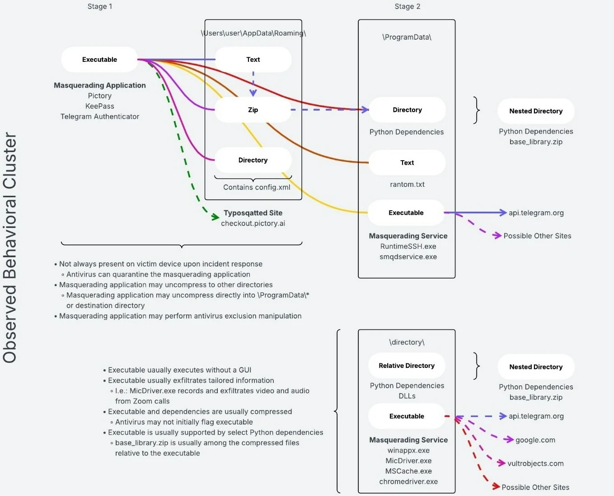

# FBI Says Iranian Hackers Are Using Telegram to Steal Data in Malware Attacks

**Handala**{.cve-chip}  **Telegram C2 Abuse**{.cve-chip}  **Data Exfiltration Malware**{.cve-chip}  **Social Engineering**{.cve-chip}

## Overview
The FBI warned that the pro-Iranian Handala hacker group is using Telegram as a command-and-control (C2) channel for malware campaigns. Victims are lured through social engineering and malicious links, then infected malware communicates through Telegram to steal files, screenshots, and sensitive data.

This activity demonstrates how trusted messaging infrastructure can be operationally abused for covert C2 and exfiltration.

## Technical Specifications

| **Attribute** | **Details** |
|---------------|-------------|
| **Threat Actor** | Pro-Iranian Handala (as reported by FBI and open-source reporting) |
| **Malware C2 Channel** | Telegram API and/or Telegram bot infrastructure |
| **Initial Access** | Phishing, fake social media contacts, malicious links, social engineering |
| **Primary Capabilities** | Remote command execution flow, file theft, screenshot capture, potential lateral movement |
| **Evasion Characteristic** | Traffic blends into legitimate encrypted messaging-platform usage |
| **Primary Victim Risk** | Covert surveillance and theft of personal/professional/political data |
| **Detection Challenge** | Messaging-platform traffic may appear normal without endpoint-level telemetry |

## Affected Products
- Endpoints infected by Telegram-connected malware payloads
- High-risk users including dissidents, journalists, and opposition figures
- Networks allowing unrestricted outbound messaging-platform traffic without context-aware monitoring
- Organizations lacking strong anti-phishing and endpoint detection controls

## Attack Scenario
1. **Social Engineering Delivery**:
   Victim is contacted through phishing or fake social profiles and is tricked into running malware.

2. **Silent Installation**:
   Malware installs and initializes persistence with minimal visible user impact.

3. **Telegram C2 Registration**:
   Compromised host connects to attacker-controlled Telegram bot/API channels.

4. **Tasking and Collection**:
   Commands instruct the malware to collect files, screenshots, and other sensitive artifacts.

5. **Exfiltration Over Legitimate Platform**:
   Stolen data is sent to attacker-controlled Telegram destinations, blending with expected traffic.

## Impact Assessment

=== "Integrity"
    * Adversary tasking can alter endpoint trust and operational workflows
    * Increased risk of manipulated or staged content through compromised accounts/devices
    * Potential abuse of compromised systems for follow-on internal activity

=== "Confidentiality"
    * Theft of sensitive personal, professional, and political information
    * Targeted surveillance of dissidents, journalists, and opposition figures
    * Ongoing intelligence collection through covert C2 channels

=== "Availability"
    * Endpoint degradation and operational disruption from malware activity
    * Increased incident-response burden due to hard-to-distinguish encrypted C2 traffic
    * Potential spread and lateral impact across connected environments

## Mitigation Strategies

### Immediate Actions
- Monitor unusual outbound endpoint connections to Telegram and other messaging platforms.
- Isolate suspected endpoints and collect forensic telemetry before remediation.
- Block known malicious indicators related to active phishing and bot infrastructure.

### Short-term Measures
- Train high-risk users on social engineering, phishing, and fake-profile tactics.
- Enforce strict application control and limit unauthorized software installation.
- Strengthen identity hygiene with MFA and rapid credential reset procedures after suspected compromise.

### Monitoring & Detection
- Deploy advanced EDR to detect abnormal process behavior, screenshot tooling, and suspicious data staging.
- Correlate endpoint events with network flows to distinguish benign Telegram use from malware patterns.
- Alert on unusual archive creation, mass file access, and exfiltration-like outbound bursts.

### Long-term Solutions
- Adopt zero-trust endpoint and network segmentation controls for sensitive users and datasets.
- Build threat-hunting playbooks for messaging-platform C2 abuse and covert exfiltration techniques.
- Maintain offline backups and tested recovery workflows to reduce incident impact.

## Resources and References

!!! info "Open-Source Reporting"
    - [FBI warns of Handala hackers using Telegram in malware attacks](https://www.bleepingcomputer.com/news/security/fbi-warns-of-handala-hackers-using-telegram-in-malware-attacks/)
    - [FBI seizes Handala data leak site after Stryker cyberattack](https://www.bleepingcomputer.com/news/security/fbi-seizes-handala-data-leak-site-after-stryker-cyberattack/)
    - [FBI says Iranian hackers are using Telegram to steal data in malware attacks | TechCrunch](https://techcrunch.com/2026/03/23/fbi-says-iranian-hackers-are-using-telegram-to-steal-data-in-malware-attacks/)
    - [FBI warns of Russian, Iranian cyber activity involving messaging platforms | The Record from Recorded Future News](https://therecord.media/russia-iran-cyber-fbi-hacks)
    - [FBI: Iranian hackers targeting opponents with Telegram malware | CyberScoop](https://cyberscoop.com/fbi-iranian-hackers-targeting-opponents-with-telegram-malware/)
    - [Iran-linked actors use Telegram as C2 in malware attacks on dissidents](https://securityaffairs.com/189820/malware/iran-linked-actors-use-telegram-as-c2-in-malware-attacks-on-dissidents.html)

---
*Last Updated: March 25, 2026*