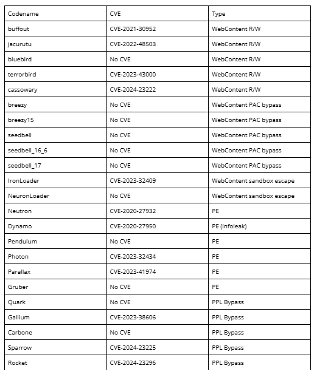
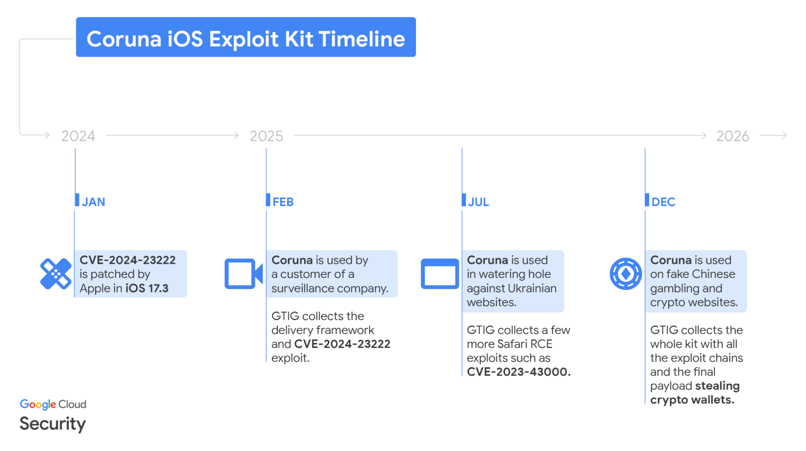
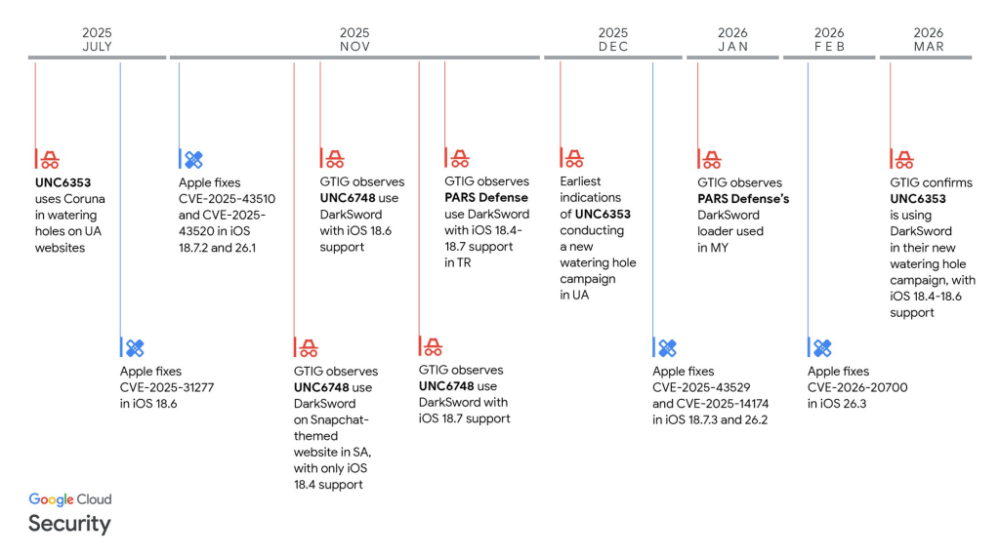

# Apple Urges iPhone Users to Update as Coruna and DarkSword Exploit Kits Emerge

**Coruna**{.cve-chip}  **DarkSword**{.cve-chip}  **iOS/WebKit Exploit Chains**{.cve-chip}  **Spyware Risk**{.cve-chip}

## Overview
Coruna and DarkSword are sophisticated exploit kits targeting iPhones. Reporting indicates they chain multiple Safari/WebKit and iOS vulnerabilities to execute code on devices with minimal or no user interaction in successful attack paths.

These exploit chains can deliver spyware and other malicious payloads, exposing sensitive personal, business, and financial data.

## Technical Specifications

| **Attribute** | **Details** |
|---------------|-------------|
| **CVE IDs** | Multiple iOS and WebKit flaws, including reported zero-day components |
| **Threat Type** | Multi-stage mobile exploit-chain campaign |
| **Affected Platform** | Apple iPhone (iOS and Safari/WebKit attack surface) |
| **Targeted Versions** | Primarily iOS 18.4-18.7; older versions may also be vulnerable |
| **Exploit Capability** | Remote code execution and security-boundary bypass attempts (including sandbox escape paths) |
| **Tooling Exposure Risk** | Public leak of DarkSword increases replication and abuse risk |
| **Likely Payloads** | Spyware and credential/data collection modules |

## Affected Products
- iPhones running vulnerable iOS builds (especially 18.4-18.7 as reported)
- Safari/WebKit browsing contexts exposed to malicious or compromised sites
- Organizations with unmanaged or delayed iOS patch cycles
- High-risk users handling sensitive communications or financial assets

## Attack Scenario
1. **Malicious Web Delivery**:
   User visits a malicious or compromised website through Safari.

2. **Exploit Triggering**:
   WebKit and iOS vulnerabilities are chained by the exploit kit.

3. **Code Execution**:
   Remote code runs on the targeted iPhone.

4. **Post-Exploitation Access**:
   Attackers extract contacts, messages, location data, credentials, and crypto-wallet related information.

5. **Operational Follow-on**:
   Compromised devices may be used for surveillance, intelligence collection, or deeper account compromise.

## Impact Assessment

=== "Integrity"
    * Device trust can be undermined through stealth payload execution
    * Potential manipulation of mobile workflow and security settings
    * Increased risk of persistent compromise via advanced mobile implants

=== "Confidentiality"
    * Theft of personal, corporate, and financial data from compromised devices
    * Exposure of messages, contacts, geolocation, and authentication artifacts
    * Elevated espionage risk for high-value and high-risk individuals

=== "Availability"
    * Device instability or forced recovery/reset actions after compromise
    * Operational disruption while investigating and remediating mobile incidents
    * Broader global risk amplification due to leaked exploitation tooling

## Mitigation Strategies

### Immediate Actions
- Update iPhones immediately to the latest available iOS/security patch level.
- Apply Apple security updates for older supported devices where available.
- Enable Lockdown Mode for users at elevated risk.

### Short-term Measures
- Use Safari safe-browsing protections and avoid untrusted links/sites.
- Restrict installation of untrusted profiles/apps and enforce device hygiene policies.
- Conduct targeted awareness for high-risk users on mobile web exploitation tactics.

### Monitoring & Detection
- Monitor mobile EDR/MDM telemetry for anomalous process, network, or browser behavior.
- Alert on unusual credential access and suspicious account activity following mobile browsing events.
- Perform rapid forensic triage for devices showing indicators of compromise.

## Resources and References

!!! info "Open-Source Reporting"
    - [Apple urges iPhone users to update as Coruna and DarkSword exploit kits emerge](https://securityaffairs.com/189716/security/apple-urges-iphone-users-to-update-as-coruna-and-darksword-exploit-kits-emerge.html)
    - [This new DarkSword iOS exploit can steal almost everything from your iPhone - here's what we know | TechRadar](https://www.techradar.com/pro/security/this-new-darksword-ios-exploit-can-steal-almost-everything-from-your-iphone-heres-what-we-know)
    - [Apple Urges Users to Patch iPhones Against Coruna and DarkSword Exploits](https://www.bitdefender.com/en-au/blog/hotforsecurity/update-ios-protect-data-patch-coruna-darksword-exploits)
    - ["This is nasty": DarkSword malware on Github, patch iPhones immediately | heise online](https://www.heise.de/en/news/This-is-nasty-DarkSword-malware-on-Github-patch-iPhones-immediately-11223189.html)
    - [DarkSword's GitHub leak threatens to turn elite iPhone hacking into a tool for the masses | CyberScoop](https://cyberscoop.com/darksword-iphone-spyware-leak-ios-18-exploit-threat/)

---
*Last Updated: March 25, 2026*