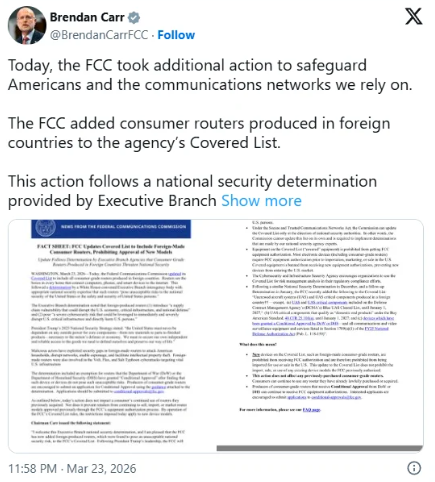
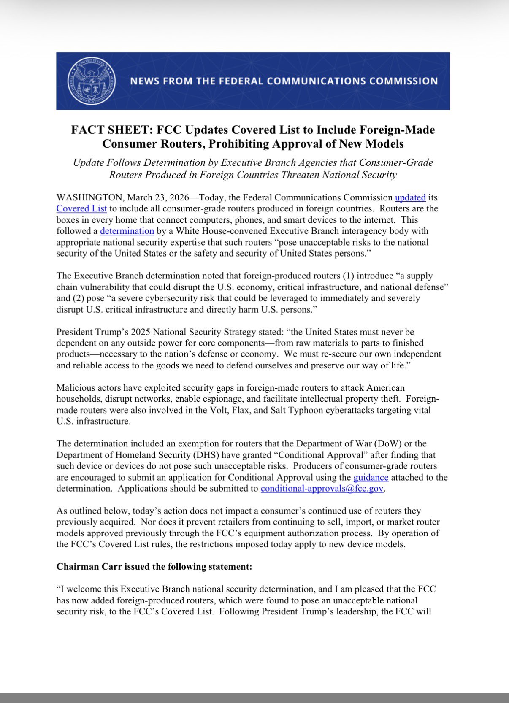
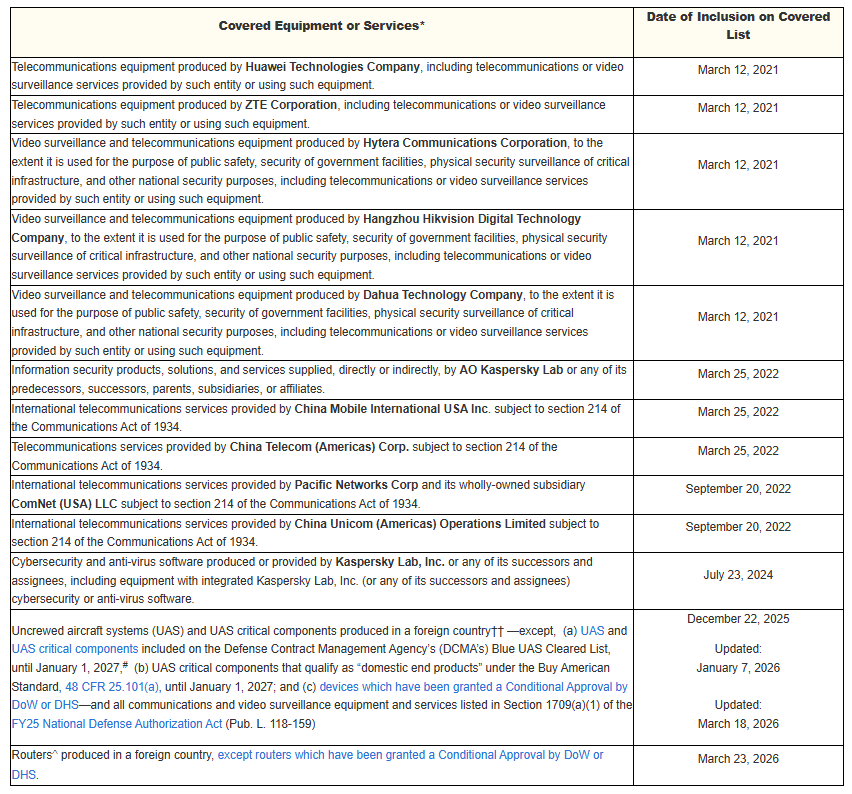

# FCC Ban on Foreign-Made Consumer Routers (Covered List Expansion)

**FCC Covered List Expansion**{.cve-chip}  **Supply Chain Security**{.cve-chip}  **Consumer Router Risk**{.cve-chip}  **National Security**{.cve-chip}

## Overview
The U.S. Federal Communications Commission expanded its Covered List to restrict authorization of new foreign-manufactured consumer routers due to national security concerns.

Because FCC authorization is required for lawful import and sale in the United States, non-compliant devices are effectively blocked from market access.

- [Brendan Carr on X](https://x.com/BrendanCarrFCC/status/2036201037552287997)

## Technical Specifications

| **Attribute** | **Details** |
|---------------|-------------|
| **Incident** | Regulatory restriction and market access control for consumer networking equipment |
| **Attack Surface Concern** | Home and small-office edge routers acting as trusted network chokepoints |
| **Core Router Functions at Risk** | NAT gateway, DNS forwarding, firewall policy enforcement |
| **Key Security Risks** | Firmware backdoors, hardcoded credentials, remote command execution flaws, weak or unsigned update paths |
| **Observed Adversary Interest** | Historical exploitation of SOHO routers and persistence via firmware-level implants |
| **Supply Chain Concern** | Limited ability to independently verify hardware/firmware integrity under untrusted manufacturing conditions |
| **Regulatory Effect** | Non-compliant new products cannot obtain required certification for U.S. import/sale |

## Affected Products
- New foreign-manufactured consumer routers requiring FCC equipment authorization
- U.S. import and retail channels dependent on FCC certification approval
- Home and SOHO deployments relying on consumer edge routers as security boundaries
- ISP and enterprise environments that may inherit downstream risk from insecure consumer edge devices

## Attack Scenario
1. **Internet-Scale Discovery**:
   Attackers scan for exposed consumer/SOHO routers and fingerprint vulnerable firmware builds.

2. **Initial Exploitation**:
   Adversaries exploit known CVEs or zero-day flaws in router management services.

3. **Privilege Acquisition**:
   Root or administrator-level access is obtained on the device.

4. **Persistence Setup**:
   Attackers establish persistence using startup scripts, cron jobs, or modified firmware images.

5. **Operational Abuse**:
   Compromised routers are used as covert proxy nodes, botnet participants, or internal network pivot points.

6. **Lateral Expansion**:
   Attackers move from router footholds into internal hosts, credentials, and enterprise services.

## Impact Assessment

=== "Integrity"
    * Unauthorized manipulation of router configuration and routing/security policies
    * Persistent tampering through firmware or startup-level modifications
    * Use of trusted network edge infrastructure for stealth operations

=== "Confidentiality"
    * Credential theft and interception of network traffic metadata or content
    * Data exfiltration via compromised edge devices and covert relay paths
    * Exposure of internal network architecture and communication patterns

=== "Availability"
    * Router instability, service outages, or degraded connectivity at scale
    * Abuse in DDoS botnets affecting upstream providers and downstream users
    * Operational disruption in ISP, enterprise, and critical infrastructure-linked networks

## Mitigation Strategies

### Immediate Actions
- Disable remote administration from WAN unless explicitly required.
- Change default credentials and enforce strong unique administrator passwords.
- Apply the latest firmware updates immediately upon release.

### Short-term Measures
- Prefer routers that enforce signed firmware updates and secure boot validation.
- Segment IoT and untrusted devices into separate VLANs or isolated network zones.
- Validate that automatic update mechanisms are enabled and functioning.

### Monitoring & Detection
- Monitor outbound traffic anomalies, unusual DNS patterns, and unexpected external connections.
- Alert on configuration drift, unauthorized admin logins, and repeated management interface probes.
- Review router logs regularly for suspicious process, persistence, or command-execution indicators.

## Resources and References

!!! info "Open-Source Reporting"
    - [FCC Bans New Foreign-Made Routers Over Supply Chain and Cyber Risk Concerns](https://thehackernews.com/2026/03/fcc-bans-new-foreign-made-routers-over.html)
    - [FCC bans new routers made outside the USA over security risks](https://www.bleepingcomputer.com/news/security/fcc-bans-new-routers-made-outside-the-usa-over-security-risks/)
    - [Critics call FCC router rule a "big swing" that could create more supply chain uncertainty | CyberScoop](https://cyberscoop.com/fcc-bans-foreign-routers-critics-warn-about-supply-chain/)
    - [What You Need to Know About the Foreign-Made Router Ban in the US | WIRED](https://www.wired.com/story/us-government-foreign-made-router-ban-explained/)
    - [FCC bans import of new consumer routers made overseas, citing security risks | TechCrunch](https://techcrunch.com/2026/03/24/fcc-bans-import-of-new-consumer-routers-made-overseas-citing-security-risks/)
    - [FCC bans import of consumer-grade routers amid national security concerns | Cybersecurity Dive](https://www.cybersecuritydive.com/news/fcc-bans-import-consumer-grade-routers-national-security/815528/)
    - [FCC targets routers in sweeping foreign tech crackdown that could impact TP-Link](https://www.cybersecuritydive.com/news/fcc-bans-import-consumer-grade-routers-national-security/815528/)
    - [US bans any new consumer-grade routers not made in America | The Register](https://www.theregister.com/2026/03/24/fcc_foreign_routers/)
    - [US bans new foreign-made consumer internet routers](https://www.theregister.com/2026/03/24/fcc_foreign_routers/)

---
*Last Updated: March 25, 2026*