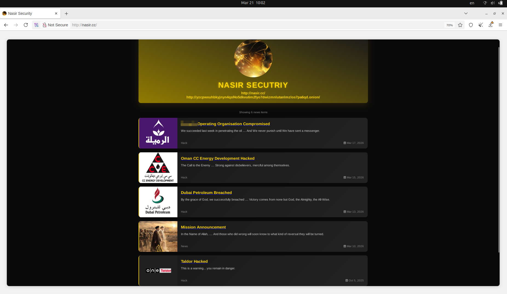
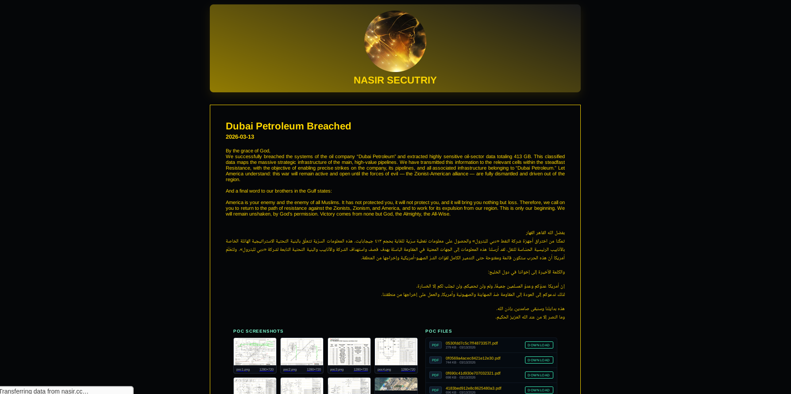
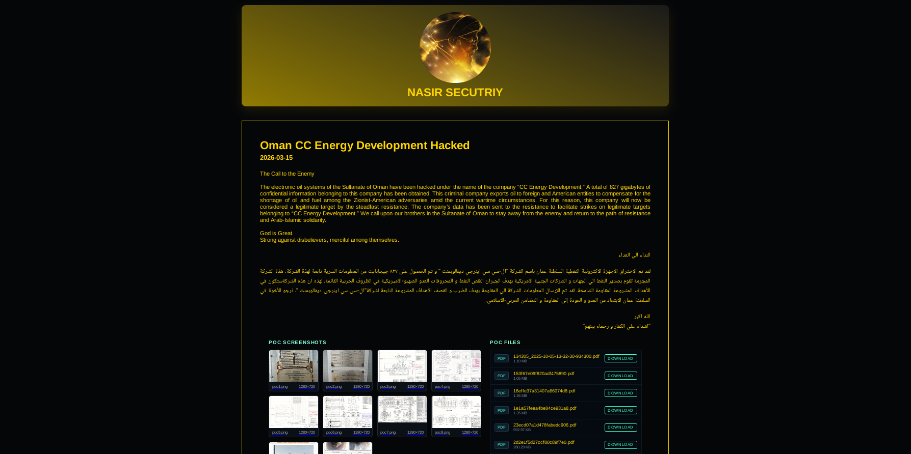
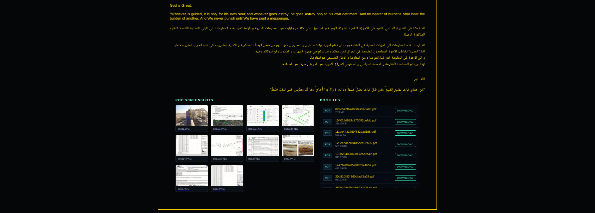
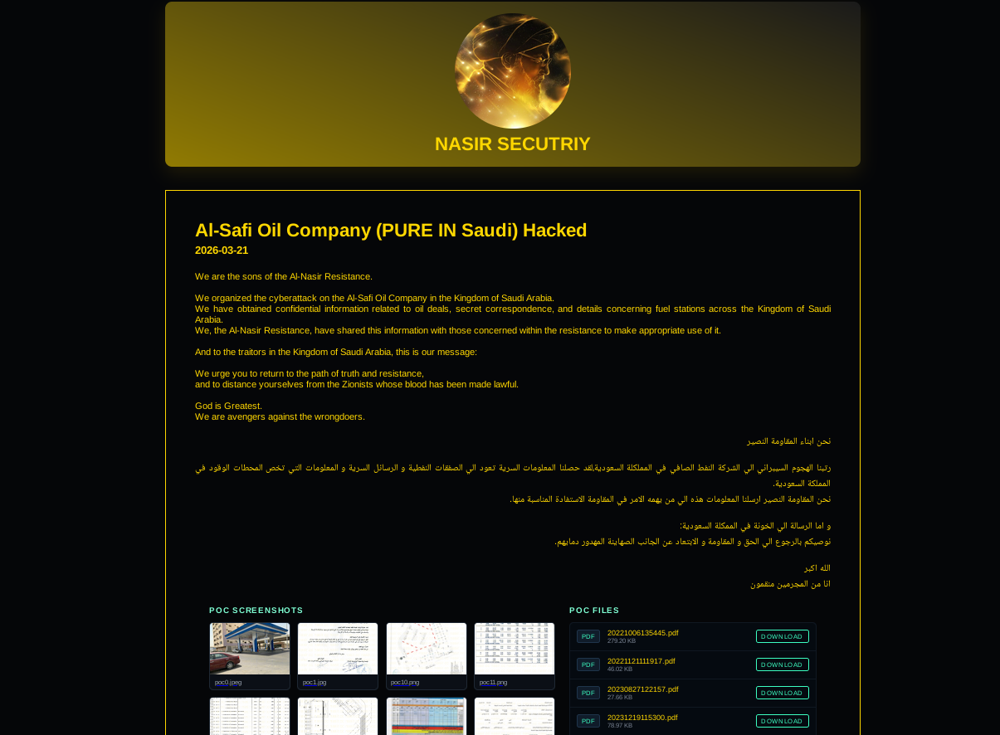

# Pro-Iranian "Nasir Security" Targeting Gulf Energy Sector

**Nasir Security**{.cve-chip}  **Gulf Energy Sector**{.cve-chip}  **Supply Chain Compromise**{.cve-chip}  **Cyber Espionage**{.cve-chip}

## Overview
A pro-Iranian threat group known as Nasir Security is conducting cyber operations against energy companies in the Gulf region. The group primarily targets third-party vendors and contractors to gain indirect access to sensitive data belonging to major oil and gas organizations.

The campaign appears focused on data theft and intelligence gathering that could support future cyber or physical attacks.

## Technical Specifications

| **Attribute** | **Details** |
|---------------|-------------|
| **Threat Type** | Targeted cyber espionage and supply-chain intrusion activity |
| **Primary Target Sector** | Gulf-region energy, oil, and gas ecosystems |
| **Initial Access** | Spear-phishing (BEC-style), trusted-entity impersonation, exploitation of exposed services |
| **Key Techniques** | Vendor/contractor compromise, credential harvesting, cloud misconfiguration abuse |
| **Primary Objective** | Theft of strategic and operational data for intelligence and influence operations |
| **Likely Follow-on Risk** | Enablement of future cyber and potential physical targeting operations |
| **Associated Information Ops** | Leak/propaganda activity using stolen documents |

## Affected Products
- Third-party vendors and contractors serving Gulf energy organizations
- Shared collaboration, cloud, and document-management environments across supplier networks
- Engineering and operational documentation repositories linked to oil and gas programs
- Organizations with weak third-party identity controls or cloud security posture

## Attack Scenario
1. **Third-Party Targeting**:
   Attackers select a supplier or contractor connected to major energy operators.

2. **Initial Compromise**:
   Access is gained via phishing, impersonation, or exposed/weakly secured services.

3. **Credential and Access Expansion**:
   Adversaries harvest credentials and move laterally into shared systems or cloud resources.

4. **Sensitive Data Collection**:
   The group extracts engineering designs, contracts, agreements, and risk/operational documents.

5. **Operational Use of Stolen Data**:
   Data is used for intelligence gathering, selective public leaks, and support of future cyber or physical attack planning.

## Impact Assessment

=== "Integrity"
    * Increased risk of manipulated or selectively leaked sensitive documents
    * Potential trust erosion across vendor and operator collaboration channels
    * Opportunity for adversaries to shape narratives through propaganda operations

=== "Confidentiality"
    * Exposure of engineering designs and infrastructure-related documentation
    * Disclosure of contractual, legal, and commercial-sensitive information
    * Loss of strategic planning and risk-assessment confidentiality

=== "Availability"
    * Elevated disruption risk for oil and gas operations through follow-on attacks
    * Potential downstream instability affecting regional and global energy supply chains
    * Increased likelihood of future OT/ICS-targeted operations impacting continuity

## Mitigation Strategies

### Immediate Actions
- Deploy advanced email protections and enforce DMARC, SPF, and DKIM.
- Monitor for suspicious logins, impossible travel, and credential abuse patterns.
- Audit cloud configurations and remediate exposed storage, IAM over-permissions, and weak access paths.

### Short-term Measures
- Enforce a formal vendor risk-management program with clear security baselines.
- Apply Zero Trust controls for third-party access and continuously verify session trust.
- Minimize vendor permissions and monitor privileged access with alerting.

### Long-term Solutions
- Segment IT and OT networks with strict control-plane separation.
- Implement stronger access governance for engineering systems and sensitive project data.
- Patch and harden exposed services continuously across both operator and supplier environments.

## Resources and References

!!! info "Open-Source Reporting"
    - [Pro-Iranian Nasir Security is targeting energy companies in the Gulf](https://securityaffairs.com/189865/cyber-warfare-2/pro-iranian-nasir-security-is-targeting-energy-companies-in-the-gulf.html)
    - [Resecurity | Pro-Iranian Nasir Security is Targeting The Energy Sector in the Middle East](https://www.resecurity.com/blog/article/pro-iranian-nasir-security-is-targeting-the-energy-sector-in-the-middle-east)
    - [Novel Iran-linked hacking group takes aim at Middle Eastern energy firms | brief | SC Media](https://www.scworld.com/brief/novel-iran-linked-hacking-group-takes-aim-at-middle-eastern-energy-firms)
    - [Nasir Security Group Targets Energy Companies in the Middle East - Thailand Computer Emergency Response Team (ThaiCERT)](https://www.thaicert.or.th/en/2026/03/25/nasir-security-group-targets-energy-companies-in-the-middle-east/)

---
*Last Updated: March 25, 2026*