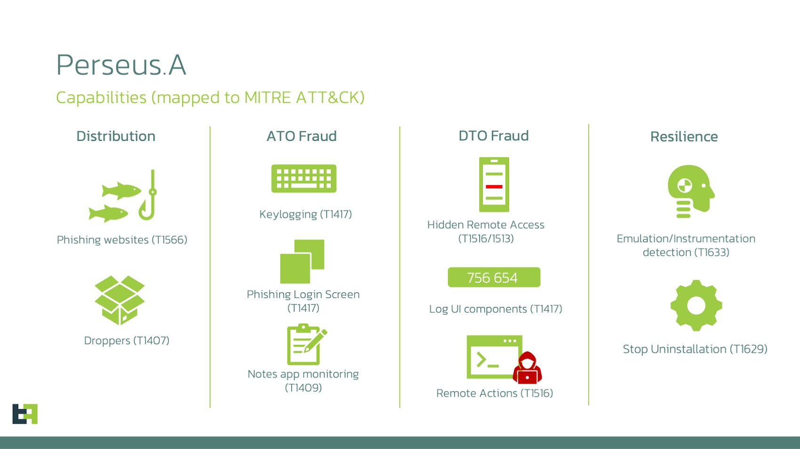
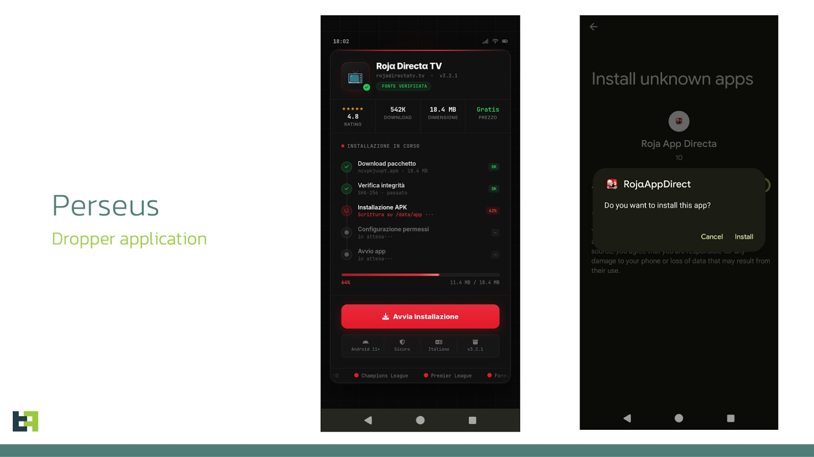

# New Perseus Android Banking Malware Monitors Notes Apps to Extract Sensitive Data

**Android Malware**{.cve-chip} **Banking Threat**{.cve-chip} **Credential Theft**{.cve-chip}

## Overview

Perseus is a newly identified Android banking malware family that targets sensitive information stored in note-taking apps such as Google Keep and Samsung Notes.

Instead of intercepting one-time codes in real time, it focuses on harvesting already stored secrets, including passwords, banking details, and cryptocurrency recovery phrases from local device data.

## Technical Specifications

| Field | Details |
|-------|---------|
| **Malware Name** | Perseus |
| **Platform** | Android |
| **Distribution Methods** | Malicious APKs, phishing links, sideloaded apps |
| **Primary Data Source** | User notes and local storage content |
| **Core Behavior** | Keyword-based scanning for financial/login secrets |
| **Exfiltration** | Data sent to attacker-controlled servers |

## Affected Products

- Android devices infected via untrusted app sources or phishing-delivered APKs.
- Note-taking applications containing stored credentials or recovery phrases.
- Users and organizations relying on notes apps for secret storage instead of dedicated secure vaults.

## Technical Details

- Perseus is delivered through malicious APK packages and social-engineering distribution channels.
- The malware requests typical app permissions that can expose access to files and note-related content.
- It scans stored notes for keywords tied to financial accounts, credentials, and crypto recovery data.
- Collected secrets are exfiltrated to attacker infrastructure for follow-on fraud and account abuse.
- This technique can bypass many MFA/OTP-centric defenses because it targets pre-stored secrets rather than live login sessions.

## Attack Scenario

1. A user installs a malicious Android app disguised as a legitimate utility.
2. The app requests storage or related permissions that appear routine.
3. Perseus silently inspects notes applications and local content for sensitive keywords.
4. Extracted credentials and recovery phrases are transmitted to attacker-controlled servers.
5. Attackers use stolen information for banking fraud, crypto theft, and account takeover.

## Impact Assessment

=== "Account and Financial Impact"
    Stolen credentials can enable unauthorized bank account access, fraudulent transactions, and direct financial loss.

=== "Cryptocurrency and Identity Impact"
    Theft of wallet recovery phrases can lead to irreversible cryptocurrency compromise and identity-linked abuse.

=== "Operational Threat Impact"
    The malware can remain stealthy and persistent by targeting offline stored data, reducing visibility compared with traditional OTP-interception campaigns.

## Mitigation Strategies

- Avoid storing passwords, PINs, or cryptocurrency recovery phrases in notes applications.
- Use dedicated password managers or secure vault solutions for secret storage.
- Install apps only from official and trusted app stores.
- Restrict or deny unnecessary storage and note-access permissions.
- Deploy mobile threat defense (MTD) controls, especially in enterprise Android environments.
- Monitor mobile endpoints for suspicious app behavior and anomalous data access patterns.

## Resources

!!! info "Open-Source Reporting"
    - [New Perseus Android Banking Malware Monitors Notes Apps to Extract Sensitive Data](https://thehackernews.com/2026/03/new-perseus-android-banking-malware.html)
    - [New 'Perseus' Android malware checks user notes for secrets](https://www.bleepingcomputer.com/news/security/new-perseus-android-malware-checks-user-notes-for-secrets/)
    - [Perseus Android malware scans user notes for sensitive data. Secret-stealing Trojan targets notes. - Bulletproof Servers](https://bulletproofservers.hk/blog/perseus-android-malware-scans-user-notes-for-sensitive-data-secret-stealing-trojan-targets-notes/)

---
*Last Updated: March 26, 2026*