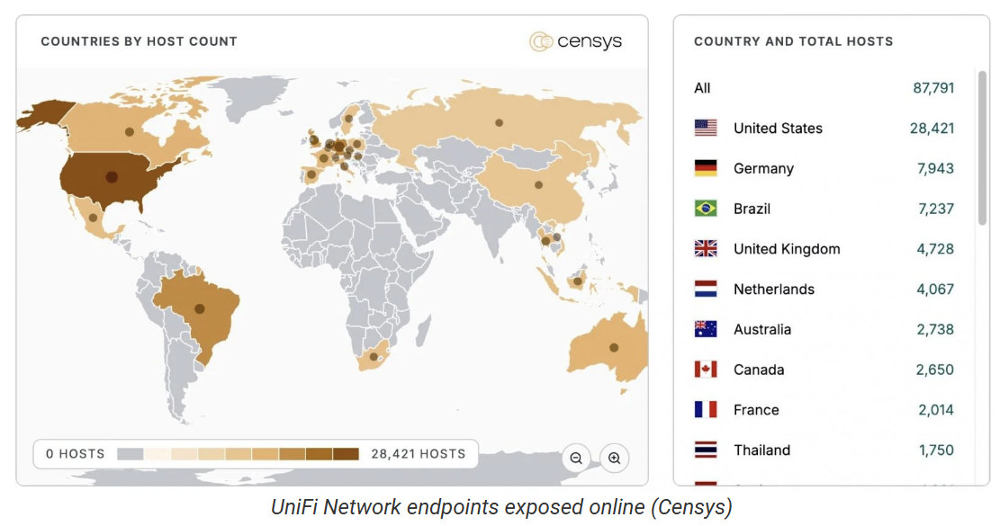

# Ubiquiti UniFi Network Application Account Takeover Vulnerability (CVE-2026-22557)

**Ubiquiti UniFi**{.cve-chip} **Account Takeover**{.cve-chip} **Path Traversal**{.cve-chip}

## Overview

A severe vulnerability in Ubiquiti UniFi Network Application (versions 10.1.85 and earlier) can enable account takeover through unauthorized access to sensitive files.

The primary issue is a path traversal weakness that may expose configuration data and credentials. Public reporting also describes a secondary authenticated NoSQL injection issue that can assist privilege escalation.

## Technical Specifications

| Field | Details |
|-------|---------|
| **Primary CVE** | CVE-2026-22557 |
| **CVSS Score** | 10.0 (Critical) |
| **Primary Flaw Type** | Path traversal / unauthorized file access |
| **Secondary Flaw** | Authenticated NoSQL injection (privilege escalation) |
| **Affected Software** | UniFi Network Application <= 10.1.85 |
| **Exposure Condition** | Remote exploitation possible if controller is network-accessible |
| **Security Impact** | Credential exposure, account takeover, administrative compromise |

## Affected Products

- Ubiquiti UniFi Network Application deployments on vulnerable versions.
- Controllers exposed to untrusted networks or broad internal access.
- Managed network environments dependent on UniFi administrative control.

## Technical Details

- CVE-2026-22557 allows path traversal that can expose sensitive application files.
- Exposed data may include credentials, tokens, and controller configuration artifacts.
- Attackers can use stolen material to hijack user sessions or accounts.
- A separate authenticated NoSQL injection weakness can permit lower-privilege users to escalate access.
- Combined exploitation may lead to full administrative control of the UniFi controller and managed devices.

## Attack Scenario

1. An attacker discovers a reachable UniFi Network Application instance running a vulnerable version.
2. Path traversal is exploited to read sensitive files from the controller environment.
3. Extracted credentials or tokens are used to impersonate privileged users.
4. The attacker escalates privileges and gains administrative controller access.
5. If available, authenticated NoSQL injection is abused to further elevate permissions.
6. The attacker modifies network policy and controls managed switches, APs, or gateways.

## Impact Assessment

=== "Account and Controller Impact"
    Attackers can seize administrative accounts and take control of the UniFi management plane.

=== "Network Configuration Impact"
    Compromise can affect switches, access points, gateways, and network policy integrity.

=== "Enterprise Security Impact"
    Exposed credentials and controller compromise can enable further internal attacks and lateral movement.

## Mitigation Strategies

- Upgrade UniFi Network Application immediately to version 10.1.89 or newer.
- Restrict controller exposure behind firewall policy and VPN-only administrative access.
- Rotate credentials and tokens if compromise is suspected.
- Review controller and authentication logs for anomalous access patterns.
- Apply least-privilege controls for local accounts and administrative roles.

## Resources

!!! info "Open-Source Reporting"
    - [Max severity Ubiquiti UniFi flaw may allow account takeover](https://www.bleepingcomputer.com/news/security/ubiquiti-warns-of-unifi-flaw-that-may-enable-account-takeover/)
    - [NVD - CVE-2026-22557](https://nvd.nist.gov/vuln/detail/CVE-2026-22557)

---
*Last Updated: March 26, 2026*