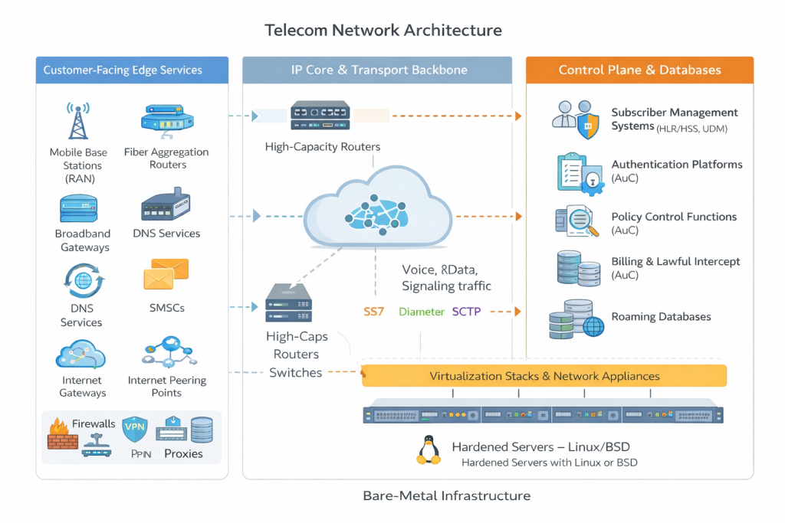
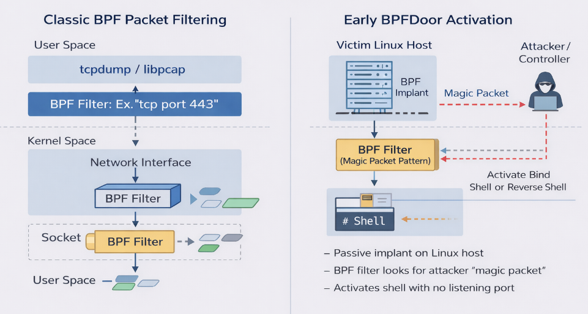

# Red Menshen APT - BPFdoor Telecom Espionage Campaign

**APT Activity**{.cve-chip} **Telecom Espionage**{.cve-chip} **Linux Backdoor**{.cve-chip}

## Overview

A China-linked threat group tracked as Red Menshen has been associated with a long-running cyber espionage campaign against telecommunications providers.

The operation relies on a stealth-focused Linux implant known as BPFdoor, designed to maintain covert persistence and remote access while minimizing conventional network-detection signals.

## Technical Specifications

| Field | Details |
|-------|---------|
| **Threat Group** | Red Menshen (China-linked reporting) |
| **Primary Malware** | BPFdoor |
| **Execution Context** | Linux systems with packet-filter interaction |
| **Stealth Characteristics** | No persistent open ports, low/no periodic beaconing |
| **Activation Method** | Specially crafted trigger packets ("magic packets") |
| **Associated Tooling** | Sliver, CrossC2, credential and brute-force utilities |

## Affected Products

- Telecom infrastructure hosts running Linux-based services.
- Internet-facing operational assets such as VPN gateways, firewalls, and web-facing systems.
- Environments where long-term covert access can support strategic intelligence collection.

## Technical Details

- BPFdoor is built for stealth and can inspect/handle traffic through low-level packet mechanisms.
- The implant may avoid traditional C2 noise by remaining dormant until triggered by crafted network packets.
- Attack operators reportedly combine BPFdoor with post-exploitation frameworks (for example Sliver/CrossC2).
- Supporting tradecraft includes credential theft, brute-force activity, and lateral movement.
- The overall objective appears to be persistent, covert access to telecom data paths and management environments.

## Attack Scenario

1. Attackers gain initial access through exposed or weak internet-facing services (for example VPN or public applications).
2. Post-exploitation tooling is used to escalate privileges and pivot internally.
3. BPFdoor is installed on selected Linux hosts to establish long-term footholds.
4. The malware remains in dormant/sleeper state to reduce operational visibility.
5. Operators transmit crafted trigger packets to activate covert access on demand.
6. Remote control is re-established for espionage collection and sustained surveillance operations.

## Impact Assessment

=== "Infrastructure Access Impact"
    Adversaries can maintain long-term unauthorized access to telecom infrastructure and operational systems.

=== "Communications Intelligence Impact"
    Compromise may enable interception or surveillance of communications metadata and traffic associated with high-value targets.

=== "Strategic Risk Impact"
    Persistent telecom intrusion increases national-security and privacy risk at population scale.

## Mitigation Strategies

- Monitor kernel-adjacent telemetry and anomalous BPF-related behavior on Linux hosts.
- Use deep packet inspection and network analytics to identify suspicious trigger-pattern traffic.
- Patch and harden internet-facing assets, especially VPNs, firewalls, and exposed services.
- Restrict and audit raw socket capabilities and privileged process behavior.
- Deploy endpoint detection with behavioral techniques, not signature-only coverage.
- Conduct proactive threat hunting focused on dormant implants and covert C2 patterns in telecom environments.

## Resources

!!! info "Open-Source Reporting"
    - [China-linked Red Menshen APT deploys stealthy BPFDoor implants in telecom networks](https://securityaffairs.com/190029/malware/china-linked-red-menshen-apt-deploys-stealthy-bpfdoor-implants-in-telecom-networks.html)
    - [China-Linked Red Menshen Uses Stealthy BPFDoor Implants to Spy via Telecom Networks](https://thehackernews.com/2026/03/china-linked-red-menshen-uses-stealthy.html)
    - [China-linked Red Menshen hides inside telecoms networks](https://securitybrief.com.au/story/china-linked-red-menshen-hides-inside-telecoms-networks)
    - [China Upgrades the Backdoor It Uses to Spy on Telcos Globally](https://www.darkreading.com/threat-intelligence/china-upgrades-backdoor-spy-telcos)
    - [Espionage campaign targets telecom with stealthy Linux-based backdoor | Cybersecurity Dive](https://www.cybersecuritydive.com/news/espionage-campaign-telecom-linux-backdoor-China/815978/)

---
*Last Updated: March 30, 2026*