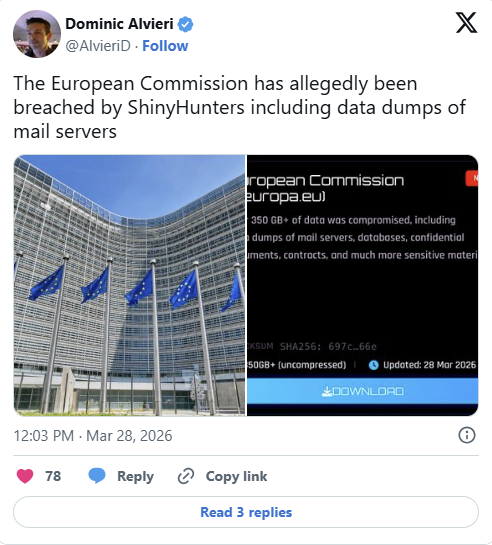
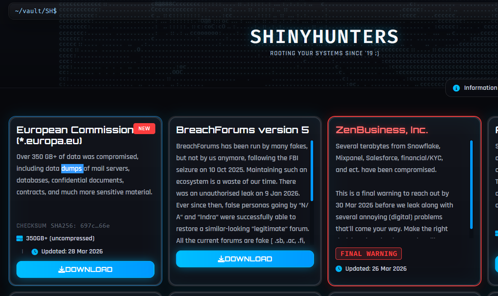

# ShinyHunters Claims Breach of European Commission

**Cloud Security**{.cve-chip} **Data Breach**{.cve-chip} **ShinyHunters**{.cve-chip}

## Overview

A cyberattack affected a cloud-based web platform used by the European Commission. The cybercrime group ShinyHunters claimed responsibility and alleged theft of more than 350 GB of internal data.

The Commission acknowledged the incident but stated that impact was limited to a web platform and that core internal systems were not compromised.

## Technical Specifications

| Field | Details |
|-------|---------|
| **Target** | Cloud-hosted Europa web platform |
| **Threat Actor Claim** | ShinyHunters |
| **Claimed Data Volume** | 350+ GB |
| **Likely Access Methods** | Phishing/social engineering, credential compromise |
| **Likely Tactics** | Account takeover, unauthorized cloud data access, exfiltration |
| **Confirmed Software Exploit** | Not publicly confirmed |

## Affected Products

- Cloud/SaaS components associated with the affected Commission web platform.
- Accounts and services reachable through compromised cloud identities.
- Data repositories linked to the impacted web environment.

## Technical Details

- Public reporting indicates unauthorized access to cloud-hosted platform resources.
- Initial access is consistent with identity-centric compromise (credentials/phishing) rather than confirmed software CVE exploitation.
- Once valid access exists, attackers can operate using legitimate interfaces and permissions.
- Reported outcomes include extraction of documents, communications data, and contact-related information.
- Leak-threat dynamics suggest extortion pressure through publication claims.

## Attack Scenario

1. Attackers conduct phishing, social engineering, or vishing to harvest credentials.
2. Compromised credentials are used to access cloud/SaaS accounts.
3. Attackers authenticate normally and perform discovery across accessible services.
4. Data is collected and exfiltrated from reachable repositories.
5. Threat actors publicize breach claims and leak threats to maximize pressure.

## Impact Assessment

=== "Data Exposure Impact"
    Potentially exposed information includes internal documents, communications material, and staff contact-related records.

=== "Operational and Reputational Impact"
    Even with no confirmed compromise of core systems, the incident creates reputational pressure and operational response burden.

=== "Follow-on Threat Impact"
    Exposed contact and communication data can increase risk of targeted phishing and further identity-focused attacks.

## Mitigation Strategies

- Enforce phishing-resistant MFA (for example FIDO2 security keys) across cloud identities.
- least privilege, conditional access, and rapid credential revocation procedures.
- Continuously monitor cloud and SaaS logs for suspicious sign-ins, token abuse, and abnormal data access patterns.
- Audit cloud configurations regularly to reduce accidental overexposure.
- Run anti-phishing and anti-vishing awareness programs for staff and contractors.

## Resources

!!! info "Open-Source Reporting"
    - [ShinyHunters claims the hack of the European Commission](https://securityaffairs.com/190095/data-breach/shinyhunters-claims-the-hack-of-the-european-commission.html)
    - [EU Commission web platform hit by cyber-attack on March 24 | Reuters](https://www.reuters.com/technology/eu-commission-web-platform-hit-by-cyber-attack-march-24-2026-03-27/)
    - [ShinyHunters claims the hack of the European Commission | SOC Defenders](https://www.socdefenders.ai/item/fec18259-fefe-40f7-904b-bbbc9413d830)
    - [ShinyHunters Claims 350GB EU Commission Breach - Databases, Emails, and Contracts Up for Leak | Cyber Kendra](https://www.cyberkendra.com/2026/03/shinyhunters-claims-350gb-eu-commission.html)

---
*Last Updated: March 30, 2026*