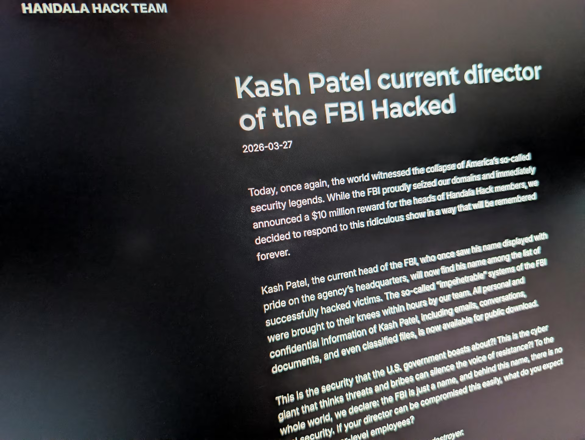

# Handala Hack of Kash Patel (FBI Director) Personal Email

**Account Compromise**{.cve-chip} **Hacktivism**{.cve-chip} **Data Leak**{.cve-chip}

## Overview

A pro-Iranian hacktivist group known as Handala claimed responsibility for compromising the personal email account of FBI Director Kash Patel and leaking hundreds of emails and personal files.

Public reporting indicates the exposed material was largely historical and personal in nature, with authorities stating that no classified information was compromised.

## Technical Specifications

| Field | Details |
|-------|---------|
| **Target** | Personal email account (reportedly Gmail) |
| **Threat Actor Claim** | Handala (pro-Iranian hacktivist group) |
| **Leaked Content** | 300+ emails, personal photos, documents (resume/travel data) |
| **Data Timeframe** | Primarily 2010-2019 |
| **Verification Notes** | Reporting cites header analysis and signature validation |
| **Classified Data Exposure** | Not reported |

## Affected Products

- Personal email account infrastructure associated with the target.
- Personal document/photo storage and communications content.
- Public information environment impacted by leak publication and amplification.

## Technical Details

- Attackers claimed unauthorized access to a high-profile personal mailbox.
- Leaked datasets reportedly included emails, images, and personal documents.
- Public analyses referenced validation signals such as email-header consistency and cryptographic authenticity indicators.
- No confirmed evidence suggests compromise of official classified systems.
- Plausible access vectors include phishing, credential reuse, or social-engineering-assisted credential theft.

## Attack Scenario

1. Threat actors select a high-profile public official as the target.
2. Credential access is obtained via phishing, reused credentials, or social engineering.
3. Attackers access the personal email account and enumerate stored data.
4. Content is exfiltrated and curated for publication.
5. Leaks are released publicly to maximize reputational and psychological impact.

## Impact Assessment

=== "Data Exposure Impact"
    Personal and sensitive non-classified information was exposed, creating privacy and personal-security risks.

=== "Reputational Impact"
    Public leak activity targeted a senior U.S. official, increasing reputational pressure and media amplification effects.

=== "Security Posture Impact"
    The case highlights persistent risk from personal-account compromise for high-profile individuals, even when official systems are not breached.

## Mitigation Strategies

- Enforce multi-factor authentication (MFA) on personal and official accounts.
- Use strong, unique passwords and eliminate credential reuse.
- Maintain strict separation between personal and official communications.
- Adopt phishing-resistant authentication mechanisms (for example, hardware security keys).
- Monitor accounts continuously for suspicious login patterns and geolocation anomalies.
- Provide targeted security-awareness training for high-profile personnel and support staff.

## Resources

!!! info "Open-Source Reporting"
    - [Iran-linked hackers breach FBI director's personal email, publish photos and documents | Reuters](https://www.reuters.com/world/us/iran-linked-hackers-claim-breach-of-fbi-directors-personal-email-doj-official-2026-03-27/)
    - [Iran-Linked Hackers Breach FBI Director's Personal Email, Hit Stryker With Wiper Attack](https://thehackernews.com/2026/03/iran-linked-hackers-breach-fbi.html)
    - [Iran-linked group Handala hacked FBI Director Kash Patel's personal email account](https://securityaffairs.com/190088/intelligence/iran-linked-group-handala-hacked-fbi-director-kash-patels-personal-email-account.html)
    - [FBI director's personal email, photos and documents leaked by Iran-linked hackers | The Guardian](https://www.theguardian.com/us-news/2026/mar/27/fbi-director-kash-patel-email-hacked-by-iran)
    - [Iranian hackers claim breach of FBI director Kash Patel's personal email account | TechCrunch](https://techcrunch.com/2026/03/27/iranian-hackers-claim-breach-of-fbi-director-kash-patels-personal-email-account/)

---
*Last Updated: March 30, 2026*