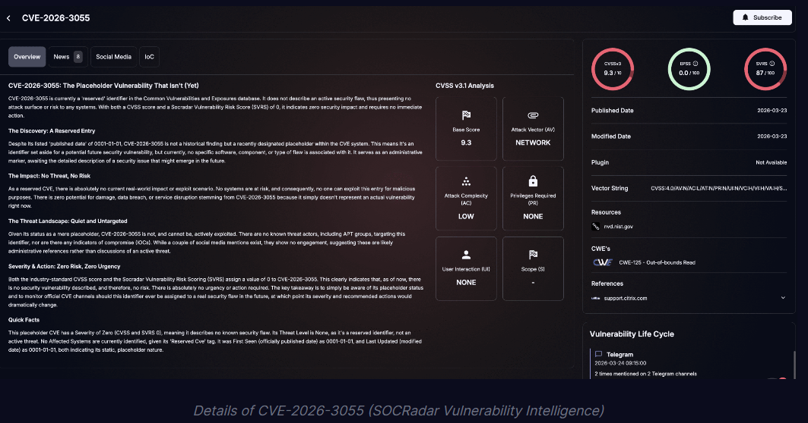
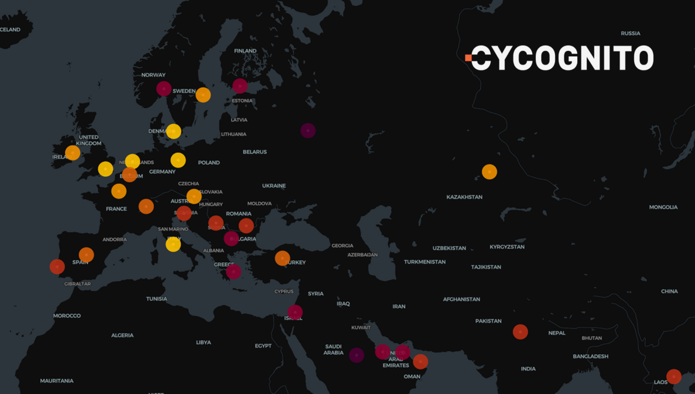

# NetScaler Memory Disclosure Vulnerability - CVE-2026-3055

**Citrix NetScaler**{.cve-chip} **Memory Disclosure**{.cve-chip} **Active Probing**{.cve-chip}

## Overview

A critical vulnerability in Citrix NetScaler ADC and Gateway, tracked as CVE-2026-3055, can allow unauthenticated attackers to trigger a memory overread and extract sensitive information from vulnerable systems.

Security reporting indicates active reconnaissance and probing activity, increasing the risk of rapid weaponization and real-world exploitation.

## Technical Specifications

| Field | Details |
|-------|---------|
| **Identifier** | CVE-2026-3055 |
| **Vulnerability Type** | Out-of-bounds memory read (memory overread) |
| **Root Cause** | Improper input validation in SAML authentication handling |
| **Attack Vector** | Crafted HTTP requests (including `/cgi/GetAuthMethods`) |
| **Exploitable Condition** | NetScaler configured as SAML Identity Provider (IdP) |
| **Potential Data Exposure** | Session tokens, credentials, internal configuration data |

## Affected Products

- Citrix NetScaler ADC deployments in vulnerable versions.
- Citrix NetScaler Gateway deployments in vulnerable versions.
- Edge systems exposed to untrusted networks while operating SAML IdP functionality.

## Technical Details

- The flaw is a memory disclosure issue caused by out-of-bounds reads during SAML-related request handling.
- Attackers can send crafted HTTP requests to trigger memory overread behavior.
- Public reporting highlights `/cgi/GetAuthMethods` as a suspicious probing path.
- Leaked memory content may include authentication tokens, credentials, and internal service information.
- Exposure can facilitate follow-on session hijacking and broader compromise of remote access workflows.

## Attack Scenario

1. Attacker scans internet-facing assets for reachable NetScaler instances.
2. Systems configured as SAML IdP are identified as higher-value targets.
3. Crafted requests are sent to trigger memory overread behavior.
4. Sensitive memory-resident data is extracted from responses.
5. Stolen tokens/credentials are used for session hijacking and unauthorized access.
6. Adversary uses access footholds for lateral movement and deeper network intrusion.

## Impact Assessment

=== "Authentication and Access Impact"
    Disclosure of tokens and credential material can enable unauthorized access to VPN and remote-access services.

=== "Infrastructure Security Impact"
    Compromise of edge authentication systems raises risk of broader enterprise intrusion and downstream service compromise.

=== "Data and Operational Impact"
    Successful exploitation can contribute to data-breach risk, incident-response burden, and service reliability concerns.

## Mitigation Strategies

- Apply Citrix patches immediately:
    - NetScaler ADC/Gateway `14.1-66.59+`
    - NetScaler ADC/Gateway `13.1-62.23+`
- Disable SAML IdP mode where not operationally required.
- Restrict external exposure of NetScaler management and authentication interfaces.
- Monitor logs for anomalous requests, especially probes targeting `/cgi/GetAuthMethods`.
- Enforce network segmentation and strong authentication controls around edge access services.

## Resources

!!! info "Open-Source Reporting"
    - [Urgent Alert: NetScaler bug CVE-2026-3055 probed by attackers could leak sensitive data](https://securityaffairs.com/190131/hacking/urgent-alert-netscaler-bug-cve-2026-3055-probed-by-attackers-could-leak-sensitive-data.html)
    - [Citrix NetScaler Under Active Recon for CVE-2026-3055 (CVSS 9.3) Memory Overread Bug](https://thehackernews.com/2026/03/citrix-netscaler-under-active-recon-for.html)
    - [CVE-2026-3055: NetScaler Memory Disclosure Puts SAML-Enabled Edge Devices at Risk](https://socradar.io/blog/cve-2026-3055-netscaler-memory-disclosure/)
    - [Citrix NetScaler ADC and Gateway Vulnerabilities (CVE-2026-3055 & CVE-2026-4368) | CyCognito Blog](https://www.cycognito.com/blog/citrix-netscaler-adc-and-gateway-vulnerabilities-cve-2026-3055-cve-2026-4368/)
    - [NetScaler ADC and NetScaler Gateway Security Bulletin for CVE-2026-3055 and CVE-2026-4368](https://support.citrix.com/external/article/CTX696300/netscaler-adc-and-netscaler-gateway-secu.html)

---
*Last Updated: March 30, 2026*