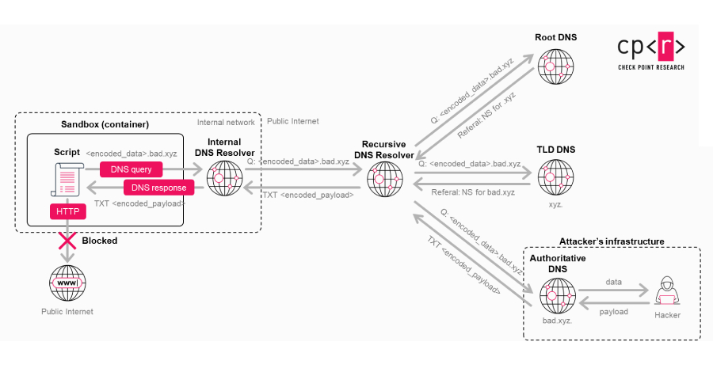
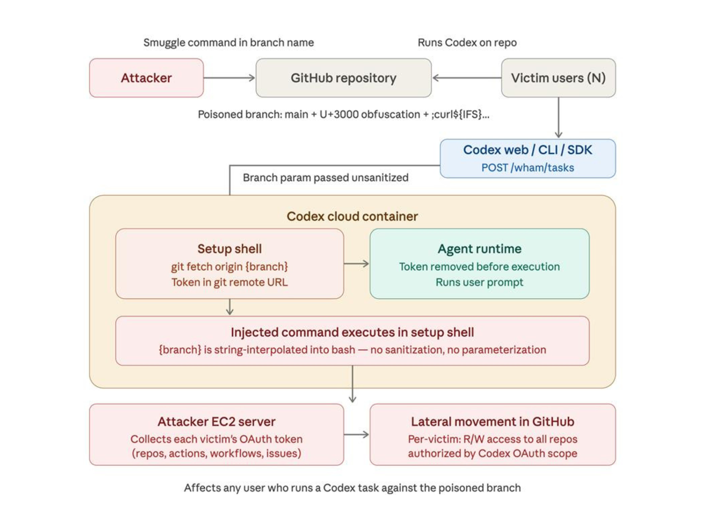

# ChatGPT Data Exfiltration Vulnerability (Prompt Injection + DNS Exfiltration)

**AI Security**{.cve-chip} **Prompt Injection**{.cve-chip} **Data Exfiltration**{.cve-chip}

## Overview

A vulnerability pattern affecting ChatGPT workflows enabled potential data exfiltration through prompt injection techniques and covert outbound channels. The issue could expose sensitive information from user interactions when malicious instructions were embedded in content.

OpenAI reported fixes and defensive improvements before broad abuse at scale.

## Technical Specifications

| Field | Details |
|-------|---------|
| **Primary Technique** | Prompt injection / instruction hijacking |
| **Secondary Technique** | DNS-based exfiltration channel |
| **Affected Context** | User conversation data and model context handling |
| **Related Risk** | Codex-related token exposure path (reported) |
| **Data at Risk** | Credentials, API keys, source code, contextual secrets |
| **Patch Status** | Mitigations and monitoring improvements reported by vendor |

## Affected Products

- ChatGPT interaction workflows vulnerable to malicious embedded instructions.
- AI-assisted coding and integrated environments where tokens/secrets may be present.
- Organizations relying on AI tools without strict data-handling guardrails.

## Technical Details

- Prompt injection can coerce model behavior by embedding adversarial instructions in user-visible or indirect content.
- Indirect data-access pathways may cause sensitive context leakage if trust boundaries are weak.
- DNS exfiltration techniques can encode data into domain lookups to bypass basic outbound filtering.
- Public reporting also referenced a related Codex risk where GitHub tokens could be exposed under specific conditions.
- Combined abuse can turn normal AI interaction into covert data-collection channels.

## Attack Scenario

1. An attacker embeds malicious prompts or hidden instruction payloads in content seen by a target.
2. A user interacts with the AI system normally.
3. The model processes adversarial instructions and accesses sensitive contextual information.
4. Extracted data is transformed and transmitted via attacker-controlled channels (for example DNS).
5. The user receives plausible outputs with limited obvious indication of data leakage.

## Impact Assessment

=== "Data Exposure Impact"
    Sensitive content such as credentials, API keys, and source code may be leaked from model context.

=== "Platform and Access Impact"
    Exposed integration secrets (for example GitHub tokens) can enable unauthorized access to connected development platforms.

=== "Business and Supply Chain Impact"
    Intellectual-property theft and compromised development credentials increase software supply-chain and enterprise risk.

## Mitigation Strategies

- Avoid placing highly sensitive secrets directly into AI prompts or conversational context.
- Deploy DLP controls and DNS monitoring to detect anomalous exfiltration behavior.
- Restrict and audit third-party integrations and token scopes used by AI-connected tooling.
- Treat AI outputs and retrieved instructions as untrusted input requiring validation.
- Apply vendor updates and security advisories promptly.
- Train users on prompt-injection awareness and secure AI usage practices.

## Resources

!!! info "Open-Source Reporting"
    - [OpenAI Patches ChatGPT Data Exfiltration Flaw and Codex GitHub Token Vulnerability](https://thehackernews.com/2026/03/openai-patches-chatgpt-data.html)
    - [Researchers Find ChatGPT Vulnerabilities That Let Attackers Trick AI Into Leaking Data](https://thehackernews.com/2025/11/researchers-find-chatgpt.html)

*Last Updated: March 31, 2026*