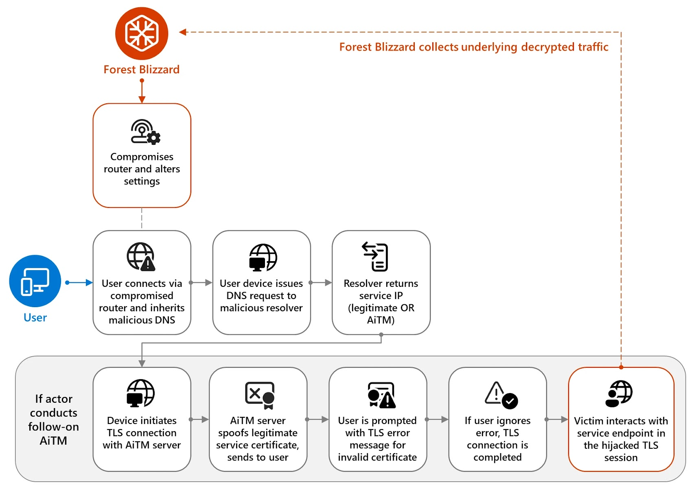
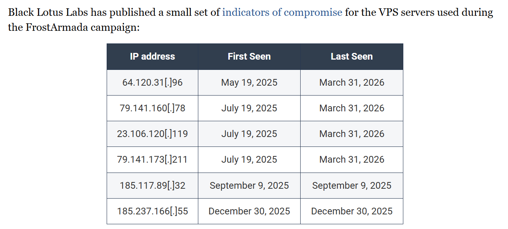

# APT28 Exploiting Network Devices for Cyber Espionage

**Russia-Linked APT**{.cve-chip} **Network Device Exploitation**{.cve-chip} **Cyber Espionage**{.cve-chip}

## Overview

APT28 (also known as Fancy Bear, Forest Blizzard, and STRONTIUM), a threat actor attributed to Russian military intelligence (GRU), has been actively exploiting vulnerabilities in internet-facing network devices — particularly SOHO routers and edge appliances. The group weaponizes these compromised devices to build covert proxy and command-and-control (C2) infrastructure, anonymize attack origins, and pivot into the internal networks of high-value targets for long-term espionage campaigns targeting government, military, and critical infrastructure organizations globally.

## Technical Specifications

| Attribute | Details |
|-----------|---------|
| **Threat Actor** | APT28 / Fancy Bear / Forest Blizzard (GRU Unit 26165) |
| **Attribution** | Russian Military Intelligence (GRU) |
| **Attack Type** | Network Device Exploitation, Cyber Espionage |
| **Primary Target** | Internet-Facing Routers & Edge Devices |
| **Objective** | Covert Access, C2 Infrastructure, Traffic Proxying, Espionage |
| **Persistence Method** | Firmware Implants, Modified Configurations |
| **Lateral Movement** | Credential Harvesting, Internal Network Pivoting |
| **Infrastructure Abuse** | Router-to-Proxy Conversion, DNS Hijacking |

## Affected Products

- **SOHO Routers**: Ubiquiti, TP-Link, Asus, and other small-office/home-office router brands commonly used by SMBs and remote workers
- **Edge Networking Devices**: Firewalls, VPN concentrators, and network appliances with known unpatched vulnerabilities
- **End-of-Life Hardware**: Devices no longer receiving vendor security updates; primary selection criterion for APT28
- **DNS Infrastructure**: Targeted for hijacking to redirect traffic and intercept credentials
- **Organizations Targeted**: Government agencies, military institutions, defense contractors, think tanks, political organizations

## Technical Details

- Exploits known, unpatched vulnerabilities in router firmware and management interfaces (CVEs affecting Ubiquiti EdgeRouter, Cisco RV series, TP-Link, and similar devices)
- Modifies device firmware or configuration to establish persistent backdoors surviving reboots
- Converts compromised routers into proxy nodes within a globally distributed anonymization network (similar to the Moobot/MASEPIE botnet infrastructure)
- Uses compromised devices as C2 relay infrastructure to obscure communications between APT28 operators and implants inside target networks
- Conducts DNS hijacking through compromised routers to redirect victim traffic to attacker-controlled servers for credential interception
- Harvests credentials stored in device configurations or intercepted from passing network traffic
- Uses legitimate administrative tools and living-off-the-land techniques to avoid detection on compromised network devices
- Performs lateral movement into target organization internal networks via VPN credentials or trust relationships with the compromised router
- Maintains persistent, long-term access for ongoing intelligence collection and traffic monitoring
- Targets specifically chosen to provide access to multiple downstream organizations through a single compromised network appliance

## Attack Scenario

1. **Scanning & Reconnaissance**: APT28 conducts large-scale internet scanning to identify routers and edge devices running vulnerable firmware versions or with management interfaces exposed to the internet
2. **Exploitation**: Exploit known CVEs or default/weak credentials to gain initial access to target network devices without requiring physical access or user interaction
3. **Persistence Establishment**: Modify device firmware, startup scripts, or configuration to persist through reboots; install backdoor accounts; disable logging to prevent detection
4. **Proxy Network Construction**: Configure compromised device as a proxy node or C2 relay; route attacker traffic through the device to anonymize the true origin of subsequent attacks
5. **Credential Harvesting**: Intercept authentication traffic passing through the compromised router; extract stored VPN credentials, admin passwords, and session tokens from device memory
6. **Lateral Movement**: Use harvested credentials or network trust relationships to pivot from the compromised router into the internal networks of connected target organizations
7. **Espionage Operations**: Monitor network traffic, intercept communications, and exfiltrate sensitive data (government communications, military plans, intellectual property, political intelligence)
8. **Long-Term Persistence**: Maintain covert access for months to years; periodically update implants; use the infrastructure to support additional APT28 operations against new targets

## Impact Assessment

=== "Technical Impact"

    - **Unauthorized Network Access**: Compromised routers provide persistent entry points into target organizations without triggering traditional endpoint security controls
    - **Traffic Interception**: All traffic routed through a compromised device is visible to the attacker, enabling credential theft and communications monitoring
    - **Credential Compromise**: VPN credentials, administrative passwords, and session tokens intercepted from device traffic enable deep network access
    - **DNS Manipulation**: Hijacked DNS enables transparent traffic redirection to attacker infrastructure, bypassing HTTPS validation in some configurations
    - **Detection Difficulty**: Network device implants are rarely visible to endpoint or application security tools; specialized network monitoring is required

=== "Strategic Impact"

    - **Government Intelligence Theft**: Access to government and military networks enables collection of sensitive diplomatic, defense, and intelligence information
    - **Long-Term Persistent Access**: Compromised network infrastructure provides years-long access windows for ongoing intelligence operations
    - **Multi-Target Leverage**: A single compromised router serving multiple downstream organizations multiplies the espionage value of each initial compromise
    - **Geopolitical Operations**: Collected intelligence supports Russian military and foreign policy decision-making; creates strategic information advantage
    - **Allied Network Exposure**: Compromised devices in NATO member or partner nations create risks for allied intelligence-sharing networks

=== "Organizational Impact"

    - **Invisible Breach**: Organizations may be compromised for extended periods without any visible indicators of intrusion in endpoint or application logs
    - **Supply Chain Risk**: Compromise of an MSP or ISP router can cascade to dozens of dependent customer networks
    - **Regulatory & Compliance Exposure**: Undetected data exfiltration may trigger notification obligations once discovered; failure to detect carries liability
    - **Remediation Complexity**: Router firmware implants require specialized forensics; standard incident response procedures may miss device-level persistence
    - **Reputational Damage**: Disclosure of long-term espionage compromise, particularly for government contractors, undermines public and partner trust

## Mitigation Strategies

### Immediate Actions

- **Patch & Update Firmware**: Apply all available firmware updates immediately to all internet-facing routers and edge devices; prioritize devices with known exploited CVEs
- **Replace End-of-Life Hardware**: Decommission and replace routers and network appliances that no longer receive vendor security updates; no mitigation can substitute vendor patch support
- **Disable Unnecessary Remote Access**: Disable WAN-side management interfaces (HTTP, HTTPS, SSH, Telnet) unless operationally required; restrict to internal management networks only

### Security Hardening

- **Change Default Credentials**: Replace all default usernames and passwords with strong, unique credentials; enforce password rotation policies for all network device accounts
- **Enforce Strong Authentication**: Implement multi-factor authentication for all remote management access where supported; use certificate-based SSH authentication instead of passwords
- **Restrict Admin Access**: Limit management interface access to specific internal IP addresses or a dedicated out-of-band management network; block all external administrative access
- **Review DNS Configuration**: Audit DNS settings on all network devices and upstream resolvers; implement DNSSEC validation; monitor for unauthorized DNS changes

### Monitoring & Detection

- **Monitor Outbound Router Traffic**: Alert on unusual outbound connections from network devices, especially to non-standard ports or unexpected geographic destinations
- **Deploy IDS/IPS**: Implement network intrusion detection capable of identifying anomalous router behavior, C2 patterns, and lateral movement indicators
- **Log & Audit Configuration Changes**: Enable syslog forwarding from all network devices to a centralized, tamper-resistant logging system; alert on unauthorized configuration changes
- **Network Segmentation**: Implement strict segmentation between IT and OT, external-facing, and internal networks to limit lateral movement from a compromised edge device

## Resources

!!! info "Open-Source Reporting"
    - [Russian State-Linked APT28 Exploits SOHO Routers in Global DNS Hijacking Campaign](https://thehackernews.com/2026/04/russian-state-linked-apt28-exploits.html)
    - [Germany Intelligence Agency Warns of Russian APT28 Cyber Spying | Reuters](https://www.reuters.com/technology/germany-intelligence-agency-warns-russian-apt28-cyber-spying-2026-04-07/)

---

*Last Updated: April 8, 2026*