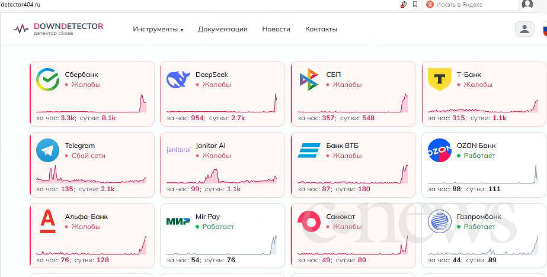

# Russia Nationwide Banking & Payment Outage (April 2026)

**Banking Outage**{.cve-chip} **Payment System Failure**{.cve-chip} **Critical Infrastructure**{.cve-chip}

## Overview

A large-scale service outage struck major Russian banking and payment systems, rendering mobile banking apps, card payment terminals, ATMs, and metro fare systems inaccessible to millions of customers nationwide. 

The disruption forced widespread reliance on cash transactions. 

While no malicious actor has been confirmed, evidence points to aggressive network filtering rules — potentially implemented by Roskomnadzor (Russia's federal communications regulator) as part of ongoing VPN-blocking operations — accidentally disrupting critical IP ranges relied upon by financial services infrastructure. 

The incident exposed deep systemic risks arising from centralized banking architecture combined with opaque, untested regulatory filtering.

## Technical Specifications

| Attribute | Details |
|-----------|---------|
| **Incident Type** | Nationwide Banking & Payment Infrastructure Outage |
| **Classification** | Non-Malicious (Regulatory/Infrastructure Failure) |
| **Attributed Cause** | Network Filtering Errors (Suspected Roskomnadzor VPN Blocking) |
| **Affected Systems** | Mobile Banking Apps, POS Terminals, ATMs, Metro Payment Systems |
| **Banks Affected** | Sberbank, VTB, Alfa-Bank, Gazprombank (and others) |
| **Duration** | Extended — multiple hours of nationwide disruption |
| **Geographic Scope** | Russia-wide across multiple regions |
| **Root Cause (Suspected)** | Accidental Blocking of Critical Financial Service IP Ranges / DNS |

## Affected Products

- **Mobile Banking Applications**: Sberbank Online, VTB Online, Alfa-Bank App, Gazprombank App — login and transaction failures observed
- **POS / Card Payment Terminals**: Nationwide point-of-sale systems unable to process card transactions
- **ATM Networks**: Automated teller machines unavailable or returning transaction errors
- **QR & Contactless Payments**: QR-code and NFC-based payment systems failed across retail locations
- **Metro Fare Systems**: Transit payment infrastructure unable to process fares (free entry reported at some stations)
- **Backend Payment Infrastructure**: API communications between banks and payment processors disrupted; potential DNS or IP-level blockage affecting financial endpoints

## Technical Details

- Multiple major Russian banks (Sberbank, VTB, Alfa-Bank, Gazprombank) simultaneously experienced service degradation, suggesting a shared infrastructure dependency or common upstream failure point
- Failures manifested across mobile banking app authentication, in-app transaction processing, and backend API connectivity
- POS terminals lost connectivity to card payment processors, preventing both debit and credit transactions in retail, fuel, and transit environments
- ATM networks experienced failures — either refusing transactions or becoming unreachable
- Metro transit payment systems, which rely on backend validation infrastructure, failed to process fare payments; some stations reported reverting to free entry to avoid public gridlock
- Probable cause: Roskomnadzor-level traffic filtering rules targeting VPN services inadvertently blocked IP address ranges or DNS records shared between VPN infrastructure and financial service endpoints
- Alternatively, a centralized banking backend dependency (shared API gateway, DNS resolver, or payment processing hub) may have failed, cascading across all dependent institutions
- Telegram founder Pavel Durov publicly stated Russia's VPN crackdown directly caused the banking outage, citing misconfigured network-level filtering rules as the trigger
- High centralization of Russian payment infrastructure amplified the blast radius — a single point of failure produced nationwide impact rather than isolated service degradation

## Attack Scenario

!!! note "Non-Malicious Incident"
    No confirmed threat actor or cyberattack is attributed to this outage. Evidence points to aggressive network filtering rules - potentially implemented by Roskomnadzor (Russia's federal communications regulator) as part of ongoing VPN-blocking operations - accidentally disrupting critical IP ranges relied upon by financial services infrastructure.

## Impact Assessment

=== "Operational Impact"

    - **Banking App Inaccessibility**: Millions of customers unable to log in, view balances, or complete transfers via mobile banking platforms
    - **Payment Failures**: Card transactions failed across retail, fuel stations, restaurants, and other point-of-sale environments nationwide
    - **ATM Unavailability**: Cash withdrawal infrastructure rendered unreliable, creating liquidity problems for individuals and businesses
    - **Transit Disruption**: Metro fare systems unable to process digital or card payments, forcing free or cash-only entry and creating station crowding
    - **Cash-Only Operations**: Businesses unprepared for cash-only transactions experienced operational disruption, lost sales, and customer dissatisfaction

=== "Systemic Impact"

    - **Centralization Risk Exposed**: The outage demonstrated the systemic risk of highly centralized payment and banking infrastructure — single points of failure produce nationwide outages
    - **Regulatory Coordination Failure**: Absence of pre-deployment testing and coordination between Roskomnadzor and financial sector operators amplified the impact
    - **Infrastructure Fragility**: Shared backend dependencies between multiple major banks and payment processors eliminated the resilience expected from a distributed financial system
    - **Cascading Failure Dynamics**: Interconnected systems without circuit breakers or fallback routing allowed a localized filtering change to cascade across unrelated services
    - **Public Trust Erosion**: Visible, nationwide banking failures reduce consumer confidence in digital payment infrastructure and regulatory competence

=== "Strategic Impact"

    - **Geopolitical Optics**: Public outage of Russia's major financial institutions during a period of geopolitical tension carries significant reputational implications domestically and internationally
    - **Precedent for Adversarial Exploitation**: The demonstrated fragility of Russia's banking infrastructure through unintentional disruption signals potential targets and methods to adversarial actors
    - **Policy Risk**: Aggressive, untested internet filtering creates collateral damage risk that undermines the regulatory objectives themselves
    - **Durov / Telegram Statement**: Pavel Durov's public attribution to Russia's VPN crackdown amplified international media coverage, increasing reputational damage to Russian financial institutions and regulators

## Mitigation Strategies

### Long-Term Measures

- **Reduce Centralized Infrastructure Dependency**: Distribute payment processing and banking backend infrastructure across geographically and logically separated systems; eliminate single points of failure
- **Network Segmentation & Redundancy**: Implement redundant routing paths for critical financial service communications; ensure banking infrastructure is not co-dependent on ISP-level filtering infrastructure
- **Pre-Deployment Testing Mandate**: Require comprehensive sandbox testing of all network filtering rules against a replica of financial service infrastructure before production deployment
- **Establish Offline Fallback Mechanisms**: Develop and deploy offline validation capabilities for critical payment and transit systems; ensure cash-acceptance capability is maintained across the network
- **Regulator-Financial Sector Coordination**: Create formal coordination protocols between Roskomnadzor and major financial institutions for regulatory changes affecting network infrastructure
- **Early Warning Monitoring**: Deploy real-time monitoring across banking and payment infrastructure that can detect cascading failures within minutes and trigger automated rollback procedures
- **IP Allowlisting for Critical Infrastructure**: Maintain a formally approved allowlist of IP ranges, domains, and services critical to financial infrastructure that are exempted from filtering rule changes

## Resources

!!! info "Open-Source Reporting"

    - [Major Outage Cripples Russian Banking Apps and Metro Payments Nationwide](https://securityaffairs.com/190464/security/major-outage-cripples-russian-banking-apps-and-metro-payments-nationwide.html)
    - [Russia's VPN Crackdown Caused Bank Outage, Telegram Founder Says | The Star](https://www.thestar.com.my/tech/tech-news/2026/04/06/russias-vpn-crackdown-caused-bank-outage-telegram-founder-says)
    - [Major Outage Hits Russian Banking Apps, Metro Payments Across Regions | The Record from Recorded Future News](https://therecord.media/outage-hits-russian-banking-apps)

---

*Last Updated: April 8, 2026*
