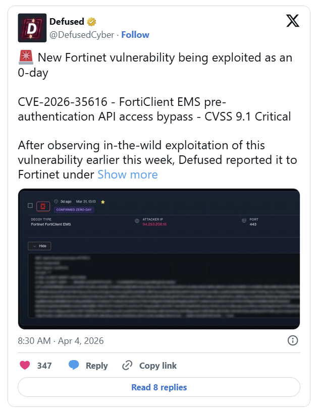

# CVE-2026-35616 - FortiClient EMS Authentication Bypass

**Fortinet EMS**{.cve-chip} **Authentication Bypass**{.cve-chip} **Active Exploitation**{.cve-chip}

## Overview

CVE-2026-35616 is a critical vulnerability in Fortinet FortiClient Endpoint Management Server (EMS) that allows unauthenticated attackers to bypass authentication and execute commands remotely via crafted API requests.

Because exploitation is reported as active, exposed vulnerable EMS instances represent a high-priority risk for enterprise compromise.

## Technical Specifications

| Field | Details |
|-------|---------|
| **CVE** | CVE-2026-35616 |
| **CVSS Score** | 9.8 (Critical) |
| **Weakness Type** | Improper Access Control (CWE-284) |
| **Attack Vector** | Remote / network-based API access |
| **Root Cause** | EMS API authentication/authorization checks can be bypassed |
| **Exploit Method** | Crafted API requests that skip login enforcement |

## Affected Products

- FortiClient EMS version 7.4.5
- FortiClient EMS version 7.4.6
- Externally reachable EMS deployments with exposed management/API interfaces

## Technical Details

- The flaw enables authentication bypass against FortiClient EMS APIs.
- Attackers can submit crafted requests to reach privileged functionality without valid credentials.
- Post-bypass access may permit remote command execution on the EMS server.
- A compromised EMS can become a centralized control point for malicious endpoint actions.
- Vendor guidance indicates patched remediation in version 7.4.7 and later.

## Attack Scenario

1. Attacker scans for internet-facing or otherwise reachable FortiClient EMS instances.
2. Vulnerable versions are identified.
3. Crafted API requests are used to bypass authentication controls.
4. Attacker gains unauthorized administrative access to EMS.
5. Commands are executed remotely on the EMS environment.
6. Adversary can push malicious configurations, distribute malware, and pivot laterally.

## Impact Assessment

=== "Server and Platform Impact"
    Successful exploitation can lead to full EMS server compromise and remote command execution.

=== "Endpoint and Network Impact"
    Attackers may leverage EMS control to influence managed endpoints, deploy malware, and expand access across enterprise networks.

=== "Data and Business Impact"
    Compromise can enable data theft, ransomware/backdoor deployment, and major operational disruption.

## Mitigation Strategies

- Update immediately to FortiClient EMS 7.4.7 or later.
- Apply official Fortinet hotfixes and verify patch completeness.
- Restrict EMS access to trusted networks (for example internal-only or VPN-only management paths).
- Monitor API activity logs and suspicious administrative actions.
- Perform compromise assessments for unauthorized configuration changes and unusual endpoint deployments.
- Segment EMS management infrastructure and enforce least-privilege access controls.

## Resources

!!! info "Open-Source Reporting"
    - [CVE-2026-35616: Fortinet fixes actively exploited high-severity flaw](https://securityaffairs.com/190392/hacking/cve-2026-35616-fortinet-fixes-actively-exploited-high-severity-flaw.html)
    - [PSIRT | FortiGuard Labs](https://fortiguard.fortinet.com/psirt/FG-IR-26-099)
    - [Fortinet Patches Actively Exploited CVE-2026-35616 in FortiClient EMS](https://thehackernews.com/2026/04/fortinet-patches-actively-exploited-cve.html)
    - [CVE-2026-35616: What We Know About the FortiClient EMS Critical Vulnerability | CyberLeveling](https://cyberleveling.com/blog/forticlient-ems-cve-2026-35616)
    - [FortiClient EMS zero-day exploited, emergency hotfixes available (CVE-2026-35616) - Help Net Security](https://www.helpnetsecurity.com/2026/04/04/forticlient-ems-zero-day-cve-2026-35616/)
    - [CVE-2026-35616 : A improper access control vulnerability in Fortinet FortiClientEMS 7.4.5 through](https://www.cvedetails.com/cve/CVE-2026-35616/)
    - [NVD - CVE-2026-35616](https://nvd.nist.gov/vuln/detail/CVE-2026-35616)

*Last Updated: April 6, 2026*