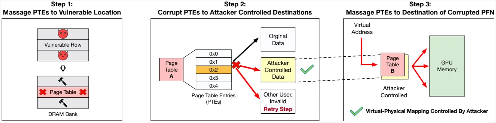
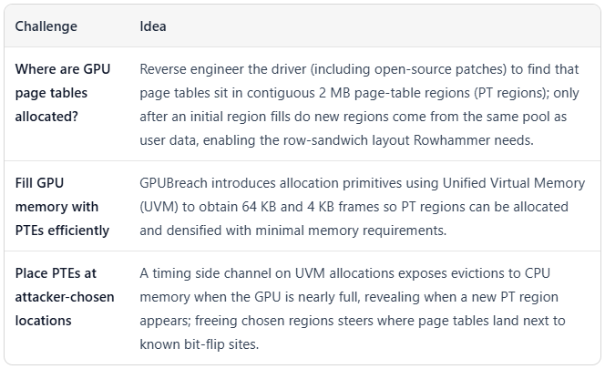
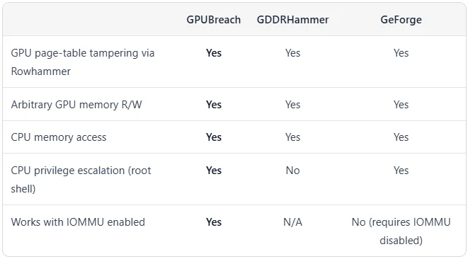

# GPUBreach / GPU Rowhammer Attack

**GPU Vulnerability**{.cve-chip} **Memory Attack**{.cve-chip} **Privilege Escalation**{.cve-chip}

## Overview

A newly disclosed attack technique known as GPUBreach demonstrates that Rowhammer-style bit-flip attacks can be executed against GPU memory (VRAM). The attack allows adversaries to manipulate memory integrity, bypass isolation mechanisms, and potentially escalate privileges to gain full control of the system. This represents a critical vulnerability in modern GPU architectures used across consumer, enterprise, and cloud environments.

## Technical Specifications

| Attribute | Details |
|-----------|---------|
| **Attack Name** | GPUBreach / GPU Rowhammer |
| **Attack Type** | Memory Bit-Flip / Privilege Escalation |
| **Flaw Category** | Hardware Vulnerability |
| **Affected Memory** | GDDR6 VRAM (Modern GPUs) |
| **Root Cause** | Insufficient memory refresh and isolation in GPU architecture |
| **Vector** | Local Access / Shared GPU Resources |
| **Attack Surface** | GPU memory management, page tables |

## Affected Products

- **NVIDIA GPUs**: RTX, A100, H100 series and other GPUs using GDDR6 memory (especially in CUDA-enabled environments)
- **AMD GPUs**: RDNA / RDNA2 architectures and other GPUs utilizing GDDR6 VRAM
- **Intel Arc GPUs**: Arc series and Data Center GPU Flex/Max variants (potential exposure, limited public exploitation evidence)
- **Cloud Platforms**:
    - Amazon Web Services EC2 GPU instances
    - Google Cloud GPU acceleration services
    - Microsoft Azure GPU virtual machines
- **Shared GPU Environments**: Research clusters, AI/ML training platforms, HPC systems, and any multi-tenant GPU infrastructure
- **Mobile GPUs**: Smartphone GPUs (Adreno, Mali, PowerVR) - theoretical risk only, not yet confirmed

## Technical Details

- Targets GDDR6 and GDDR6X VRAM used in modern GPUs
- Attack exploits the high-frequency memory access patterns available through GPU compute APIs (CUDA, OpenCL, HIP)
- Uses memory "hammering" techniques to induce bit flips in sensitive VRAM regions
- Exploits weaknesses in GPU memory isolation mechanisms that were originally designed for graphics workloads, not security-critical compute
- Bypasses traditional memory refresh schedules used in CPU DRAM and GDDR memory
- Can target GPU page tables, leading to arbitrary memory read/write
- Controlled bit flips enable corruption of GPU kernel structures, process isolation, and access control
- Potential escalation vector to system RAM through GPU-to-CPU memory mapping
- Attack complexity relatively low due to standard GPU compute APIs being publicly documented
- Performance overhead minimal; attack can run in background during normal GPU workload

## Attack Scenario

1. **Initial Access**: Attacker gains local access to a system with a vulnerable GPU (shared cloud instance, multi-tenant HPC cluster, or compromised workstation)
2. **GPU Workload Execution**: Crafted GPU compute kernel is created using CUDA, OpenCL, or similar framework with tight memory loops
3. **Rowhammer Trigger**: Kernel deliberately accesses specific memory rows at extremely high frequency to trigger DRAM refresh rate violations in VRAM
4. **Memory Bit Flips**: Repeated access patterns cause bit flips in sensitive GPU memory regions (page tables, access control structures)
5. **Isolation Bypass**: Bit flips corrupt GPU memory access control lists, breaking process/kernel isolation
6. **Privilege Escalation**: Attacker transitions from user GPU context to privileged context, gaining kernel-level GPU access
7. **System Pivot**: Using GPU memory manipulation, attacker reads/writes GPU-mapped system RAM, escalating from GPU privilege to full OS kernel control
8. **Persistence**: Attacker plants kernel rootkit or persistent backdoor, maintaining access beyond GPU workload execution

## Impact Assessment

=== "Technical Impact"
    - Full GPU compromise with arbitrary code execution in GPU kernel
    - Arbitrary read/write access to GPU memory owned by other processes
    - Corruption of GPU-accelerated machine learning models (silent data integrity loss)
    - Leakage of cryptographic keys or sensitive computation results from GPU memory
    - Escape from GPU sandbox to gain access to host system memory
    - Bypass of GPU virtualization security boundaries in cloud environments
    - Potential for multi-tenant data exfiltration in shared GPU scenarios

=== "Strategic Impact"
    - AI/ML model theft or poisoning in cloud training environments (AWS SageMaker, GCP Vertex AI, Azure ML)
    - Compromise of cryptocurrency mining operations and GPU-accelerated financial systems
    - Breach of confidentiality in high-performance computing (HPC) research centers
    - Lateral movement within cloud infrastructure via GPU hypervisor escape
    - Supply chain risk to organizations relying on third-party GPU-accelerated services
    - Potential espionage vectors targeting government or military HPC clusters

=== "Enterprise Impact"
    - All organizations running GPU workloads at risk (cloud ML, rendering, scientific computing)
    - Massive scope: GPU acceleration used in 70%+ of modern data centers
    - Risk to financial institutions using GPU-accelerated trading/risk analysis
    - Healthcare organizations using GPU acceleration for medical imaging vulnerable to data theft
    - Cloud service providers must address isolation guarantees to enterprise customers
    - Potential for large-scale cloud tenant compromise if not addressed

## Mitigation Strategies

- **Enable ECC Memory**: Deploy ECC (Error-Correcting Code) VRAM where available; detects and corrects single-bit errors before they cause damage
- **GPU Virtualization/Isolation**: Use IOMMU (GPU-IOMMU) and GPU memory access control policies (such as NVIDIA's GPU memory protection) to isolate GPU workloads and prevent cross-process access
- **Avoid Multi-Tenant GPU Sharing**: Disable GPU sharing between untrusted users; allocate full GPUs per security domain rather than slicing GPUs
- **Restrict GPU Compute APIs**: Disable or restrict public access to GPU compute APIs (CUDA, OpenCL) in multi-tenant environments; require authentication/authorization
- **Memory Lockdown Policies**: Implement strict GPU memory page locking and access policies on systems supporting it; prevent user-mode processes from hammering memory
- **Update GPU Drivers**: Apply the latest GPU driver patches to enable firmware-level mitigations (memory refresh rate hardening, access control updates)
- **Hardware Upgrades**: Prioritize GPU architectures with built-in bit-flip protections (newer NVIDIA/AMD GPUs with enhanced security features)
- **Monitor Abnormal GPU Workloads**: Implement GPU performance monitoring to detect high-frequency memory access patterns characteristic of Rowhammer attacks
- **Hypervisor-Level Controls**: For virtualized GPUs, enforce strict memory bandwidth limits and time-slice GPU access to disrupt sustained hammering attacks
- **Kernel Hardening**: Apply OS-level kernel protections (SMEP, SMAP) to reduce impact even if GPU isolation is bypassed
- **Incident Response**: Develop GPU-specific incident response procedures; monitor GPU event logs for memory access anomalies or privilege escalation attempts
- **Research and Patch Tracking**: Subscribe to GPU vendor security advisories; monitor ongoing GPUBreach research for additional attack vectors

## Resources

!!! info "Open-Source Reporting"
    - [New GPUBreach attack enables system takeover via GPU rowhammer](https://www.bleepingcomputer.com/news/security/new-gpubreach-attack-enables-system-takeover-via-gpu-rowhammer/)
    - [New 'GeForce' and 'GDDRHammer' attacks can fully infiltrate your system through Nvidia's GPU memory (Tom's Hardware)](https://www.tomshardware.com/pc-components/gpus/new-geforge-and-gddrhammer-attacks-can-fully-infiltrate-your-system-through-nvidias-gpu-memory-rowhammer-attacks-in-gpus-force-bit-flips-in-protected-vram-regions-to-gain-read-write-access)
    - [Security Notice: Rowhammer - July 2025 | NVIDIA](https://nvidia.custhelp.com/app/answers/detail/a_id/5671)

*Last Updated: April 7, 2026*