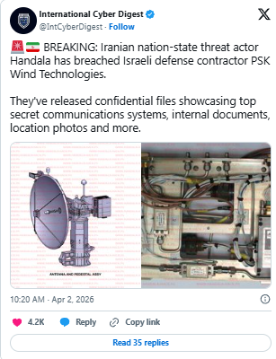
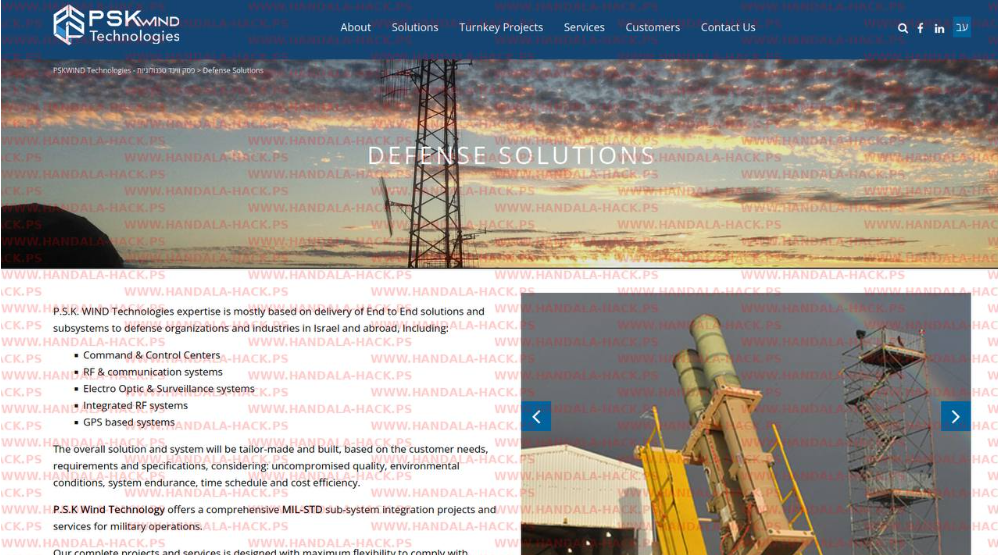

# Handala Hack Team Breach Claim Against PSK Wind Technologies

**Handala**{.cve-chip}  **Hacktivist Activity**{.cve-chip}  **Defense Sector Targeting**{.cve-chip}  **Data Exfiltration Claim**{.cve-chip}

## Overview
A pro-Iranian hacktivist group, Handala, claimed to have breached Israeli defense contractor PSK Wind Technologies. The group alleged exfiltration of sensitive data related to military command-and-control systems and communications infrastructure, and published partial evidence online.

The breach has not been officially confirmed at the time of reporting.

## Technical Specifications

| **Attribute** | **Details** |
|---------------|-------------|
| **Incident Type** | Claimed targeted intrusion and information operation |
| **Target Sector** | Defense contractor ecosystem |
| **Initial Access (Reported)** | Unknown; likely phishing or credential compromise |
| **Observed/Reported TTPs** | Spear-phishing, credential harvesting, living-off-the-land activity |
| **Data Claimed Exfiltrated** | Internal documents, system architecture files, internal environment screenshots |
| **Post-Exploitation Risk** | Persistence and lateral movement across sensitive systems |
| **Verification Status** | Public claim with partial evidence; no official confirmation |

## Affected Products
- PSK Wind Technologies corporate and technical environments (as claimed)
- Systems associated with command-and-control and communications workflows
- Employee identity/access systems targeted through phishing or credential abuse paths
- Partner and downstream environments that may share trust relationships

## Attack Scenario
1. **Targeting and Delivery**:
   Attackers target employees through spear-phishing or social engineering.

2. **Initial Access**:
   Compromised credentials are used to access internal systems.

3. **Lateral Movement**:
   Adversaries traverse internal networks toward high-value command-and-control related assets.

4. **Collection**:
   Sensitive documents, architecture information, and screenshots are gathered.

5. **Exfiltration**:
   Collected data is transferred to attacker-controlled infrastructure.

6. **Information Operation**:
   Samples and threat messaging are published to maximize psychological and media impact.

## Impact Assessment

=== "Integrity"
    * Trust degradation in internal defense-sector system security posture
    * Risk of manipulated or selectively leaked material influencing decisions
    * Increased pressure from coordinated cyber and information operations

=== "Confidentiality"
    * Potential exposure of command-and-control and communication architecture details
    * Intelligence advantage for adversaries if leaked data is authentic
    * Elevated targeting risk for connected suppliers, staff, and critical systems

=== "Availability"
    * Potential disruption from containment and recovery operations
    * Increased likelihood of follow-on cyber or physical targeting attempts
    * Operational overhead from sustained incident response and threat hunting

## Mitigation Strategies

### Immediate Actions
- Enforce multi-factor authentication across privileged and remote access paths.
- Harden email security controls and phishing detection.
- Isolate suspicious accounts/endpoints and rotate exposed credentials.

### Short-term Measures
- Apply zero-trust access controls and least privilege for sensitive systems.
- Segment networks between user, corporate, and high-value command-related environments.
- Strengthen DLP controls to detect and block unauthorized data movement.

### Monitoring & Detection
- Run continuous monitoring with SIEM, EDR, and XDR telemetry correlation.
- Hunt for living-off-the-land activity, unusual VPN/tunneling behavior, and lateral movement indicators.
- Alert on anomalous archive creation, screenshot tooling, and outbound transfer spikes.

### Long-term Solutions
- Maintain patching and vulnerability management programs for exposed infrastructure.
- Deliver recurring employee awareness training focused on spear-phishing and social engineering.

## Resources and References

!!! info "Open-Source Reporting"
    - [Pro-Iran Handala group breached Israeli defence contractor PSK Wind Technologies](https://securityaffairs.com/190319/data-breach/pro-iran-handala-group-breached-israeli-defence-contractor-psk-wind-technologies.html)
    - [Business news | data | Eastern Europe | Eurasia | Middle East | Africa](https://new.intellinews.com/articles/iran-linked-hackers-claim-breach-of-israeli-air-defence-contractor-psk-wind-435328)
    - [Handala Publishes Documents on Israeli Air Defense Systems - WANA](https://wanaen.com/handala-publishes-documents-on-israeli-air-defense-systems/)

---

*Last Updated: April 5, 2026*
