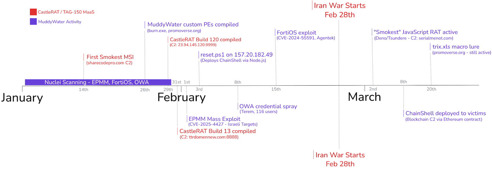
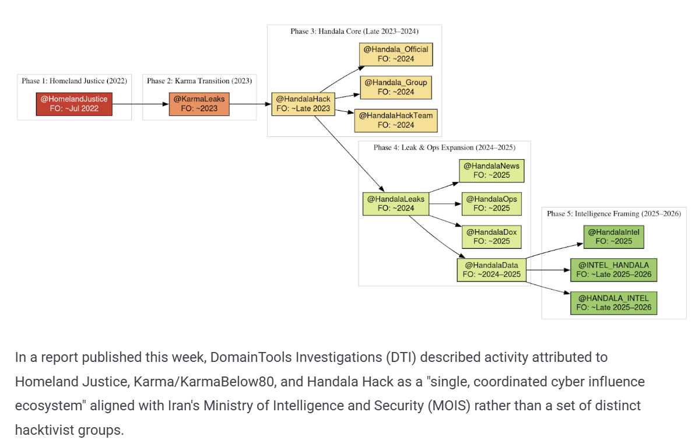

# Iran-Linked Hackers Disrupt U.S. Critical Infrastructure

**Iran-Linked APT**{.cve-chip} **ICS/OT Attack**{.cve-chip} **Critical Infrastructure**{.cve-chip}

## Overview

Iran-linked threat actors conducted coordinated cyberattacks targeting U.S. critical infrastructure by exploiting internet-exposed industrial control systems (ICS). Unlike traditional espionage campaigns, these attacks focused on operational disruption through manipulation of PLC logic, SCADA configurations, and HMI interfaces — marking a significant shift toward cyber-physical sabotage. The attackers leveraged weak authentication, absent network segmentation, and direct internet exposure to manipulate physical processes and mislead operators with falsified dashboard data.

## Technical Specifications

| Attribute | Details |
|-----------|---------|
| **Threat Actor** | Iran-Linked APT (Unattributed Specific Group) |
| **Attack Type** | ICS/OT Intrusion, Cyber-Physical Sabotage |
| **Target Sector** | U.S. Critical Infrastructure (Water, Energy) |
| **Primary Vector** | Internet-Exposed ICS/PLC Devices |
| **Access Method** | Unauthorized SSH (Dropbear), Misconfigured Services |
| **Objective** | Operational Disruption, Not Espionage |
| **Root Cause** | Default Credentials, No Network Segmentation, Direct Internet Exposure |
| **Impact** | Operational Disruption, False Sensor Data, Safety Risk |

## Affected Products

- **Rockwell Automation / Allen-Bradley PLCs**: Directly targeted; project file and logic manipulation observed
- **SCADA Systems**: Configuration files altered to affect process control
- **HMI Interfaces**: Dashboard data manipulated to display false readings to engineers
- **Dropbear SSH**: Exploited for unauthorized remote access on internet-facing ICS devices
- **Sectors Affected**: Water treatment facilities, energy distribution, other U.S. critical infrastructure operators

## Technical Details

- Threat actors scanned for publicly exposed ICS and PLC devices using tools such as Shodan and custom network scanners
- Targeted devices running default or weak credentials on management interfaces
- Gained unauthorized SSH access via Dropbear on internet-exposed devices lacking authentication controls
- Modified PLC project files and ladder logic to alter physical process behavior
- Manipulated HMI displays to present false operational data, causing engineers to misinterpret system state
- Exploited complete absence of network segmentation — no separation between IT and OT networks
- No firewall rules or access control lists restricting inbound connections to ICS ports (502/Modbus, 44818/EtherNet/IP, 22/SSH)
- Attack methodology prioritized disruption over stealth; changes were designed to cause immediate operational impact
- Evidence of reconnaissance phase: attackers catalogued connected devices before initiating destructive modifications

## Attack Scenario

1. **Reconnaissance**: Threat actors use internet scanning tools to identify publicly exposed ICS/SCADA systems and PLCs in the U.S. critical infrastructure sector
2. **Target Selection**: Identify vulnerable systems lacking authentication, running outdated firmware, or accessible over standard ICS ports directly from the internet
3. **Initial Access**: Gain unauthorized access via SSH (Dropbear) or misconfigured remote management interfaces using default or brute-forced credentials
4. **Persistence & Exploration**: Enumerate connected devices, map network topology, and identify PLC models, firmware versions, and project files
5. **Configuration Manipulation**: Modify PLC ladder logic and project files to alter physical process behavior (e.g., pump speed, valve positions, chemical dosing)
6. **HMI Falsification**: Manipulate HMI dashboard displays to show false readings, preventing engineers from detecting the attack or responding correctly
7. **Operational Disruption**: Altered control logic causes unintended physical outcomes — service interruptions, incorrect process states, or unsafe operating conditions
8. **Impact Sustainment**: Maintain access to continue disruption; modifications may persist even after initial connection is severed if backups are not restored

## Impact Assessment

=== "Operational Impact"

    - **Service Disruptions**: Manipulation of PLC logic can halt or degrade water treatment, energy distribution, or manufacturing processes
    - **Engineer Deception**: False HMI data prevents operators from identifying and responding to the actual system state
    - **Safety Risks**: Incorrect process control poses direct physical safety hazards to personnel, equipment, and surrounding communities
    - **Recovery Complexity**: Restoring secure, known-good configurations requires offline backups and forensic validation of all modified files
    - **Extended Downtime**: Industrial process restoration is time-consuming, especially without clean backup configurations

=== "Strategic Impact"

    - **Escalation Toward Sabotage**: Attack represents a documented shift in Iranian TTPs from cyber espionage to destructive cyber-physical operations
    - **Geopolitical Signal**: Targeting U.S. critical infrastructure carries significant diplomatic and national security implications
    - **Infrastructure Confidence**: Public knowledge of ICS compromise erodes confidence in the security of critical services
    - **Precedent for Future Attacks**: Successful disruption validates the approach for other adversaries eyeing critical infrastructure targets
    - **Cross-Sector Spill**: Disruption of water or energy infrastructure has cascading effects on other dependent sectors (healthcare, transportation)

=== "Regulatory & Community Impact"

    - **CISA Reporting Obligation**: Critical infrastructure operators are obligated to report ICS intrusions; non-reporting carries regulatory penalties
    - **Community Service Risk**: Water and energy disruptions directly impact residential and commercial consumers
    - **Financial Losses**: Disrupted operations, emergency response, and remediation costs impose significant financial burden on operators
    - **Insurance & Liability**: ICS attacks with physical consequences may trigger insurance disputes over cyber vs. property coverage
    - **Increased Regulatory Scrutiny**: Incidents accelerate regulatory pressure for mandatory OT security standards and audits

## Mitigation Strategies

### Immediate Actions

- **Disconnect from Internet**: Remove PLCs and ICS devices from direct internet access immediately; place behind firewalls with strict whitelist rules
- **Disable Unnecessary Remote Access**: Disable SSH, Telnet, and other remote access services unless operationally required; remove Dropbear where not needed
- **Rotate All Credentials**: Immediately change all default and shared passwords; eliminate default credentials across all ICS/OT devices; implement unique strong passwords per device

### Security Hardening

- **Network Segmentation**: Implement strict separation between IT and OT networks using firewalls, DMZs, and unidirectional security gateways; apply the Purdue Model for ICS architecture
- **Secure Remote Access**: Replace direct internet exposure with VPN-only access or dedicated jump hosts with multi-factor authentication for all remote ICS management
- **Patch & Firmware Updates**: Apply all available firmware and software updates for PLCs, SCADA systems, and HMI platforms; follow vendor hardening guides

### Strategic Measures

- **OT Incident Response Plan**: Develop and test an OT-specific incident response plan; ensure response procedures include ICS-aware forensics and safe system restoration steps
- **Zero Trust / Assume Breach**: Apply zero trust principles to OT environments; assume compromise and minimize blast radius through strict access controls and monitoring
- **Regular Security Assessments**: Conduct periodic ICS penetration testing and vulnerability assessments; use CISA's free ICS security assessment services where available
- **Asset Inventory**: Maintain a complete, up-to-date inventory of all ICS components; unknown assets cannot be protected or monitored

## Resources

!!! info "Open-Source Reporting"
    - [Iran-Linked Hackers Disrupt U.S. Critical Infrastructure by Targeting Internet-Exposed PLCs](https://thehackernews.com/2026/04/iran-linked-hackers-disrupt-us-critical.html)
    - [Iranian hackers' targeting of US critical infrastructure has escalated since start of war | Reuters](https://www.reuters.com/world/middle-east/iranian-hackers-targeting-us-critical-infrastructure-has-escalated-since-start-2026-04-07/)
    - [Iran-Linked Hackers Are Sabotaging US Energy and Water Infrastructure | WIRED](https://www.wired.com/story/iran-linked-hackers-are-sabotaging-us-energy-and-water-infrastructure/)
    - [FBI and NSA Issue Joint Warning of Iran-Linked Cyberattacks on Critical Infrastructure | Times of India](https://timesofindia.indiatimes.com/technology/tech-news/fbi-and-nsa-issue-joint-warning-of-iran-linked-cyberattacks-on-critical-infrastructure-says-us-companies-should-urgently-/articleshow/130103462.cms)

---

*Last Updated: April 8, 2026*