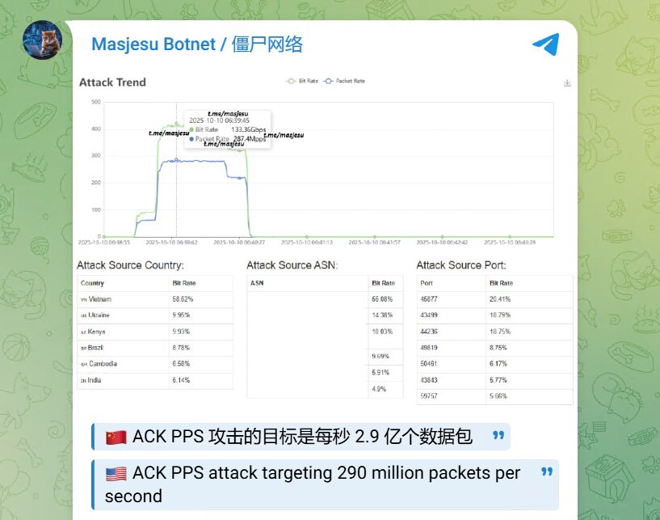
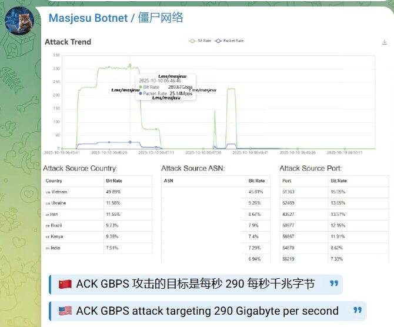
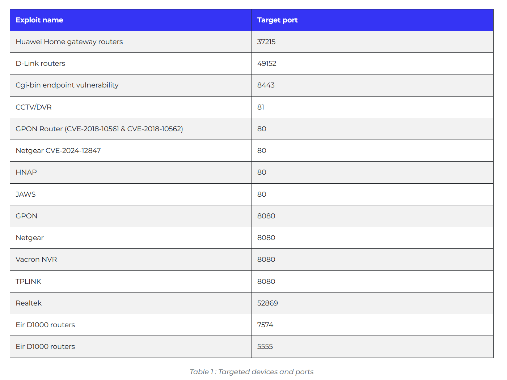
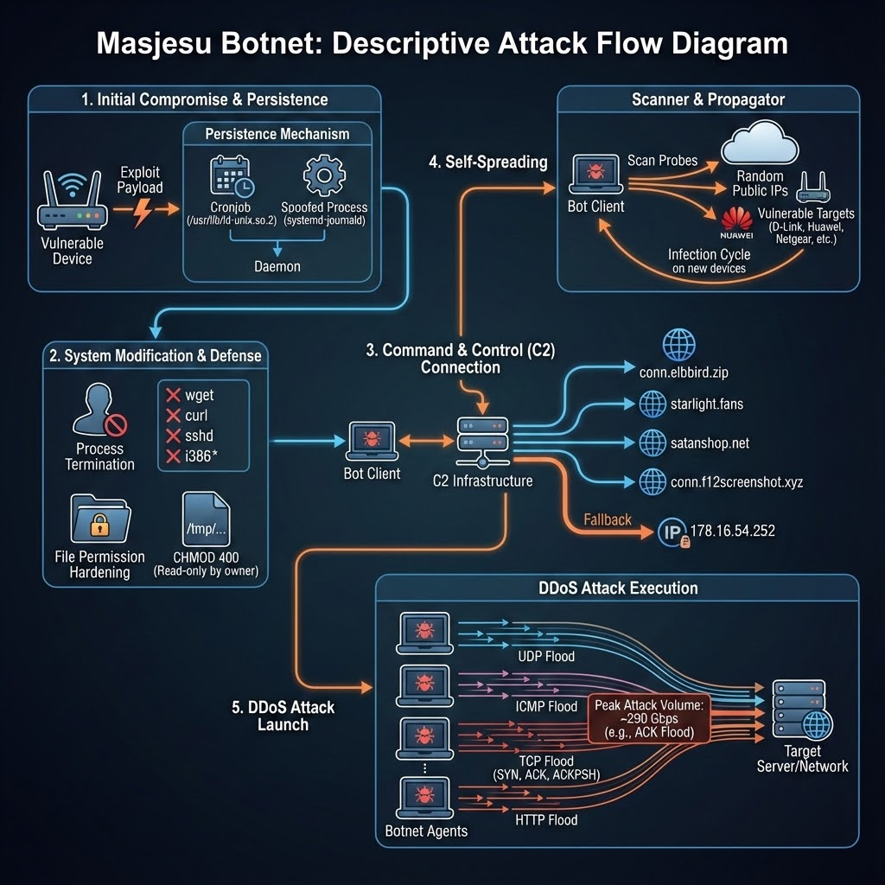

# Masjesu Botnet Emerges as DDoS-for-Hire Service Targeting Global IoT Devices

**IoT Botnet**{.cve-chip} **DDoS-for-Hire**{.cve-chip} **Critical Infrastructure**{.cve-chip}

## Overview

Masjesu is an advanced IoT-based botnet purpose-built for large-scale distributed denial-of-service (DDoS) attacks, operated as a commercial DDoS-for-hire service through underground platforms including Telegram. The botnet targets vulnerable routers, gateways, and embedded systems across multiple CPU architectures, converting infected devices into remotely controlled bots. Its layered C2 infrastructure, encrypted communications, evasion mechanisms, and broad attack vector support make Masjesu a significant and accessible threat — lowering the technical barrier for adversaries to launch destructive attacks against businesses, governments, and critical infrastructure worldwide.

## Technical Specifications

| Attribute | Details |
|-----------|---------|
| **Malware Name** | Masjesu |
| **Type** | IoT Botnet / DDoS-for-Hire |
| **Primary Use** | Large-Scale DDoS Attacks |
| **Target Devices** | Routers, Gateways, Embedded IoT Systems |
| **Architecture Support** | ARM, MIPS, x86 (multi-architecture) |
| **Propagation** | Automated Scanning + Vulnerability Exploitation |
| **C2 Infrastructure** | Multiple Domains + Fallback IPs |
| **C2 Encryption** | Multi-Layer XOR Encryption |
| **Persistence** | Signal Termination Resistance (ignores SIGTERM/SIGKILL) |
| **Distribution Model** | DDoS-as-a-Service via Telegram Underground Markets |

## Affected Products

- **SOHO Routers**: Consumer and small-business routers with default credentials or unpatched firmware (TP-Link, Netgear, D-Link, Asus, Mikrotik, and similar)
- **IoT Gateways**: Industrial and home IoT gateways running lightweight Linux-based firmware
- **Embedded Systems**: Any internet-facing embedded device running ARM, MIPS, or x86 architecture with exposed management services
- **Attack Targets**: Any organization reachable over the internet — websites, web applications, gaming servers, financial platforms, government services, and critical infrastructure

## Technical Details

- **Multi-Architecture Support**: Masjesu binaries compiled for ARM, MIPS, and x86 architectures, enabling infection of a wide range of IoT and embedded devices regardless of hardware platform
- **Automated Scanning & Exploitation**: Botnet modules perform continuous internet-wide scanning for vulnerable devices; exploits weak or default credentials, exposed Telnet/SSH services, and known firmware vulnerabilities to propagate autonomously
- **C2 Infrastructure**: Uses multiple domain names and hardcoded fallback IP addresses for C2 resilience; if primary C2 is taken down or filtered, infected devices automatically reconnect through backup channels
- **Multi-Layer XOR Encryption**: C2 communications are encrypted using layered XOR encoding, complicating traffic inspection and signature-based detection by network security tools
- **Persistence via Signal Resistance**: Masjesu actively ignores process termination signals (SIGTERM, SIGKILL) on infected devices, preventing routine administrative actions from clearing the infection; designed to survive reboots through modified startup scripts or cron jobs
- **Evasion Mechanisms**: Deliberately avoids scanning or targeting specific sensitive IP ranges (e.g., government networks, military blocks) to reduce visibility and avoid triggering high-profile incident response; mimics legitimate traffic patterns to blend with normal device behavior
- **DDoS-as-a-Service Panel**: Operators sell access to the botnet through Telegram channels and underground forums; customers interact with a control panel to select targets, attack types, duration, and intensity without needing technical expertise
- **Broad Attack Vector Support**: Supports TCP SYN/ACK floods, UDP floods, HTTP Layer 7 application-layer floods, ICMP floods, GRE floods, and RDP floods — covering volumetric, protocol, and application-layer attack categories

## Attack Scenario

1. **Service Acquisition**: Attacker rents access to the Masjesu DDoS-for-hire service via Telegram or underground forum; pays for a service tier based on attack duration, volume, and target type
2. **Target Specification**: Attacker specifies the target (IP address, domain, or service), selects attack type (e.g., HTTP Layer 7 flood for a website, UDP flood for a game server), and configures duration
3. **Command Dispatch**: Attack order is sent through the Masjesu control panel to C2 infrastructure; encrypted instructions are distributed to all active bots in the network
4. **Bot Activation**: Thousands of infected IoT devices (routers, gateways, embedded systems) receive the attack command and begin generating malicious traffic simultaneously toward the specified target
5. **Traffic Flood**: Bots collectively flood the target with high-volume attack traffic across the selected vector; combined bandwidth easily overwhelms typical mitigation capacity of unprotected targets
6. **Service Disruption**: Target systems, servers, or network infrastructure become overwhelmed, resulting in service degradation or complete outage; legitimate users are unable to access the affected services
7. **Secondary Attack Cover**: DDoS-induced outage and incident response distraction creates a window for secondary operations — intrusion attempts, data exfiltration, or ransomware deployment — against the same or affiliated targets
8. **Persistence & Re-engagement**: Infected IoT bots retain their infection between attack campaigns; the attacker can re-engage the same botnet for future attacks or resell access to other operators

## Impact Assessment

=== "Target Organizations"

    - **Service Downtime**: Sustained DDoS floods cause complete or partial service outages, rendering websites, APIs, and applications inaccessible to legitimate users
    - **Financial Losses**: Business interruption during outages directly translates to revenue loss; e-commerce, financial services, and gaming platforms are particularly vulnerable
    - **Reputational Damage**: Visible service outages erode customer trust, generate negative media coverage, and damage brand reputation — especially for SLA-bound service providers
    - **Increased Infrastructure Costs**: Emergency DDoS mitigation, CDN scaling, and bandwidth overages during sustained attacks impose significant unplanned infrastructure costs
    - **Secondary Attack Risk**: DDoS campaigns often function as a distraction tactic, masking concurrent intrusion attempts, credential stuffing, or data exfiltration operations

=== "IoT Device Owners"

    - **Unwitting Participation**: Compromised routers and IoT devices are weaponized without owner awareness, making device owners inadvertently complicit in attacks on third parties
    - **Device Performance Degradation**: Infected devices experience degraded performance, increased CPU/memory usage, and abnormal network traffic that may be noticed as slow internet or device instability
    - **Privacy Risk**: Persistent malware on home or business routers can passively intercept unencrypted traffic, exposing browsing activity, credentials, and internal network communications
    - **Remediation Burden**: Cleaning infected IoT devices often requires firmware re-flash; many consumer devices lack the tooling or user expertise for proper remediation

=== "Global Infrastructure"

    - **Internet Infrastructure Strain**: Large-scale botnets generate significant junk traffic that strains internet exchange points, upstream providers, and transit networks beyond the primary target
    - **DDoS Democratization**: DDoS-for-hire lowers the attack barrier to near-zero; any individual with minimal funds can now launch enterprise-grade attacks, dramatically increasing attack frequency industry-wide
    - **Critical Infrastructure Risk**: Financial institutions, healthcare platforms, government services, and utilities targeted by DDoS face operational and public safety consequences beyond simple business disruption
    - **Law Enforcement Challenge**: Distributed, encrypted botnet infrastructure operated through anonymous Telegram channels significantly complicates attribution and takedown efforts

## Mitigation Strategies

### For Target Organizations

- **Deploy DDoS Protection**: Implement upstream DDoS scrubbing services (Cloudflare, Akamai, AWS Shield) or on-premises scrubbing appliances; ensure protection tiers match realistic threat volumes
- **Web Application Firewall (WAF)**: Deploy WAF solutions to absorb and filter HTTP Layer 7 application-layer floods; configure rate limiting, challenge pages, and bot detection rules
- **Rate Limiting & Traffic Filtering**: Implement rate limiting at edge routers and load balancers; filter known malicious ASNs and geographic sources where operationally feasible
- **Anycast & Load Balancing**: Distribute service capacity across Anycast IP networks and global load balancers to absorb volumetric attacks by spreading traffic across multiple PoPs
- **Traffic Anomaly Monitoring**: Deploy SIEM/NDR solutions to detect abnormal inbound traffic spikes in real time; establish baseline traffic profiles and alert on deviations exceeding thresholds
- **Incident Response Plan**: Maintain a tested DDoS incident response runbook; pre-establish escalation paths to upstream providers, DDoS mitigation vendors, and ISPs for rapid response

### For IoT & Network Owners

- **Change Default Credentials**: Replace all default usernames and passwords on routers, gateways, and IoT devices immediately upon deployment; enforce unique credentials per device
- **Disable Unnecessary Remote Access**: Disable Telnet and SSH on devices where remote management is not required; restrict access to internal management networks only; never expose management ports to the internet
- **Regular Firmware Updates**: Apply vendor firmware updates promptly; subscribe to vendor security advisories; replace end-of-life devices that no longer receive security patches
- **Network Segmentation**: Place IoT devices on isolated VLANs separated from core business and personal networks; restrict IoT devices to only the internet access they require
- **Firewall Inbound Access Rules**: Configure firewall rules to block unsolicited inbound connections to IoT device management ports; implement default-deny inbound policies for all IoT subnets

## Resources

!!! info "Open-Source Reporting"
    - [Masjesu Botnet Emerges as DDoS-for-Hire Service Targeting Global IoT Devices](https://thehackernews.com/2026/04/masjesu-botnet-emerges-as-ddos-for-hire.html)
    - [Masjesu Rising: The Commercial IoT Botnet Built for Stealth, DDoS, and IoT Evasion](https://www.trellix.com/blogs/research/masjesu-rising-stealth-iot-botnet-ddos-evasion/)
    - [Masjesu Botnet Targets Routers in Commercial DDoS Attacks](https://ground.news/article/masjesu-botnet-targets-routers-in-commercial-ddos-attacks_5a2f2f)
    - [Masjesu Rising: The Commercial IoT Botnet Built for Stealth, DDoS, and IoT Evasion | MalwareTips Forums](https://malwaretips.com/threads/masjesu-rising-the-commercial-iot-botnet-built-for-stealth-ddos-and-iot-evasion.140774/)

*Last Updated: April 9, 2026*