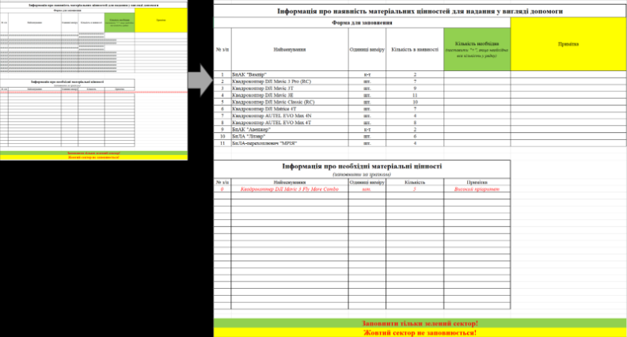

# APT28 PRISMEX Campaign

**Russia-Linked APT**{.cve-chip} **Spear-Phishing**{.cve-chip} **Cyber Espionage**{.cve-chip}

## Overview

APT28 (Fancy Bear / Forest Blizzard), the Russian GRU-attributed threat actor, conducted a sophisticated cyber-espionage campaign targeting Ukrainian and NATO-linked entities using a multi-stage malware framework named PRISMEX. The campaign leverages spear-phishing emails with malicious Excel attachments to deliver layered malware modules capable of fileless execution, steganographic payload concealment, COM hijacking persistence, and cloud-based command-and-control. PRISMEX is designed for long-term stealthy persistence, intelligence collection, and potential disruption of critical military and logistics operations.

## Technical Specifications

| Attribute | Details |
|-----------|---------|
| **Threat Actor** | APT28 / Fancy Bear / Forest Blizzard (GRU Unit 26165) |
| **Campaign Name** | PRISMEX |
| **Attack Type** | Cyber Espionage, Spear-Phishing, Multi-Stage Malware |
| **Targets** | Ukrainian & NATO-Linked Entities (Military, Logistics) |
| **Initial Vector** | Spear-Phishing Emails with Malicious Excel Attachments |
| **CVEs Exploited** | CVE-2026-21509, CVE-2026-21513 (possible zero-day) |
| **Persistence Method** | COM Hijacking |
| **Payload Concealment** | PNG Steganography |
| **C2 Infrastructure** | Cloud Services (e.g., Filen.io) |
| **Execution Style** | Fileless / In-Memory |

## Affected Products

- **Microsoft Excel / Office**: Exploited via malicious `.xls`/`.xlsm` attachments triggering CVE-2026-21509 and CVE-2026-21513
- **Windows COM Infrastructure**: Hijacked for persistence across system reboots without requiring privileged installation
- **Windows Endpoint Systems**: All Windows systems running vulnerable Office versions without macro restrictions
- **Cloud Storage Services**: Filen.io and similar cloud platforms abused for C2 communication and data exfiltration
- **Organizations Targeted**: Ukrainian government and military agencies, NATO-aligned defense contractors, logistics and supply chain operators supporting Ukraine

## Malware Architecture

PRISMEX operates as a modular, staged malware framework with four distinct components:

| Module | Function |
|--------|----------|
| **PrismexSheet** | Malicious Excel entry point; triggers exploit on file open |
| **PrismexDrop** | Dropper stage; establishes persistence via COM hijacking |
| **PrismexLoader** | Extracts encrypted payload hidden inside PNG images (steganography) |
| **PrismexStager** | Connects to attacker-controlled C2 infrastructure; receives tasking |

## Technical Details

- **Initial Access**: Spear-phishing emails are themed around military logistics, weapons deliveries, or official communications to maximize victim relevance; attachments appear as legitimate Excel reports or briefings
- **Exploitation**: Opening the malicious Excel file triggers CVE-2026-21509 (and potentially CVE-2026-21513 as a zero-day) to execute embedded shellcode without requiring macro enablement
- **Dropper (PrismexDrop)**: Writes persistence entries by hijacking legitimate COM object registrations in the Windows registry; subsequent system events (logon, application launch) silently re-execute the malware without any visible scheduled tasks or services
- **Steganography (PrismexLoader)**: Malicious payload is concealed within PNG image files using steganographic techniques; PrismexLoader reads and decrypts the hidden payload from these images, evading signature-based detection tools that do not inspect image files
- **Fileless Execution (PrismexStager)**: The final payload is loaded and executed entirely in memory, leaving no files on disk that could be detected by traditional antivirus solutions
- **C2 via Cloud Abuse**: PrismexStager communicates with attacker-controlled infrastructure hosted on legitimate cloud services (Filen.io), blending malicious traffic with ordinary HTTPS cloud service usage to evade network-based detection
- **Data Collection & Exfiltration**: The stager collects target intelligence (documents, credentials, keystrokes, screenshots) and exfiltrates encrypted data through the same cloud channel
- **Detection Evasion**: Combination of steganography, fileless execution, COM hijacking, and cloud C2 makes PRISMEX resistant to conventional endpoint, network, and SIEM detection rules

## Attack Scenario

1. **Phishing Delivery**: APT28 crafts targeted spear-phishing emails themed around Ukrainian military logistics, NATO supply chain updates, or official government communications; emails include a malicious Excel attachment
2. **Exploitation**: Victim opens the Excel file; CVE-2026-21509 (and possibly CVE-2026-21513) is triggered, executing embedded shellcode without any macro prompt
3. **PrismexDrop Execution**: Shellcode drops PrismexDrop, which modifies Windows COM object registry keys to achieve persistent, stealthy re-execution on every user session without creating detectable scheduled tasks or services
4. **Steganographic Payload Loading**: PrismexLoader is invoked, locating PNG image files staged on disk or retrieved from attacker-controlled storage; hidden encrypted payloads are extracted and decrypted from within the image data
5. **In-Memory Execution**: Decrypted payload is injected and executed entirely in memory by PrismexLoader, bypassing file-based AV/EDR scanning; no malicious executables are written to disk
6. **C2 Establishment**: PrismexStager beacons to attacker-controlled infrastructure via Filen.io or similar cloud services over encrypted HTTPS; attacker confirms access and begins tasking
7. **Intelligence Collection**: Stager collects sensitive documents, credentials, screenshots, and keystroke data; surveys the network for high-value targets and connected systems
8. **Exfiltration & Persistence**: Collected data is encrypted and exfiltrated through the cloud C2 channel; COM hijacking ensures the malware survives reboots and persists for long-term access even if the original Excel file is deleted

## Impact Assessment

=== "Technical Impact"

    - **Persistent Foothold**: COM hijacking provides reboot-surviving persistence without requiring privileged installation or detectable artifacts like scheduled tasks or services
    - **Fileless Evasion**: In-memory execution bypasses most signature-based antivirus and endpoint protection solutions
    - **Steganographic Concealment**: Payload hidden in PNG images evades network inspection tools and file-based detection, complicating forensic analysis
    - **Cloud C2 Evasion**: Use of legitimate cloud services for C2 and exfiltration blends malicious traffic with normal business activity, defeating network-layer detection
    - **Long-Term Access**: Combination of techniques enables APT28 to maintain persistent, undetected presence inside target networks for months or years

=== "Strategic Impact"

    - **Military Intelligence Theft**: Targeting of Ukrainian and NATO-linked military and logistics entities enables collection of sensitive operational data, supply chain details, and strategic planning documents
    - **Supply Chain Visibility**: Monitoring of logistics operations supporting Ukraine provides real-time intelligence on weapons deliveries, troop movements, and resource allocation
    - **NATO Operations Exposure**: Breaching NATO-aligned entities risks exposure of alliance-level coordination, shared intelligence, and coalition planning
    - **Pre-Positioning for Disruption**: Long-term implants inside critical infrastructure networks may serve as pre-positioned access for future destructive or disruptive operations
    - **Geopolitical Intelligence Value**: Collected data supports Russian military decision-making and foreign policy operations during an active conflict environment

=== "Organizational Impact"

    - **Silent Breach Risk**: Organizations may be compromised for extended periods with no visible indicators; fileless + steganography techniques defeat most standard monitoring
    - **Credential Compromise**: Harvested credentials can be used to access additional systems, escalate privileges, or enable follow-on attacks
    - **Data Loss**: Sensitive documents, personnel records, logistics data, and operational plans may be exfiltrated without detection
    - **Incident Response Complexity**: Detecting and eradicating a multi-stage, fileless, COM-hijacking implant requires specialized forensic capability beyond standard IR tooling
    - **Partner Network Risk**: Compromise of one NATO-linked entity may expose partner organizations through shared credentials, VPNs, or trusted network relationships

## Mitigation Strategies

### Technical Controls

- **Patch Microsoft Office Immediately**: Apply all available patches for CVE-2026-21509 and CVE-2026-21513; prioritize any system with Microsoft Excel exposure to external files
- **Disable or Restrict Macros**: Enforce Group Policy to block macros in Office files received from external sources; deploy Attack Surface Reduction (ASR) rules via Microsoft Defender to block Office applications from creating child processes
- **Monitor COM Object Modifications**: Implement registry monitoring (Sysmon EventID 13) for changes to COM object keys in `HKCU\Software\Classes\CLSID`; alert on any modifications made by Office processes or unknown executables
- **Inspect Outbound Cloud Traffic**: Monitor and alert on outbound HTTPS connections to cloud storage services (Filen.io, Dropbox, OneDrive) from endpoints that do not normally access them; implement DNS filtering for unapproved cloud services
- **Deploy EDR/XDR Solutions**: Use endpoint detection and response tools capable of detecting fileless/in-memory execution, process injection, and anomalous in-memory activity; ensure memory scanning is enabled
- **Steganography Detection**: Deploy network or email scanning capable of detecting steganographic content in image files; inspect PNG attachments and image downloads from untrusted sources

### Security Practices

- **User Awareness Training**: Conduct targeted phishing awareness training for personnel likely to receive military/logistics-themed lures; simulate spear-phishing exercises with realistic APT28-style pretexts
- **Network Segmentation**: Isolate critical systems (military networks, logistics platforms, classified environments) from general enterprise networks; limit lateral movement blast radius if an endpoint is compromised
- **Zero Trust Architecture**: Apply zero trust principles — enforce least-privilege access, verify all connections, and assume breach; require re-authentication for sensitive resource access
- **Threat Hunting**: Proactively hunt for steganography-based payloads in image files on endpoints and network shares; search for unusual COM hijacking entries introduced by non-admin processes; look for beaconing patterns to cloud services

## Resources

!!! info "Open-Source Reporting"
    - [APT28 Deploys PRISMEX Malware in Campaign Targeting Ukraine and NATO Allies](https://thehackernews.com/2026/04/apt28-deploys-prismex-malware-in.html)
    - [Russia-Linked APT28 Uses PRISMEX to Infiltrate Ukraine and Allied Infrastructure with Advanced Tactics](https://securityaffairs.com/190510/apt/russia-linked-apt28-uses-prismex-to-infiltrate-ukraine-and-allied-infrastructure-with-advanced-tactics.html)

*Last Updated: April 9, 2026*
